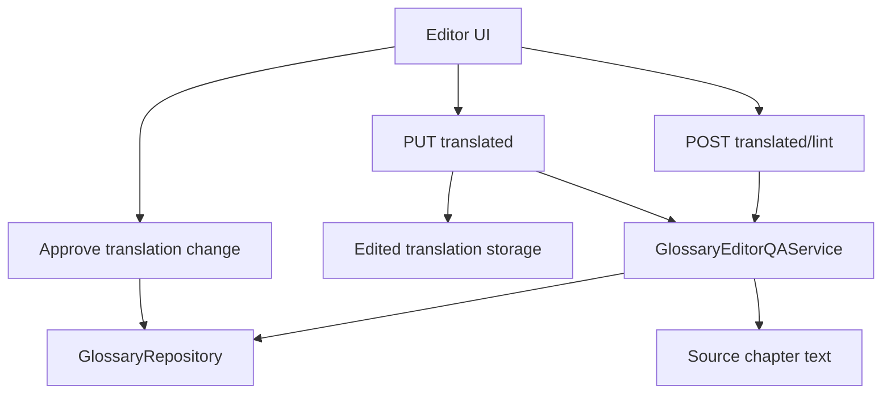

# Design: Glossary-Aware Editor QA

## Overview

This design adds deterministic glossary QA to the manual translation editor path.

Machine translation already receives approved glossary terms during prompt construction, but manual edits can accidentally remove approved terminology, introduce stale variants, or replace locked terms. This feature checks edited translation text against approved glossary entries before and during save, then returns structured issues that the editor UI can render and the backend can enforce.

This spec also absorbs the earlier partial `editor-glossary-enforcement` work. Preview linting, save-time enforcement, override metadata, glossary update shortcuts, and persisted QA summaries should be implemented in one coherent editor QA workflow.

The design is deterministic. It does not ask an LLM to judge terminology quality. It compares known approved glossary entries against source text and edited translation text using stable matching rules.

## Goals

- Detect edited translations that drop approved glossary translations.
- Detect forbidden, stale, or non-approved variants introduced by manual edits.
- Let editors preview glossary issues before saving.
- Support blocking behavior for strict, required, locked, or owner-enforced terms.
- Preserve an auditable override path.
- Provide an admin shortcut to approve a better translation as the new glossary value.
- Persist compact QA summaries with edited translation versions.
- Keep legacy editor saves working when glossary data is unavailable.
- Emit glossary revision metadata that the glossary invalidation spec can consume.

## Non-Goals

- Semantic translation review.
- LLM-based QA.
- Batch linting every chapter in a novel.
- Replacing prompt-time glossary injection.
- Replacing glossary review workflows.
- Implementing full glossary revision invalidation.
- Public reader glossary annotations.
- Public reader warnings.
- Changing active-version selection.

## Current System Context

The editor save path stores edited translated chapter content but does not currently validate edits against approved glossary entries.

Approved glossary entries are already available through glossary repository/service code and are used by prompt-related services. This feature reuses the same approved-term source of truth for editor QA.

Implementation should prefer existing repository, auth, schema, router, and storage patterns. If the current code already has a service named `GlossaryLintService`, that name is acceptable internally, but API responses should expose the broader feature as `glossary_qa`.

## Architecture



## Backend Components

| Component | Responsibility |
|---|---|
| `GlossaryEditorQAService` | Computes deterministic QA results for edited text |
| `GlossaryRepository` | Loads approved glossary entries and updates approved translations |
| Editor router | Adds preview lint endpoint and save-time QA integration |
| Admin glossary router | Adds approve-translation-change shortcut |
| Edited translation storage | Persists QA summaries and override metadata |
| Editor frontend | Displays QA issues, preview lint results, override controls, and approval shortcuts |

## QA Service

Create:

```text
backend/src/novelai/services/glossary_editor_qa_service.py
```

If the existing project naming favors `glossary_lint_service.py`, that is acceptable.

Suggested service interface:

```python
class GlossaryEditorQAService:
    def check_edit(
        self,
        *,
        platform_novel_id: int | None,
        novel_slug: str,
        chapter_id: str,
        edited_text: str,
        source_text: str | None,
        user_id: int | None = None,
        max_terms: int = 50,
    ) -> GlossaryQAResult:
        ...
```

The service should:

- Load approved glossary entries for the novel.
- Include inherited/global glossary entries if the repository already supports them.
- Prefer source-text matching to decide which entries are relevant.
- Fall back to advisory all-entry checking when source text is unavailable.
- Use deterministic normalized matching.
- Avoid mutating glossary entries.
- Return a stable data contract suitable for API responses and persisted summaries.
- Include the glossary revision used for checking when available.
- Resolve approved terms from the same glossary source used by prompt injection.

## Glossary Entry Inputs

The QA service should use the available approved glossary entry fields.

Expected fields, where present:

```json
{
  "entry_id": 42,
  "canonical_term": "魔王",
  "approved_translation": "Demon King",
  "aliases": ["魔王様"],
  "forbidden_variants": ["Devil Lord"],
  "known_variants": ["Dark Lord"],
  "status": "approved",
  "owner_locked": false,
  "enforcement_level": "warning"
}
```

Rules:

- Only approved or enforced entries should be treated as required.
- Pending entries must not be enforced as approved terms.
- Disabled, rejected, or archived entries must not create blocking issues.
- If aliases are used by prompt injection, they should also be considered source-term matches.
- Matching should use the current glossary revision.

## Matching Rules

| Rule | Behavior |
|---|---|
| Source relevance | If `source_text` is present, only entries whose `canonical_term` or aliases appear in source text are required |
| Missing approved translation | If a relevant term's `approved_translation` is absent from edited text, emit `missing_approved_translation` |
| Required/locked missing term | If the missing term is strict, required, blocking, or owner-locked, emit `missing_required_term` |
| Forbidden variant | If an entry's forbidden variant appears in edited text, emit `forbidden_variant` |
| Non-approved variant | If a known non-approved variant appears while the approved translation is absent, emit `non_approved_translation` |
| Ambiguous match | If matching may be caused by substring collision, emit `ambiguous_match` as warning/advisory |
| No source context | If source text is absent, add `legacy_no_source_context` note and avoid blocking solely because a term was not detected in source |

The first implementation may use normalized case-insensitive substring matching.

Future improvements can add token boundaries, script-aware matching, fuzzy matching, or morphology-aware matching. Those improvements should remain deterministic and testable.

## Normalization

Normalize text before matching:

- Unicode normalization where appropriate.
- Case-insensitive comparison for English translations.
- Trim surrounding whitespace.
- Collapse repeated internal whitespace.
- Preserve original text for display.
- Do not alter stored edited text.

Do not use normalization that changes term meaning.

## Severity Mapping

| Glossary entry state | Default severity | Save behavior |
|---|---|---|
| `owner_locked = true` | `error` | Blocking unless authorized override is accepted |
| `enforcement_level in strict|required|blocking` | `error` | Blocking unless authorized override is accepted |
| `enforcement_level = warning` | `warning` | Save succeeds with issue metadata |
| `enforcement_level in advisory|soft` | `advisory` | Save succeeds with note |
| Unknown enforcement level | `warning` | Save succeeds with issue metadata |

If the current schema does not include `enforcement_level`, derive severity from `owner_locked` first and treat all other approved terms as warnings.

## Issue Codes

Supported issue codes:

| Code | Meaning |
|---|---|
| `missing_approved_translation` | Approved term appears relevant but approved translation is missing |
| `missing_required_term` | Required or locked approved translation is missing |
| `forbidden_variant` | Forbidden variant appears in edited text |
| `non_approved_translation` | Known non-approved variant appears without approved translation |
| `ambiguous_match` | Matching may be affected by substring collision |
| `legacy_no_source_context` | Source text unavailable, so checks are advisory |
| `glossary_unavailable` | Glossary data could not be resolved |

## Result Status

| Status | Meaning |
|---|---|
| `passed` | Checked terms found no issues |
| `advisory` | QA ran with notes only, or glossary data was unavailable |
| `warning` | Non-blocking issues exist |
| `blocked` | Blocking issues exist and no override was accepted |
| `overridden` | Blocking issues existed, but an authorized override allowed save |

Status selection:

- `blocked` if any blocking issue exists and no valid override is accepted.
- `overridden` if blocking issues exist and a valid override is accepted.
- `warning` if non-blocking warnings exist.
- `advisory` if only advisory notes exist or glossary is unavailable.
- `passed` if QA runs and finds no issues.

## API Contracts

### Preview Lint

Route:

```http
POST /{novel_id}/chapters/{chapter_id}/translated/lint
```

Request:

```json
{
  "text": "Edited translated chapter text",
  "source_text": "Optional source chapter text",
  "max_terms": 50
}
```

Response:

```json
{
  "glossary_qa": {
    "status": "warning",
    "novel_id": "my-novel",
    "platform_novel_id": 123,
    "chapter_id": "chapter-001",
    "glossary_revision": 7,
    "checked_terms": 12,
    "issue_count": 2,
    "has_errors": false,
    "has_warnings": true,
    "source_context": "provided",
    "notes": [],
    "issues": [
      {
        "issue_id": "gqa_001",
        "entry_id": 42,
        "canonical_term": "魔王",
        "approved_translation": "Demon King",
        "matched_variant": "Devil Lord",
        "severity": "warning",
        "code": "non_approved_translation",
        "owner_locked": false,
        "context_hint": "Use approved glossary translation: Demon King."
      }
    ]
  }
}
```

If the `Novel` DB row or glossary state cannot be resolved, return HTTP 200 with an advisory result:

```json
{
  "glossary_qa": {
    "status": "advisory",
    "checked_terms": 0,
    "issue_count": 0,
    "has_errors": false,
    "has_warnings": false,
    "issues": [],
    "notes": ["Glossary not available for this novel."]
  }
}
```

### Save-Time QA

Route:

```http
PUT /{novel_id}/chapters/{chapter_id}/translated
```

Extend the request schema with optional fields:

```json
{
  "text": "Edited translated chapter text",
  "lint": true,
  "source_text": "Optional source chapter text",
  "glossary_override": {
    "reason": "The new term is more accurate in this context.",
    "issue_ids": ["gqa_001"]
  }
}
```

Behavior:

- Run QA before committing active edited content when QA is enabled or enforcement is configured for the novel.
- Return `glossary_qa` when `lint=true`.
- Return HTTP 409 with `glossary_qa` when blocking issues exist and no valid override is provided.
- Save successfully and mark QA status as `overridden` when an authorized override is provided.
- Save warnings and advisory results as non-blocking metadata.
- Do not fail solely because glossary data is unavailable unless an existing editor policy requires hard failure.

### Approve Translation Change

Route:

```http
POST /{novel_id}/glossary/entries/{entry_id}/approve-translation-change
```

Request:

```json
{
  "new_translation": "Demon King",
  "rationale": "Matches the established English title in edited chapters."
}
```

Response:

```json
{
  "entry_id": 42,
  "canonical_term": "魔王",
  "approved_translation": "Demon King",
  "glossary_revision": 8,
  "updated_at": "2026-07-08T00:00:00Z"
}
```

Behavior:

- Require owner/admin or equivalent glossary permission.
- Update the approved translation through existing glossary repository methods.
- Increment glossary revision through existing glossary revision behavior.
- Record a glossary decision event with `event_type = "approve"` or the nearest existing event type.
- Do not silently approve pending or rejected terms without following existing glossary rules.

## Persistence

When an edited translation is saved after QA, persist a compact QA summary with the edited translation version or edit history record.

```json
{
  "glossary_qa": {
    "status": "overridden",
    "glossary_revision": 8,
    "checked_terms": 12,
    "issue_count": 1,
    "has_errors": true,
    "has_warnings": false,
    "issues": [
      {
        "issue_id": "gqa_001",
        "entry_id": 42,
        "canonical_term": "魔王",
        "approved_translation": "Demon King",
        "severity": "error",
        "code": "missing_required_term"
      }
    ],
    "override": {
      "user_id": 10,
      "reason": "Intentional local title treatment.",
      "issue_ids": ["gqa_001"],
      "created_at": "2026-07-08T00:00:00Z"
    }
  }
}
```

Rules:

- Do not store full source text in QA metadata.
- Do not store full edited text inside QA metadata.
- Store short sanitized snippets only if needed for display.
- Prefer recomputing QA on demand for detailed context.
- Persist glossary revision so revision invalidation can compare editor QA against the glossary state used at save time.
- Persist override metadata for auditability.

## Authorization

| Action | Required permission |
|---|---|
| Preview lint | Same permission as editing translated chapter |
| Save with non-blocking QA | Same permission as editing translated chapter |
| Save with blocking override | Owner/admin or explicit glossary override permission |
| Approve translation change | Owner/admin for the novel or glossary scope |

Unauthorized users must receive the existing project auth error style.

## Frontend Behavior

The editor should show a glossary QA panel or inline issue list near the translated text.

The UI may run preview lint from:

- a manual "Check glossary" button,
- debounced editor changes,
- save attempt.

The UI should clearly distinguish:

- `passed`,
- `advisory`,
- `warning`,
- `blocked`,
- `overridden`.

For blocking issues, the UI should offer permitted actions:

- fix the edited text,
- override with a required reason,
- approve the edited translation as the new glossary translation.

The UI should treat glossary-unavailable results as non-blocking.

## Observability

Log structured QA events:

```json
{
  "event": "glossary_editor_qa",
  "novel_id": "my-novel",
  "chapter_id": "chapter-001",
  "platform_novel_id": 123,
  "glossary_revision": 8,
  "checked_terms": 12,
  "issue_count": 2,
  "status": "warning",
  "elapsed_ms": 18
}
```

Do not log:

- full source text,
- full translated text,
- full edited text,
- private user notes,
- credentials.

## Failure Handling

| Failure | Behavior |
|---|---|
| Glossary novel row missing | Preview returns advisory empty result; save continues unless another error exists |
| Glossary repository unavailable | Preview returns service error; save may treat QA as unavailable only if existing editor policy allows soft failure |
| Source text missing | QA runs in advisory/no-source mode |
| Invalid override payload | Save returns HTTP 400 |
| Blocking issue without override | Save returns HTTP 409 with `glossary_qa` |
| Unauthorized override | Return existing auth error style |
| Unauthorized approval | Return existing auth error style |
| Unknown enforcement level | Treat as warning |
| Excessive glossary term count | Respect `max_terms` cap and include truncation/note metadata |

## Test Strategy

### Unit Tests

- matching approved terms against source text,
- matching aliases against source text,
- detecting missing approved translation,
- detecting forbidden variants,
- detecting non-approved variants,
- ambiguous substring match behavior,
- no-source-context behavior,
- severity mapping,
- owner-locked blocking behavior,
- enforcement-level mapping,
- term cap behavior,
- empty glossary behavior,
- deterministic issue IDs.

### API Tests

- preview lint success,
- preview lint with missing glossary returns advisory result,
- preview lint auth requirements,
- save with no issues succeeds,
- save with warnings succeeds and persists QA metadata,
- save blocked by strict term returns HTTP 409,
- save with authorized override succeeds,
- save with invalid override returns HTTP 400,
- save with unauthorized override returns auth error,
- approve translation change updates glossary entry,
- approve translation change increments glossary revision,
- approve translation change records decision event.

### Storage Tests

- persisted QA metadata appears on edited version or edit history record,
- override metadata is persisted,
- full source text is not persisted inside QA metadata,
- legacy edited versions without QA metadata remain loadable.

### Frontend Tests

- QA issue panel renders advisory, warning, blocked, and overridden states,
- preview lint action displays returned issues,
- blocked save flow requires fix or override,
- override requires reason,
- approve translation change action calls API,
- glossary-unavailable result is non-blocking.

## Migration and Backward Compatibility

- Existing edited translations remain loadable.
- Existing editor save behavior remains compatible when glossary data is unavailable.
- Existing prompt-time glossary injection remains unchanged.
- Existing glossary approval workflows remain the source of truth.
- New API fields are additive.
- Public reader output is unchanged.
- Full glossary revision invalidation is handled by the separate invalidation spec.

## Acceptance Criteria

1. Editor preview lint returns deterministic `glossary_qa` results.
2. Save-time QA blocks strict, required, or owner-locked terminology violations unless an authorized override is provided.
3. Non-blocking glossary issues are persisted as QA metadata.
4. Override reason and issue IDs are persisted for auditability.
5. Admins can approve an edited translation as the new approved glossary translation.
6. Glossary revision metadata is included in QA results and persisted summaries when available.
7. Missing glossary data does not break legacy editor saves.
8. Public reader output remains unchanged.
9. Unit, API, storage, and frontend tests cover the editor QA flow.