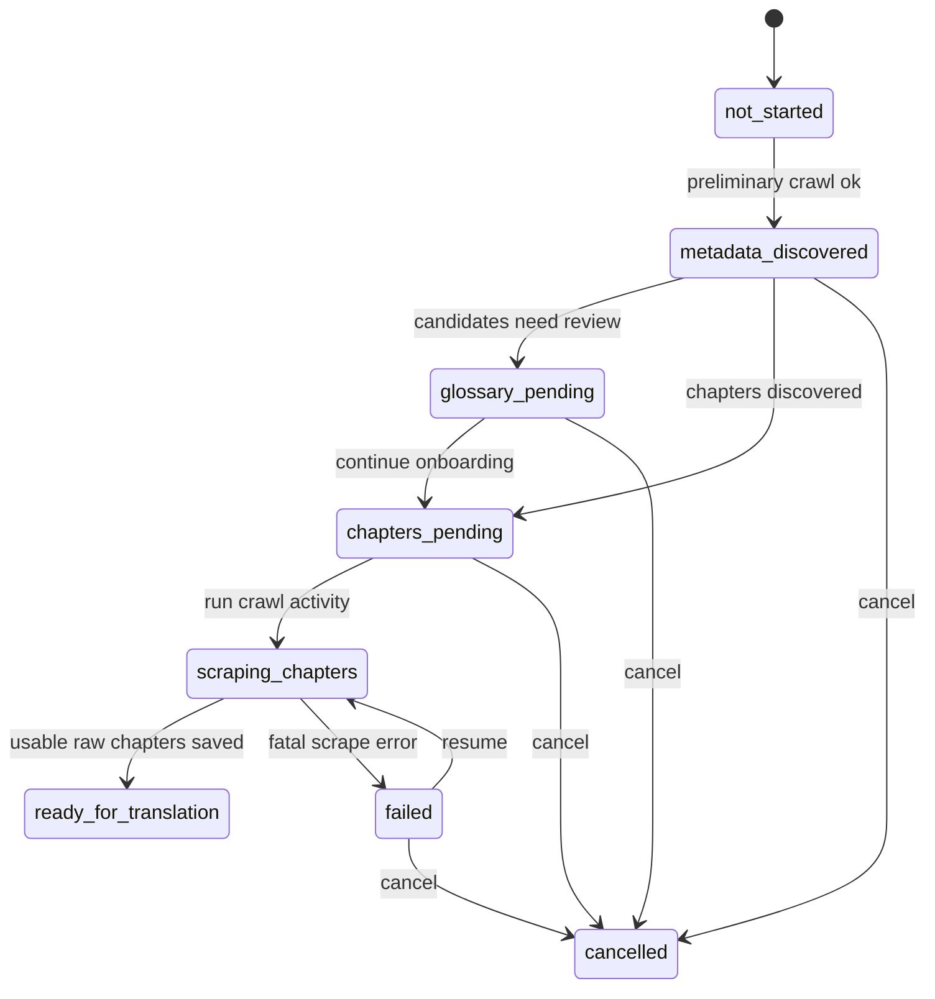

# Design: Novel Onboarding State Machine

## Overview

This design makes the add-novel workflow explicit and recoverable. Today, preliminary crawl can persist metadata and glossary candidates before chapter bodies are fetched. That is useful, but it creates a partial state that the backend and admin UI should recognize instead of treating every novel folder as equally ready.

The design adds an additive `onboarding_status` field to novel metadata, derives compatibility state for existing novels, exposes the status in admin responses, and gates translation until onboarding is complete.

## State Machine

### States

| State | Meaning |
|---|---|
| `not_started` | No onboarding work has started; mostly an internal/default state |
| `metadata_discovered` | Preliminary metadata exists, but chapter body scrape has not been started |
| `glossary_pending` | Glossary candidates/review are pending; chapter scrape may still be pending too |
| `chapters_pending` | Metadata has chapter list, but selected chapter bodies have not been fetched |
| `scraping_chapters` | Full chapter scrape is currently running |
| `ready_for_translation` | At least the required raw chapter bodies are available and translation may proceed if glossary gate passes |
| `failed` | Onboarding failed before reaching ready state |
| `cancelled` | Admin cancelled incomplete onboarding; not ready for translation |

### Transition Diagram



`glossary_pending` is not a replacement for glossary system state. It is an onboarding-visible state that should align with existing `novel.glossary_status` and glossary preflight behavior.

## Data Model

### Storage Metadata

Add fields to `metadata.json`:

```json
{
  "onboarding_status": "chapters_pending",
  "onboarding_updated_at": "2026-07-07T00:00:00Z",
  "onboarding_error_code": null,
  "onboarding_error_message": null
}
```

Optional supporting fields:

```json
{
  "onboarding_body_scrape_required": true,
  "onboarding_chapters_total": 42,
  "onboarding_chapters_scraped": 0
}
```

Keep fields additive. Existing metadata without these fields must still load.

### DB Projection

Preferred first implementation: store canonical onboarding state in `metadata.json` and expose it through existing metadata/catalog projection refresh.

If admin list queries cannot efficiently expose the status without DB support, add a DB projection field such as `Novel.onboarding_status`. If that path is chosen:

- include a migration,
- backfill existing novels by inferred status,
- keep `metadata.json` as canonical unless the project already treats SQL as canonical for workflow state.

## Status Inference for Existing Novels

Existing novels may not have `onboarding_status`.

Add helper:

```python
def infer_onboarding_status(meta: dict[str, Any], storage: StorageService, novel_id: str) -> str:
    explicit = meta.get("onboarding_status")
    if explicit in VALID_ONBOARDING_STATUSES:
        return explicit

    chapters = meta.get("chapters") or []
    if not chapters:
        return "metadata_discovered"

    raw_ids = set(storage.list_raw_chapters(novel_id))  # or equivalent helper
    if raw_ids:
        return "ready_for_translation"

    return "chapters_pending"
```

If no raw chapter listing helper exists, use existing chapter load/list APIs or catalog projection state.

## Backend Workflow Integration

### Preliminary Crawl

In `OperationsService.preliminary_crawl_novel` or the orchestrator code that saves metadata:

1. Save fetched metadata.
2. Bootstrap glossary as today.
3. Compute onboarding status:
   - `metadata_discovered` if metadata exists but no chapters are discovered.
   - `chapters_pending` if chapters are discovered and body scrape is required.
   - `glossary_pending` if existing glossary status requires review and the UI should prioritize glossary work.
4. Persist onboarding fields into `metadata.json`.
5. Return onboarding status in the preliminary crawl response.

Status choice nuance:

- If the system can only expose one status, use the most actionable blocker.
- Recommended priority: `glossary_pending` over `chapters_pending` only when glossary review must happen before translation and the UI can still show body scrape required separately.
- Otherwise, use `chapters_pending` and expose glossary state separately.

### Full Chapter Scrape

At crawl activity start:

```python
storage.update_onboarding_status(
    novel_id,
    "scraping_chapters",
    clear_error=True,
)
```

On completion:

```python
if usable_raw_chapters > 0:
    storage.update_onboarding_status(novel_id, "ready_for_translation")
else:
    storage.update_onboarding_status(
        novel_id,
        "failed",
        error_code="no_raw_chapters_saved",
        error_message="Chapter scrape finished without saving usable raw chapters.",
    )
```

On fatal exception:

```python
storage.update_onboarding_status(
    novel_id,
    "failed",
    error_code=classify_onboarding_error(exc),
    error_message=safe_error_message(exc),
)
raise
```

Do not store stack traces, full raw chapter text, provider secrets, or sensitive config in metadata.

## Storage Helper

Add helper methods near metadata storage:

```python
VALID_ONBOARDING_STATUSES = {
    "not_started",
    "metadata_discovered",
    "glossary_pending",
    "chapters_pending",
    "scraping_chapters",
    "ready_for_translation",
    "failed",
    "cancelled",
}

def update_onboarding_status(
    self,
    novel_id: str,
    status: str,
    *,
    error_code: str | None = None,
    error_message: str | None = None,
    clear_error: bool = False,
) -> dict[str, Any]:
    ...
```

Behavior:

- Validate status.
- Load metadata.
- Patch onboarding fields.
- Set `onboarding_updated_at`.
- Clear errors when `clear_error=True`.
- Save metadata using existing safe metadata write path.
- Refresh catalog projection if current patterns require it.
- Return updated metadata.

## Resume Operation

Resume should use existing crawl activity flow rather than inventing a separate scrape executor.

Possible implementation:

- Add an admin endpoint such as `POST /admin/novels/{novel_id}/onboarding/resume`.
- Or extend existing activity creation flow to accept novels in pending/failed onboarding state.

Response:

```json
{
  "novel_id": "novel-id",
  "onboarding_status": "scraping_chapters",
  "activity_id": "activity-id"
}
```

Rules:

- Do not rerun preliminary crawl by default.
- Use existing metadata chapter list.
- Respect existing crawl concurrency lock.
- If an activity is already running for this novel, return that activity or a clear conflict response.

## Cancel Operation

Add a non-destructive cancel operation:

```http
POST /admin/novels/{novel_id}/onboarding/cancel
```

Behavior:

- Allowed from `metadata_discovered`, `glossary_pending`, `chapters_pending`, and `failed`.
- Sets `onboarding_status = "cancelled"`.
- Does not delete files.
- Does not mark novel unpublished unless existing publish logic already requires that.
- Blocks translation readiness.

If the product already has a delete novel operation, the UI can offer delete separately for destructive cleanup.

## Translation Readiness Gate

Add onboarding readiness to translation preflight.

Pseudo-logic:

```python
status = resolve_onboarding_status(novel_id)
if status != "ready_for_translation":
    return PreflightIssue(
        code="onboarding_not_ready",
        message=f"Novel onboarding is {status}; complete chapter scraping before translation.",
        severity="blocking",
    )
```

This does not replace glossary gate. A novel must pass onboarding readiness and existing glossary readiness unless an existing explicit override applies to glossary only.

## Admin UI

Add onboarding status display where novels are listed or managed:

- Badge in admin library/novel list.
- Detail banner for incomplete onboarding.
- Resume action for `metadata_discovered`, `glossary_pending`, `chapters_pending`, and `failed`.
- Cancel action for incomplete or failed onboarding.
- Error display for failed onboarding.

Badge examples:

| Status | Badge | Primary action |
|---|---|---|
| `chapters_pending` | Body scrape pending | Resume scrape |
| `glossary_pending` | Glossary pending | Review glossary / resume scrape |
| `failed` | Onboarding failed | Retry |
| `cancelled` | Cancelled | Delete or resume if supported later |
| `ready_for_translation` | Ready | Translate |

## API Response Shape

Additive fields:

```json
{
  "onboarding_status": "chapters_pending",
  "onboarding_updated_at": "2026-07-07T00:00:00Z",
  "onboarding_error_code": null,
  "onboarding_error_message": null,
  "body_scrape_required": true
}
```

Apply where relevant:

- preliminary crawl response,
- admin novel detail,
- admin novel list/library,
- resume/cancel responses,
- activity completion metadata if convenient.

Update strict response models if they would otherwise drop the fields.

## Migration and Backward Compatibility

- Existing metadata without onboarding fields is supported through inference.
- No DB migration is required if metadata-only canonical state is sufficient.
- If a DB projection column is added, include a backfill migration.
- Existing crawler endpoints remain valid.
- Existing translation endpoints remain valid but gain a clearer blocking preflight issue for non-ready novels.
- Public reader behavior remains governed by publish status and reader availability policies.

## Test Design

Create focused tests such as:

- `test_preliminary_crawl_sets_chapters_pending_status`
- `test_preliminary_crawl_with_glossary_candidates_exposes_glossary_pending`
- `test_full_scrape_start_sets_scraping_chapters`
- `test_full_scrape_completion_sets_ready_for_translation`
- `test_full_scrape_fatal_failure_sets_failed_with_safe_error`
- `test_resume_pending_onboarding_creates_crawl_activity`
- `test_resume_failed_onboarding_clears_stale_error`
- `test_cancel_onboarding_sets_cancelled`
- `test_translation_blocks_when_onboarding_not_ready`
- `test_existing_metadata_without_onboarding_status_infers_ready`
- `test_admin_novel_list_includes_onboarding_status`

No tests should perform real network requests.

## Acceptance Criteria

1. Preliminary crawl records explicit onboarding state.
2. Full scrape start/completion/failure updates onboarding state.
3. Admin can resume pending or failed onboarding.
4. Admin can cancel incomplete onboarding non-destructively.
5. Translation is blocked for non-ready onboarding states.
6. Existing novels without onboarding fields remain compatible through inference.
7. Admin list/detail responses expose onboarding status additively.
8. Existing glossary gate remains intact.
9. Focused backend and UI tests pass.

