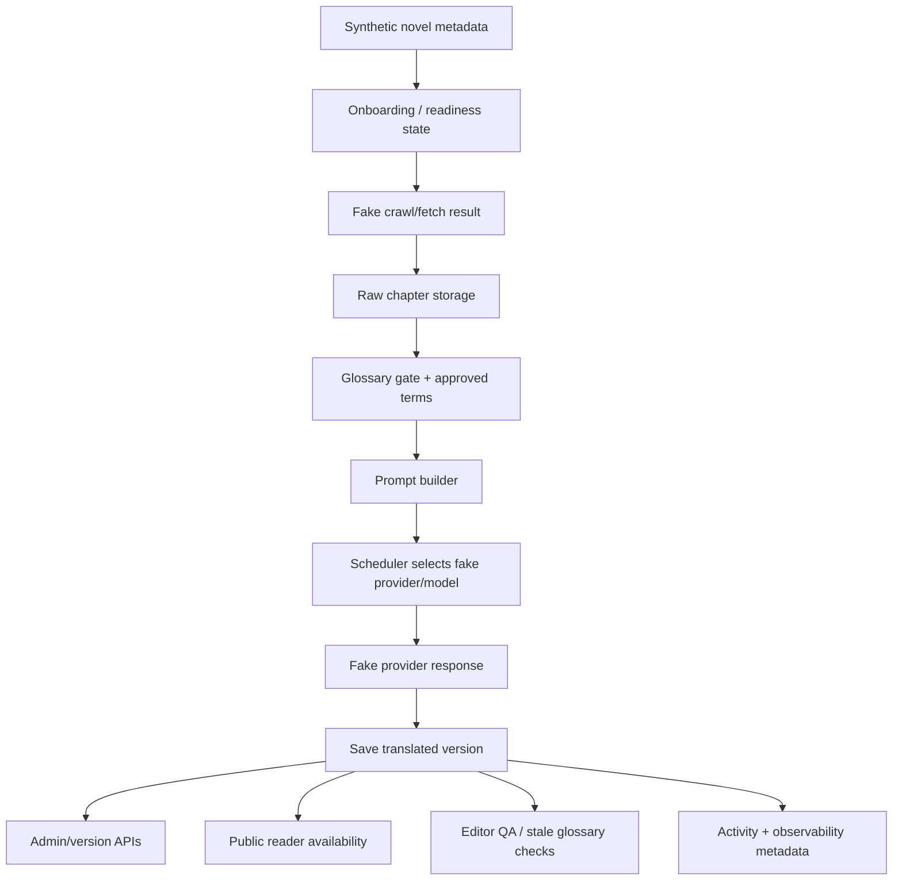

# Design: Translation Integration Regression Suite

## Overview

This design adds an expanded backend regression suite for the translation-related architecture that has landed or is being implemented across the current specs.

A basic end-to-end integration suite already exists or has already been completed, so this spec should not duplicate broad E2E coverage. Instead, it creates deterministic regression tests around the high-risk seams introduced by the newer specs:

- crawl/fetch observability,
- public reader availability,
- JP-EN prompt quality policy,
- glossary revision translation invalidation,
- translation scheduler observability,
- glossary-aware editor QA,
- export/storage observability,
- storage contract behavior,
- onboarding state transitions that gate translation readiness.

The suite uses real orchestration and storage paths where practical, but replaces external systems with deterministic fakes. No test should call live translation providers, real source websites, real object storage, or public network services.

## Goals

The suite should prove that:

- synthetic raw chapters can flow into versioned translated storage,
- glossary gates and approved-term prompt injection remain intact,
- scheduler fallback and observability metadata are captured safely,
- translation cache identity changes when prompt/glossary/model dimensions change,
- stale glossary translations are detected and can be retranslated safely,
- public reader availability behavior remains stable,
- crawl/fetch observability metadata does not corrupt onboarding or translation state,
- editor QA can resolve glossary terms against the correct glossary revision,
- failure paths do not corrupt active translation versions or activity metadata.

## Non-Goals

This suite does not:

- replace unit tests for individual services,
- replace existing E2E tests,
- call live LLM providers,
- call real crawler websites,
- validate translation literary quality through live model output,
- add new production behavior except minimal dependency-injection seams,
- change storage schemas,
- change scheduler policy,
- change public reader rendering behavior.

## Architecture

### Affected Files

| File | Change type |
|---|---|
| `backend/tests/test_translation_integration_regression.py` | New expanded regression suite |
| `backend/tests/fixtures/translation_integration/` | Synthetic novel, chapter, glossary, translation, and reader fixtures |
| Existing `backend/tests/conftest.py` | Add reusable fake provider, fake adapter, storage, glossary, scheduler, and activity fixtures |
| Existing test helper modules | Add helpers for versioned translation storage, fake scheduler decisions, fake crawl results, and public reader setup |
| Translation provider factory or registry | Add minimal test override seam only if current code cannot inject fake providers |
| Source adapter registry | Add fake adapter only for tests if needed |
| Storage backend fixture setup | Use local temp storage and fake object storage projection where needed |

### Files Not Touched

- Production prompt templates, unless tests reveal a missing injection seam.
- Scheduler policy logic.
- Glossary business rules.
- Public reader implementation.
- Storage schemas.
- Provider credentials/config loading.
- Real source adapters.

## Test Topology

The suite should exercise real backend paths with deterministic fakes:



## Fixture Design

### Synthetic Novel Fixture

Create a reusable synthetic novel with:

- `novel_id`,
- public slug,
- source language `ja`,
- target language `en`,
- two or more chapters,
- raw chapter bundles,
- optional translated versions,
- optional glossary state,
- temporary storage root,
- test DB session where required.

Use short synthetic text only:

```text
太郎は王都へ向かった。
```

Do not use copyrighted novel text.

### Glossary Fixtures

Provide helpers for:

- approved glossary entries,
- pending glossary entries,
- glossary-ready novel,
- glossary-pending novel,
- glossary revision increment,
- stale glossary snapshot,
- legacy translation without glossary metadata.

Example glossary entries:

| Source Term | Approved Translation | Status |
|---|---|---|
| `王都` | `Royal Capital` | approved |
| `太郎` | `Taro` | approved |

### Fake Translation Provider

Fake provider behavior:

```python
class FakeTranslationProvider:
    def __init__(
        self,
        responses: dict[str, str] | None = None,
        error: Exception | None = None,
    ):
        ...

    async def translate(self, request: TranslationRequest) -> TranslationResponse:
        if self.error:
            raise self.error
        return TranslationResponse(text=self._response_for(request))
```

The fake provider must record requests so tests can inspect:

- selected provider/model,
- prompt text,
- glossary block presence,
- JP-EN prompt policy instructions,
- JSON output instructions,
- request ID/job ID when available,
- cache hit/miss behavior where exposed.

### Fake Scheduler Fixtures

Provide deterministic scheduler states for:

- primary available,
- primary cooling down,
- primary quota exhausted,
- RPM limited,
- RPD limited,
- fallback available,
- all unavailable,
- checkpoint blocked,
- memory pressure.

Scheduler state must reset between tests.

### Fake Crawl Adapter Fixture

Provide a fake source adapter that can produce:

- discovered metadata,
- chapter list,
- raw chapter content,
- partial chapter failure,
- retryable fetch failure,
- image download error metadata.

No tests should perform real HTTP.

### Public Reader Fixtures

Provide helpers for:

- published novel,
- unpublished novel,
- active translation available,
- chapter exists but untranslated,
- saved non-active translation version,
- owner-authenticated request,
- public unauthenticated request.

## Test Categories

### 1. Core Translation Storage Regression

Tests:

- raw synthetic chapter translates into saved translated version,
- version list contains the new version,
- active version loads expected text,
- provider/model metadata is stored,
- retranslation creates a second version,
- old version remains listable,
- active-version behavior matches current storage rules.

### 2. Glossary Gate and Prompt Injection Regression

Tests:

- pending glossary blocks translation,
- glossary-ready novel allows translation,
- approved glossary terms appear in fake provider prompt,
- pending terms do not appear as approved injected terms,
- `skip_glossary_gate` works only where existing behavior supports it,
- prompt glossary block is not duplicated,
- glossary revision/hash metadata reaches translation version metadata where implemented.

### 3. JP-EN Prompt Policy Regression

Tests should assert prompt/request shape, not live model quality.

Tests:

- JP-EN prompt includes quality policy instructions,
- non-JP-EN prompt does not include JP-EN-specific policy by default,
- glossary compliance instructions remain present,
- honorific policy instructions render correctly,
- ambiguity/omitted-subject instructions remain present,
- dialogue/register instructions remain present,
- chapter title/body separation instructions remain present,
- JSON mode accepts optional review metadata when parser support exists.

### 4. Scheduler Selection and Observability Regression

Tests:

- primary model selected when available,
- fallback model selected when primary is cooling down,
- fallback model selected when primary quota is exhausted,
- no-capacity state records a safe failure,
- selected provider/model metadata matches scheduler decision,
- scheduler decision includes stable skip reason codes,
- scheduler summary is written to activity metadata,
- request ID/job ID/chapter ID are preserved where available,
- candidate lists are bounded and redacted.

### 5. Cache Identity Regression

Tests:

- same source/model/prompt/glossary state reuses cache,
- force/retranslate bypasses cache,
- model change changes cache key,
- provider change changes cache key,
- prompt policy version changes cache key when available,
- glossary revision/hash changes cache key when available,
- legacy cache entries without glossary identity are not reused for non-zero glossary revision.

### 6. Glossary Revision Invalidation Regression

Tests:

- translation version stores glossary revision,
- translation version stores glossary hash when available,
- active version becomes stale after glossary revision increment,
- historical versions compute freshness independently,
- legacy versions without glossary metadata remain loadable,
- retranslate-stale creates a new fresh version,
- stale detection does not deactivate active version,
- old stale versions remain available for comparison.

### 7. Crawl/Fetch Observability Regression

Tests:

- fake crawl activity persists `metadata.crawl_result`,
- per-chapter failure records include safe error category/status/retry fields,
- fatal crawl error does not write misleading partial `crawl_result`,
- running crawl progress updates `metadata.progress`,
- source health aggregates stored crawl results,
- image download failures are counted by affected chapter count,
- crawl observability metadata does not break translation readiness state.

### 8. Public Reader Availability Regression

Tests:

- default `hard_404` still returns 404 for missing translation,
- `chapter_shell` returns 200 with `text=null`,
- `latest_version` returns newest saved version when active version is missing,
- active version is always preferred when present,
- owner can preview `?version_id=`,
- public unauthenticated `?version_id=` is ignored,
- chapter list includes additive `availability_status`,
- public reader does not expose admin-only glossary/scheduler metadata.

### 9. Editor QA and Glossary Resolution Regression

Tests:

- editor QA resolves approved glossary terms against current revision,
- stale translation version is flagged when glossary revision changes,
- editor QA does not treat pending terms as approved,
- approved-term suggestions preserve configured term casing/spelling,
- QA metadata remains admin/editor-only,
- public reader output is unaffected.

### 10. Failure Safety Regression

Tests:

- missing raw chapter produces safe preflight/per-chapter failure,
- fake provider failure does not create active partial version,
- partial chapter failure does not erase successful translations when partial success is supported,
- fatal translation activity records top-level error metadata,
- failed retranslation does not overwrite active version,
- failed scheduler no-capacity path does not corrupt activity metadata.

## Conditional Assertions

Some observability fields may depend on whether related specs have landed.

Use helper assertions:

```python
def assert_optional_field_if_present(payload: dict, key: str, validator: Callable[[Any], None]) -> None:
    if key in payload:
        validator(payload[key])
```

Guidelines:

- Core translation storage behavior should be mandatory.
- Already-landed specs should have strict assertions.
- Not-yet-landed optional observability fields may use conditional assertions temporarily.
- Once a related spec lands, convert conditional assertions into strict regression tests.
- Do not let optional fields silently disappear after they are considered complete.

## Dependency Injection Strategy

Preferred injection strategy:

- use existing provider factory override,
- override provider registry in tests,
- inject fake scheduler configs/runtime state,
- use fake source adapter registry,
- use temporary local storage root,
- use test DB session fixtures,
- use fake object storage projection where needed,
- use dependency overrides for owner/admin auth.

If production code lacks injection seams, add minimal optional parameters that default to current production behavior:

```python
TranslationService(
    ...,
    provider_factory: ProviderFactory | None = None,
)
```

No production default should change.

## Test Isolation Rules

- No live provider calls.
- No real HTTP crawler calls.
- No real S3/object storage calls.
- No dependence on test ordering.
- Reset scheduler runtime state between tests.
- Reset glossary revision/cache state between tests.
- Use synthetic text only.
- Use temporary storage directories.
- Use deterministic timestamps where possible.
- Use deterministic fake provider outputs.

## Test Commands

Focused command:

```bash
pytest backend/tests/test_translation_integration_regression.py --tb=short -q
```

Related commands:

```bash
pytest backend/tests/test_translation*.py --tb=short -q
pytest backend/tests/test_public_reader_availability.py --tb=short -q
pytest backend/tests/test_glossary_revision_translation_invalidation.py --tb=short -q
pytest backend/tests/test_translation_scheduler_observability.py --tb=short -q
pytest backend/tests/test_crawl_fetch_observability.py --tb=short -q
```

Run lint/type checks on changed test helpers and production seams.

## Migration and Backward Compatibility

- Existing integration tests remain valid.
- New tests are additive.
- Production behavior must not change except minimal dependency-injection seams.
- Existing translation versions remain loadable.
- Existing activity records remain loadable.
- Existing public reader behavior remains unchanged unless an opt-in policy test explicitly configures it.
- Existing scheduler policy and glossary workflows remain unchanged.

## Acceptance Criteria

1. Regression suite translates a synthetic raw chapter into versioned translated storage.
2. Glossary gate and approved-term prompt injection are verified with deterministic fakes.
3. JP-EN prompt policy behavior is covered by prompt/request assertions.
4. Scheduler fallback and no-capacity behavior are covered without changing scheduler policy.
5. Scheduler observability metadata is asserted where implemented.
6. Cache reuse and invalidation dimensions are covered.
7. Glossary stale-version detection and stale retranslation are covered.
8. Crawl/fetch observability metadata is covered without real HTTP.
9. Public reader availability policies are covered.
10. Editor QA glossary-resolution behavior is covered where implemented.
11. Failure tests prove active translations are not corrupted.
12. Tests are deterministic, isolated, synthetic, and do not call live providers.
13. Focused regression command passes.