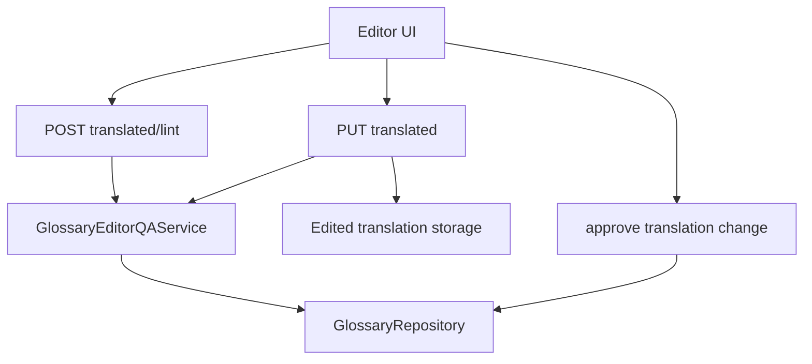

# Design: Glossary-Aware Editor QA

## Overview

This design adds deterministic glossary QA to the manual editor path. It protects approved terminology after machine translation by checking editor changes before and during save. The spec also absorbs the earlier partial `editor-glossary-enforcement` work, so preview linting, save-time enforcement, override metadata, and glossary update shortcuts are handled in one place.

The design is intentionally deterministic. It does not ask an LLM whether terminology is correct. It checks known approved glossary entries against source text and edited translation text, then returns structured issues that the editor UI can render and the backend can enforce.

## Goals

- Catch edited translations that drop approved glossary translations.
- Catch forbidden or stale variants introduced by manual edits.
- Let editors preview glossary issues before saving.
- Allow configured blocking behavior for strict or locked terms.
- Preserve an auditable override path.
- Provide an admin shortcut to update an approved glossary translation when the edit is intentionally better.
- Keep legacy editor saves working when glossary data is absent.

## Non-Goals

- Semantic translation review.
- Public reader annotations.
- Batch linting for all chapters.
- Replacing prompt-time glossary injection.
- Implementing full revision invalidation. This spec emits enough metadata for the invalidation spec to consume.

## Current System Context

The existing editor save route stores edited translated chapter content but does not validate it against glossary entries. Approved glossary entries are already available through the glossary repository and are used by prompt-related services in other specs. This feature reuses those entries for editor QA.

The implementation should prefer existing repository, auth, schema, and editor route patterns. If the current code names the service `GlossaryLintService`, that name is acceptable, but the API response should expose the broader concept as `glossary_qa`.

## Architecture



## Backend Components

| Component | Responsibility |
| --- | --- |
| `GlossaryEditorQAService` | Computes deterministic QA results for edited text. |
| `GlossaryRepository` | Loads approved glossary entries and updates approved translations. |
| Editor router | Adds preview lint endpoint and save-time QA integration. |
| Admin glossary router | Adds approve translation change shortcut. |
| Edited translation storage | Persists QA summaries and override metadata with edited versions. |
| Editor frontend | Displays issues, supports preview lint, override, and approve term change actions. |

## QA Service

Create `backend/src/novelai/services/glossary_editor_qa_service.py`, or use `glossary_lint_service.py` if that better matches the existing naming. The service should stay independent of HTTP concerns.

Suggested signature:

```python
class GlossaryEditorQAService:
    def check_edit(
        self,
        *,
        platform_novel_id: int | None,
        novel_slug: str,
        chapter_id: str,
        edited_text: str,
        source_text: str | None,
        user_id: int | None = None,
        max_terms: int = 50,
    ) -> GlossaryQAResult:
        ...
```

The service should:

- Load approved glossary entries for the novel.
- Include inherited global entries if the current glossary repository already supports that behavior.
- Prefer source-text matching to decide which entries are relevant.
- Fall back to advisory all-entry checking when source text is unavailable.
- Match source terms and translations with normalized case-insensitive substring checks first.
- Avoid mutating glossary entries.
- Return a stable data contract suitable for API responses and persisted summaries.

## Matching Rules

| Rule | Behavior |
| --- | --- |
| Source relevance | If `source_text` is present, only entries whose `canonical_term` or aliases appear in source text are required. |
| Missing approved translation | If a relevant term's `approved_translation` is absent from edited text, emit `missing_required_term` or `missing_approved_translation`. |
| Forbidden variant | If an entry's forbidden variant appears in edited text, emit `forbidden_variant`. |
| Non-approved variant | If a known non-approved variant appears while the approved translation is absent, emit `non_approved_translation`. |
| Ambiguous match | If matching cannot confidently distinguish approved translation from a substring collision, emit `ambiguous_match` as warning/advisory. |
| No source context | If source text is absent, add `legacy_no_source_context` note and avoid blocking solely because a term was not detected in source. |

This first implementation can use deterministic substring matching. Word-boundary or tokenizer improvements can be added later for languages and scripts where substring collisions become noisy.

## Severity Mapping

| Glossary entry state | Default severity | Save behavior |
| --- | --- | --- |
| `owner_locked = true` | `error` | Blocking unless override is accepted. |
| `enforcement_level in strict|required|blocking` | `error` | Blocking unless override is accepted. |
| `enforcement_level = warning` | `warning` | Save succeeds with issue metadata. |
| `enforcement_level in advisory|soft` | `advisory` | Save succeeds with note. |
| Unknown enforcement level | `warning` | Save succeeds with issue metadata. |

If the current schema does not yet include `enforcement_level`, derive severity from `owner_locked` first and treat all other approved terms as warnings.

## API Contracts

### Preview Lint

Route:

```http
POST /{novel_id}/chapters/{chapter_id}/translated/lint
```

Request:

```json
{
  "text": "Edited translated chapter text",
  "source_text": "Optional source chapter text",
  "max_terms": 50
}
```

Response:

```json
{
  "glossary_qa": {
    "status": "warning",
    "novel_id": "my-novel",
    "platform_novel_id": 123,
    "chapter_id": "chapter-001",
    "glossary_revision": 7,
    "checked_terms": 12,
    "issue_count": 2,
    "has_errors": false,
    "has_warnings": true,
    "source_context": "provided",
    "notes": [],
    "issues": [
      {
        "issue_id": "gqa_001",
        "entry_id": 42,
        "canonical_term": "魔王",
        "approved_translation": "Demon King",
        "matched_variant": "Devil Lord",
        "severity": "warning",
        "code": "non_approved_translation",
        "owner_locked": false,
        "context_hint": "Use approved glossary translation: Demon King."
      }
    ]
  }
}
```

If the `Novel` DB row cannot be resolved, return HTTP 200:

```json
{
  "glossary_qa": {
    "status": "advisory",
    "checked_terms": 0,
    "issue_count": 0,
    "issues": [],
    "notes": ["Glossary not available for this novel."]
  }
}
```

### Save-Time QA

Route:

```http
PUT /{novel_id}/chapters/{chapter_id}/translated
```

Extend the request schema with optional fields:

```json
{
  "text": "Edited translated chapter text",
  "lint": true,
  "source_text": "Optional source chapter text",
  "glossary_override": {
    "reason": "The new term is more accurate in this context.",
    "issue_ids": ["gqa_001"]
  }
}
```

Behavior:

- Run QA before committing active edited content when QA is enabled or enforcement is configured for the novel.
- Return `glossary_qa` when `lint=true`.
- Return HTTP 409 with `glossary_qa` when blocking issues exist and no valid override is provided.
- Save successfully and mark status `overridden` when an authorized override is provided.
- Do not fail solely because glossary data is unavailable.

### Approve Translation Change

Route:

```http
POST /{novel_id}/glossary/entries/{entry_id}/approve-translation-change
```

Request:

```json
{
  "new_translation": "Demon King",
  "rationale": "Matches the established English title in edited chapters."
}
```

Response:

```json
{
  "entry_id": 42,
  "canonical_term": "魔王",
  "approved_translation": "Demon King",
  "glossary_revision": 8,
  "updated_at": "2026-07-08T00:00:00Z"
}
```

The endpoint should record a glossary decision event with `event_type = "approve"` or the nearest existing event type.

## Result Status

| Status | Meaning |
| --- | --- |
| `passed` | Checked terms found no issues. |
| `advisory` | QA ran with notes only, or glossary data was unavailable. |
| `warning` | Non-blocking issues exist. |
| `blocked` | Blocking issues exist and no override was accepted. |
| `overridden` | Blocking issues existed, but an authorized override allowed save. |

## Persistence

When an edited translation is saved after QA, persist a compact summary with the edited translation version or edit history record:

```json
{
  "glossary_qa": {
    "status": "overridden",
    "glossary_revision": 8,
    "checked_terms": 12,
    "issue_count": 1,
    "issues": [
      {
        "entry_id": 42,
        "canonical_term": "魔王",
        "approved_translation": "Demon King",
        "severity": "error",
        "code": "missing_required_term"
      }
    ],
    "override": {
      "user_id": 10,
      "reason": "Intentional local title treatment.",
      "issue_ids": ["gqa_001"],
      "created_at": "2026-07-08T00:00:00Z"
    }
  }
}
```

Do not store full source text in QA metadata. If text context is needed for display, store a short sanitized snippet or recompute QA on demand.

## Authorization

| Action | Required permission |
| --- | --- |
| Preview lint | Same as editing translated chapter. |
| Save with non-blocking QA | Same as editing translated chapter. |
| Save with override | Owner/admin or explicit glossary override permission. |
| Approve translation change | Owner/admin for the novel or glossary scope. |

## Frontend Behavior

The editor should add a glossary QA panel or inline issue list near the translated text. It can run preview lint from a button or debounce after edits. The UI should make the distinction between advisory, warning, blocked, and overridden states clear.

For blocking issues, the UI should offer:

- Fix the edited text.
- Override with a required reason, if the user has permission.
- Approve the new translation globally, if the issue represents a better glossary translation and the user has permission.

The UI should treat glossary-unavailable results as non-blocking.

## Observability

Log structured QA events:

- `novel_id`
- `chapter_id`
- `platform_novel_id`
- `glossary_revision`
- `checked_terms`
- `issue_count`
- `status`
- `elapsed_ms`

Do not log full source or translated chapter text.

## Failure Handling

| Failure | Behavior |
| --- | --- |
| Glossary novel row missing | Preview returns advisory empty result; save continues unless another error exists. |
| Glossary repository error | Preview returns service error if direct lint call; save treats QA as unavailable only if existing editor policy allows soft failure. |
| Invalid override payload | Save returns 400. |
| Blocking issue without override | Save returns 409 with `glossary_qa`. |
| Unauthorized approval | Return existing auth error style. |

## Test Strategy

- Unit-test matching, severity mapping, source-context handling, term caps, and empty glossary behavior.
- API-test preview lint success, missing novel advisory response, auth errors, save with warnings, save blocked by strict term, save with override, and approval endpoint.
- Storage-test persisted QA metadata on edited version files or DB records.
- Frontend-test issue rendering, blocked save flow, override reason validation, and approve translation change action.

