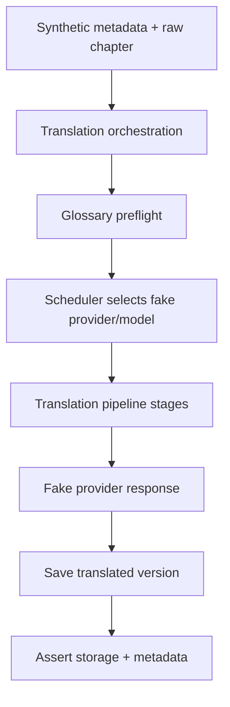

# Design: Translation Integration Test Suite

## Overview

This design adds a focused integration test suite for the translation backend. The suite runs real orchestration and storage paths with deterministic fake providers. It proves that raw chapters can be translated into versioned storage, glossary gates and prompt injection work, scheduler fallback is respected, cache behavior is stable, and failure paths do not corrupt stored translations.

The suite is test infrastructure only. It should not change production behavior except for small dependency-injection seams if needed.

## Architecture

### Affected Files

| File | Change type |
|---|---|
| `backend/tests/test_translation_integration.py` | New integration test module |
| `backend/tests/fixtures/translation_integration/` | Synthetic fixtures if file-based fixtures are useful |
| Existing `conftest.py` or test helper modules | Add reusable fake provider/storage/glossary fixtures |
| Translation provider factory or service injection seam | Minimal test injection only if current code cannot use fakes |

### Files Not Touched

- Production prompt templates, except if tests reveal missing injection seams.
- Scheduler policy logic.
- Glossary business rules.
- Storage schemas.
- Public reader routes.

## Test Topology

The tests should exercise this path:



## Fixture Design

### Synthetic Novel Fixture

Create a synthetic novel with:

- `novel_id`,
- metadata with title/source language/target language/chapter list,
- one or more raw chapter bundles,
- optional glossary state,
- temporary storage root.

Use short synthetic text:

```text
太郎は王都へ向かった。
```

Do not use copyrighted novel text.

### Glossary Fixtures

Create helpers:

- approved glossary entries,
- pending glossary entries,
- glossary-ready novel,
- glossary-pending novel.

Example:

| Source Term | Approved Translation | Status |
|---|---|---|
| `王都` | `Royal Capital` | approved |
| `太郎` | `Taro` | approved |

### Fake Provider

Fake provider behavior:

```python
class FakeTranslationProvider:
    def __init__(self, responses: dict[str, str] | None = None, error: Exception | None = None):
        ...

    async def translate(self, request: TranslationRequest) -> TranslationResponse:
        if self.error:
            raise self.error
        return TranslationResponse(text=self._response_for(request))
```

The fake should record requests so tests can inspect:

- prompt text,
- glossary block presence,
- provider/model used,
- JSON mode fields if applicable.

### Scheduler Fixtures

Provide model configs and runtime state for:

- primary available,
- primary cooling down,
- primary exhausted,
- all unavailable.

Keep scheduler state reset between tests.

## Test Categories

### 1. Happy Path

Test:

- metadata and raw chapter exist,
- glossary ready,
- fake provider returns deterministic translation,
- translation orchestration runs,
- translated chapter is saved,
- version list contains new version,
- active version loads expected text,
- provider/model metadata is stored.

### 2. Glossary Gate and Prompt Injection

Test:

- pending glossary blocks translation,
- `skip_glossary_gate` allows translation when current behavior supports it,
- approved glossary terms appear in fake provider request prompt,
- prompt glossary block and chunk glossary do not duplicate conflict sections,
- glossary metadata reaches context/version metadata when available.

### 3. Scheduler Fallback

Test:

- primary model selected when available,
- fallback model selected when primary cooling down,
- fallback selected when primary quota exhausted,
- no-capacity state raises/records clear failure,
- selected provider/model metadata matches scheduler decision.

### 4. Cache Behavior

Test:

- same source/model/prompt/glossary state reuses cache,
- force/retranslate bypasses cache,
- model change changes cache key,
- prompt policy version changes cache key if available,
- glossary revision/hash changes cache key if available.

Optional tests can be skipped or marked conditional until dependent specs exist.

### 5. Versioning and Retranslation

Test:

- first translation creates `v1` or equivalent initial version,
- retranslation creates another version,
- old version remains listable,
- active version behavior matches current storage rules,
- version metadata remains intact.

### 6. Failure Safety

Test:

- missing raw chapter produces preflight/per-chapter failure,
- fake provider failure does not create active partial version,
- partial chapter failure does not erase successful translations if partial success is supported,
- fatal activity status/error metadata is recorded.

## Conditional Assertions for Other Specs

This suite may coexist with specs that are not always implemented yet.

Use helper checks:

```python
if "glossary_diagnostics" in version:
    assert ...

if "scheduler_decision" in version:
    assert ...
```

Do not make this suite fail only because optional observability fields from another spec are absent, unless that spec has already landed in the target branch.

## Dependency Injection Strategy

Preferred:

- use existing provider factory injection,
- override provider registry in tests,
- inject fake scheduler configs,
- use temporary storage root,
- use test DB session fixtures.

If production code lacks injection seams, add minimal optional parameters that default to current production behavior:

```python
TranslationService(..., provider_factory: ProviderFactory | None = None)
```

No production default should change.

## Test Commands

Focused command:

```bash
pytest backend/tests/test_translation_integration.py --tb=short -q
```

Also run:

```bash
pytest backend/tests/test_translation*.py --tb=short -q
```

when practical.

## Acceptance Criteria

1. Integration suite translates a synthetic raw chapter into saved translated version storage.
2. Glossary gate blocks pending glossary and allows ready/bypassed flows according to existing rules.
3. Fake provider request proves glossary terms are injected into prompt.
4. Scheduler fallback tests prove primary/fallback/no-capacity behavior.
5. Cache tests prove reuse and invalidation dimensions that exist in the codebase.
6. Retranslation creates a new version and preserves historical versions.
7. Provider failure does not corrupt active translation state.
8. Tests are deterministic, isolated, synthetic, and do not call live providers.
9. Focused test command passes.

