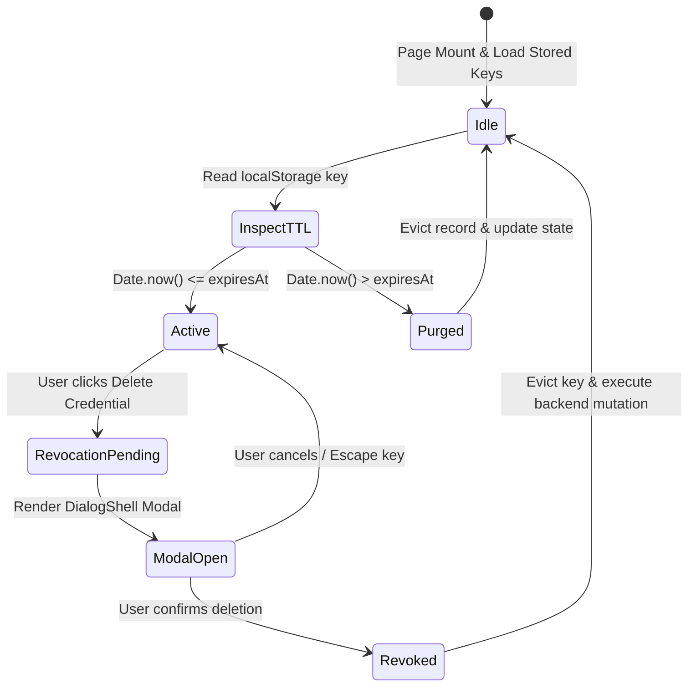
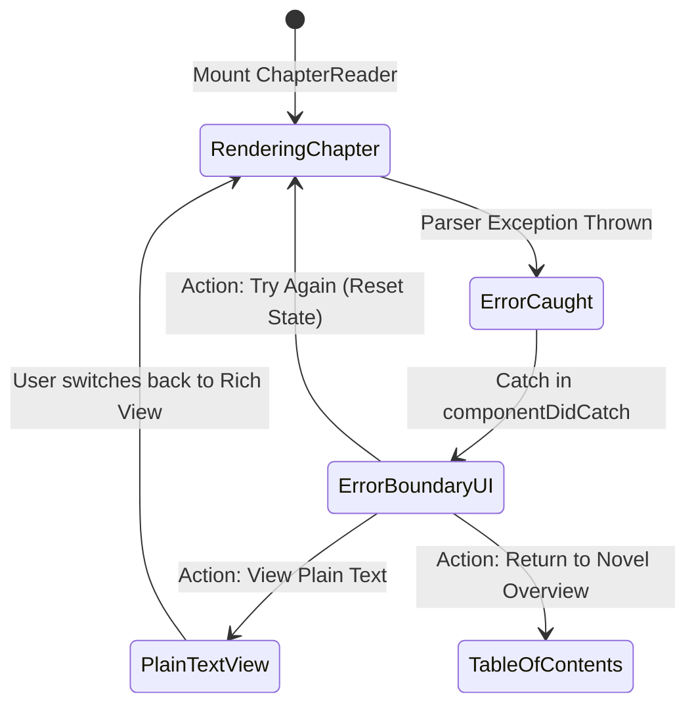

# Frontend Audit Remediation Design

Spec ID: frontend-audit-remediation
Version: 1.1.0
Status: Active
Updated: 2026-09-05

## Source of Truth Mapping

- Primary Architecture: `docs/ARCHITECTURE.md` (System boundaries between public reader, admin panel, R2 object store, and FastAPI backend)
- Frontend Architecture: `frontend/README.md` and `docs/DESIGN.md` (Zustand stores, TanStack Query caching, App Router layout hierarchy, and DialogShell conventions)
- Security & Storage Invariants: `docs/STORAGE.md` and `docs/CONFIGURATION.md` (R2 storage keys, client token TTL, and cookie flags)
- Audit Findings Reference: `AUDIT.md` (Comprehensive audit of 285 files covering all 100 findings across Iterations 1 through 10, specifically targeting Critical and High severity findings 1.1, 1.2, 1.3, 2.3, 2.8, 3.1, 3.6, 4.1, 5.1, 5.3, 6.1, 7.1, 7.2, 7.5, 8.1, 8.8, 9.3, 10.1)

---

## Traceability

| Requirement | Acceptance Criterion | Planned Task | Module / Component | Finding Reference |
| :--- | :--- | :--- | :--- | :--- |
| REQ-1 | AC-1 | T-001 | `frontend/app/(public)/novels/[slug]/page.tsx` | Finding 1.1 (JSON-LD Script Injection) |
| REQ-2 | AC-2 | T-002 | `frontend/app/(public)/account/contributions/page.tsx` | Finding 1.2 (Native confirm in Sandboxed UI) |
| REQ-3 | AC-3 | T-003 | `frontend/lib/public-api.ts` | Finding 1.3 (Open-Redirect Whitespace Evasion) |
| REQ-4 | AC-4 | T-004 | `frontend/components/public/public-header.tsx`, `chapter/[chapterId]/page.tsx` | Findings 2.3, 7.1, 7.2 (Unthrottled Scroll Handlers) |
| REQ-5 | AC-5 | T-005 | `frontend/components/public/reader-controls.tsx` | Finding 2.8 (Unscoped Global Hotkeys) |
| REQ-6 | AC-6 | T-006 | `frontend/components/reader/reader-error-boundary.tsx` | Finding 3.1 (Reader Error Boundary Fallback) |
| REQ-7 | AC-7 | T-007 | `frontend/lib/public-api.ts` | Finding 3.6 (Fetch AbortSignal & Timeout Propagation) |
| REQ-8 | AC-8 | T-008 | `frontend/lib/store.ts` | Finding 4.1 (Monolithic UI Store Partitioning) |
| REQ-9 | AC-9 | T-009 | `frontend/app/(admin)/admin/layout.tsx` | Finding 5.1 (Admin Layout Client-Only Auth Guard) |
| REQ-10 | AC-10 | T-010 | `frontend/app/(public)/browse-novels/page.tsx` | Finding 5.3 (Missing Suspense around SearchParams) |
| REQ-11 | AC-11 | T-011 | `frontend/components/ui/button.tsx` | Finding 6.1 (Button Component Implicit Submit Type) |
| REQ-12 | AC-12 | T-012 | `frontend/app/(admin)/admin/analytics/page.tsx` | Finding 7.5 (Dynamic Lazy Loading for Recharts) |
| REQ-13 | AC-13 | T-002 | `frontend/app/(public)/account/contributions/page.tsx` | Finding 8.1 (Contributor Token TTL Expiry) |
| REQ-14 | AC-14 | T-003 | `frontend/lib/cookie-utils.ts` | Finding 8.8 (Secure & SameSite Cookie Flags) |
| REQ-15 | AC-15 | T-013 | `frontend/components/admin/cover-uploader.tsx` | Finding 9.3 (Cover File Magic Byte Validation) |
| REQ-16 | AC-16 | T-014 | `frontend/lib/types.ts` | Finding 10.1 (Publication Status Enum Alignment) |
| NFR-1 | AC-5 | T-005 | Frontend Test Suite (`components/public/reader-controls.test.tsx`) | Hotkey focus isolation validation |
| NFR-1 | AC-6 | T-006 | Frontend Test Suite (`components/reader/reader-error-boundary.test.tsx`) | Error boundary fallback validation |
| NFR-1 | AC-7 | T-007 | Frontend Test Suite (`lib/public-api.test.ts`) | Public API timeout signal validation |
| NFR-1 | AC-8 | T-008 | Frontend Test Suite (`lib/store.test.ts`) | State store partitioning validation |
| NFR-1 | AC-10 | T-010 | Frontend Test Suite (`app/(public)/browse-novels/page.test.tsx`) | Suspense boundary rendering validation |
| NFR-1 | AC-11 | T-011 | Frontend Test Suite (`components/ui/button.test.tsx`) | Button default type verification |
| NFR-1 | AC-12 | T-012 | Frontend Test Suite (`app/(admin)/admin/analytics/page.test.tsx`) | Dynamic bundle import validation |
| NFR-2 | AC-16 | T-014 | TypeScript Typecheck & Lint (`npm run typecheck`) | Domain enum type synchronization |
| NFR-3 | AC-4 | T-004 | Frontend Test Suite (`components/public/public-header.test.tsx`) | rAF scroll throttle verification |
| SEC-1 | AC-2 | T-002 | `frontend/app/(public)/account/contributions/page.tsx` | Sandboxed credential confirmation modal |
| SEC-1 | AC-9 | T-009 | `frontend/app/(admin)/admin/layout.tsx` | Server-side admin layout authentication guard |
| SEC-1 | AC-13 | T-002 | `frontend/app/(public)/account/contributions/page.tsx` | Contributor token TTL expiry & eviction |
| SEC-1 | AC-14 | T-003 | `frontend/lib/cookie-utils.ts` | Secure & SameSite cookie flag enforcement |
| SEC-2 | AC-1 | T-001 | `frontend/app/(public)/novels/[slug]/page.tsx` | JSON-LD metadata script escape |
| SEC-2 | AC-3 | T-003 | `frontend/lib/public-api.ts` | Safe return URL normalization & origin check |
| SEC-2 | AC-15 | T-013 | `frontend/components/admin/cover-uploader.tsx` | Cover image header magic byte validation |

---

## System Architecture & Component Interaction

```mermaid
flowchart TD
    subgraph Browser Client Context
        User[Browser User / Reader / Admin]
        PublicApp[Public Reader App Router: /novels, /chapter, /browse-novels]
        AdminApp[Admin Console App Router: /admin/*]
    end

    subgraph Security & Boundary Sanitizers
        SafeRedirect[safeRelativeReturnPath: Control Char & Whitespace Stripping]
        JsonSanitizer[JSON-LD Escaper: replace /</g, '\u003c']
        CookieGuard[cookie-utils: SameSite=Lax; Secure; path=/]
        MagicValidator[validateImageMagicBytes: PNG, JPEG, WEBP header checks]
    end

    subgraph Isolated Client Stores [Zero-Legacy Partitioning]
        ReaderStore[useReaderUiStore: dokushodo-reader-ui]
        AdminStore[useAdminUiStore: dokushodo-admin-ui]
    end

    subgraph Performance & Event Guards
        ScrollThrottle[rAF Scroll Handler: { passive: true } & cancelAnimationFrame]
        FocusGuard[ReaderControls: isEditableTarget Focus Isolation]
        SuspenseWrap[React Suspense Boundary: /browse-novels]
        LazyCharts[next/dynamic Recharts Bundle Isolation]
    end

    subgraph Failure Recovery Subsystems
        ErrorBoundary[ReaderErrorBoundary]
        PlainFallback[Plain-Text / Raw String Fallback Renderer]
        TocFallback[Safe Return to TOC Navigation]
        FetchTimeout[publicFetch: AbortSignal.timeout(15000) Propagation]
    end

    User --> PublicApp
    User --> AdminApp

    PublicApp --> JsonSanitizer
    PublicApp --> SafeRedirect
    PublicApp --> ScrollThrottle
    PublicApp --> FocusGuard
    PublicApp --> SuspenseWrap
    PublicApp --> ErrorBoundary
    PublicApp --> ReaderStore
    PublicApp --> FetchTimeout

    AdminApp --> MagicValidator
    AdminApp --> LazyCharts
    AdminApp --> AdminStore
    AdminApp --> CookieGuard

    ErrorBoundary --> PlainFallback
    ErrorBoundary --> TocFallback
```

---

## Subsystem Detailed Designs

### 1. JSON-LD Metadata Sanitization & Script Escaping (Finding 1.1)

#### Context & Threat Model
In `frontend/app/(public)/novels/[slug]/page.tsx`, novel metadata harvested from external web novel syndication platforms (e.g. Syosetu, Kakuyomu, Hameln) is serialized directly into `<script type="application/ld+json">`. Untrusted novel titles, synopses, or author pseudonyms containing `</script><script>` strings cause HTML parser premature termination of the JSON-LD script tag and execute arbitrary malicious JavaScript in the reader browser context (Stored XSS).

#### Architectural Solution
Enforce uniform JSON-LD serialization through string escaping where all literal `<` characters are replaced by unicode escape sequence `\u003c`. This matches the secure implementation in `frontend/app/(public)/novels/[slug]/layout.tsx:78` and `frontend/app/(public)/novels/[slug]/chapter/[chapterId]/layout.tsx:90`.

#### Code Specification
```typescript
// frontend/lib/metadata-utils.ts
export function serializeJsonLd(data: unknown): string {
  return JSON.stringify(data).replace(/</g, "\u003c");
}
```
In `frontend/app/(public)/novels/[slug]/page.tsx`:
```tsx
<script
  type="application/ld+json"
  dangerouslySetInnerHTML={{
    __html: JSON.stringify(jsonLd).replace(/</g, "\u003c"),
  }}
/>
```

---

### 2. Accessible Contributor Credential Revocation & Token TTL (Findings 1.2, 8.1)

#### Context & Threat Model
1. Synchronous native `window.confirm` in `frontend/app/(public)/account/contributions/page.tsx:66` freezes browser UI execution, breaks within sandboxed WebViews, and fails accessibility requirements for focus traps and screen readers.
2. Contributor API credentials stored in browser `localStorage` lack expiration timestamps (`expiresAt`), persisting indefinitely on shared devices and expanding the compromise window if an access key is abandoned.

#### Architectural Solution
1. Replace native `window.confirm` with a controlled modal dialog wrapped inside `DialogShell` (or the existing `ConfirmDialog` component). The dialog enforces:
   - Trapped keyboard focus and `Escape` key dismissal.
   - Click-outside backdrop closing.
   - Body scroll locking via `document.body.style.overflow = "hidden"`.
2. Enhance stored contributor credential objects with explicit lifecycle metadata:
   - `cachedAt: number` (epoch timestamp in milliseconds)
   - `expiresAt: number` (epoch timestamp in milliseconds, strictly 30 days: `Date.now() + 30 * 24 * 60 * 60 * 1000`)
3. On page initialization or credential retrieval, inspect `expiresAt`. If `Date.now() > expiresAt`, purge the record from `localStorage` immediately. No stale or expired credentials are retained.

#### State Machine Flow


---

### 3. Open-Redirect Prevention & Cookie Flag Enforcement (Findings 1.3, 8.8)

#### Context & Threat Model
1. In `frontend/lib/public-api.ts:359-371`, `safeRelativeReturnPath(returnTo?: string)` checks `returnTo.startsWith("/") && !returnTo.startsWith("//")`. It fails to strip leading/trailing whitespace, tabs, or ASCII control characters (`	`, `
`, `
`, ``). Payloads like `	//evil.com` or ` //evil.com` bypass simple string checks and evaluate as protocol-relative URLs on navigation, redirecting users to phishing sites.
2. In `frontend/lib/cookie-utils.ts`, cookies created client-side omit explicit security directives (`SameSite=Lax; Secure; path=/`), allowing cross-site request leakage in non-HTTPS environments or sub-path ambiguity.

#### Architectural Solution
1. In `safeRelativeReturnPath`:
   - Strip leading and trailing whitespace and all ASCII control characters (`/[-]/g`).
   - Validate that the sanitized path starts with `/` and does NOT start with `//` or `\\`.
   - Verify path resolution using WHATWG URL parser: `new URL(sanitizedPath, "http://novelai.local").origin === "http://novelai.local"`.
   - If invalid or external, return default fallback path `/`.
2. In `setCookie` inside `frontend/lib/cookie-utils.ts`:
   - Append `; SameSite=Lax; path=/` unconditionally.
   - If `window.location.protocol === "https:"`, append `; Secure`.

---

### 4. High-Performance Scroll Throttling & Reflow Elimination (Findings 2.3, 7.1, 7.2)

#### Context & Threat Model
In `frontend/components/public/public-header.tsx:43` and `frontend/app/(public)/novels/[slug]/chapter/[chapterId]/page.tsx`, scroll event listeners invoke `window.scrollY` and execute DOM state updates synchronously on every single scroll tick. High-refresh displays (120Hz/144Hz) trigger hundreds of events per second, causing layout thrashing, frame drops below 30 FPS, and battery drain.

#### Architectural Solution
1. Wrap all scroll listener callbacks in `requestAnimationFrame` with a single re-entrant boolean lock (`ticking`).
2. Attach listeners with `{ passive: true }` to guarantee the browser rendering pipeline is never blocked by scroll handling.
3. Clean up both the event listener and any pending animation frame handle (`cancelAnimationFrame`) in `useEffect` unmount cleanup.

#### Code Specification
```typescript
useEffect(() => {
  let ticking = false;
  let rafId: number | null = null;

  const handleScroll = () => {
    if (!ticking) {
      ticking = true;
      rafId = window.requestAnimationFrame(() => {
        const currentScrollY = window.scrollY;
        setIsScrolled(currentScrollY > 10);
        ticking = false;
      });
    }
  };

  window.addEventListener("scroll", handleScroll, { passive: true });
  return () => {
    window.removeEventListener("scroll", handleScroll);
    if (rafId !== null) {
      window.cancelAnimationFrame(rafId);
    }
  };
}, []);
```

---

### 5. Reader Keyboard Navigation Focus Guard (Finding 2.8)

#### Context & Threat Model
In `frontend/components/public/reader-controls.tsx:112`, global `window.addEventListener("keydown", handleKeyDown)` binds shortcuts (`ArrowLeft`, `ArrowRight`, `j`, `k`) for chapter progression and reading mode toggles. Because the listener does not inspect `event.target`, typing in a feedback input, search box, or review comment triggers unwanted chapter navigation, destroying user draft inputs.

#### Architectural Solution
Guard all keyboard navigation handlers with an editable target inspector:
```typescript
function isEditableTarget(target: EventTarget | null): boolean {
  if (!target || !(target instanceof HTMLElement)) return false;
  const tagName = target.tagName;
  return (
    tagName === "INPUT" ||
    tagName === "TEXTAREA" ||
    tagName === "SELECT" ||
    target.isContentEditable ||
    Boolean(target.closest("[contenteditable='true']"))
  );
}
```
In `handleKeyDown`:
```typescript
if (isEditableTarget(event.target)) {
  return;
}
```

---

### 6. Reader Error Boundary & Offline Chapter Recovery (Finding 3.1)

#### Context & Threat Model
In `frontend/components/reader/reader-error-boundary.tsx:48`, when chapter markup or ruby annotation parsing throws a runtime exception, the error boundary renders a generic error card with only a "Try Again" button. If the chapter markup has a syntax defect, retrying fails repeatedly, completely locking the reader out of reading the novel chapter text.

#### Architectural Solution
Enhance `ReaderErrorBoundary` with a secondary recovery strategy:
1. Primary action: "Retry Component" (standard reset).
2. Secondary action: "View Plain Text" (renders raw sanitized chapter text without complex ruby/HTML styling, bypassing the crashed parser).
3. Tertiary action: "Return to Table of Contents" (navigates safely back to `/novels/${slug}`).

#### State Machine Flow


---

### 7. Public API Adaptive Timeout & AbortSignal Propagation (Finding 3.6)

#### Context & Threat Model
In `frontend/lib/public-api.ts:89`, `publicFetch` accepts `options?: RequestInit` but does not enforce a default timeout signal. When public API endpoints or CDN edge nodes hang due to network degradation, requests remain open indefinitely in the browser, consuming socket pools and keeping loading skeletons mounted indefinitely.

#### Architectural Solution
1. When caller does not provide an `AbortSignal`, instantiate standard 15-second timeout signal: `AbortSignal.timeout(15_000)`.
2. When caller provides an `AbortSignal`, combine with 15-second timeout using native `AbortSignal.any([options.signal, AbortSignal.timeout(15_000)])`.
3. Differentiate between explicit caller abortion (`AbortError`) and network timeout (`TimeoutError`).

---

### 8. Partitioned Client State & Namespace Isolation (Finding 4.1)

#### Context & Threat Model
In `frontend/lib/store.ts`, a monolithic Zustand store `useUiStore` persists both public reader settings (font size, line height, reader theme) and admin console settings (sidebar collapsed, table density) under the single localStorage key `"novelai-ui"`. This pollutes reader browser profiles with admin state and risks state leakage across security boundaries.

#### Architectural Solution
1. Split `useUiStore` into two independent stores with strict domain separation:
   - `useReaderUiStore`: Key `"dokushodo-reader-ui"`, fields: `fontSize`, `lineHeight`, `fontFamily`, `readerTheme`, `readingProgress`.
   - `useAdminUiStore`: Key `"dokushodo-admin-ui"`, fields: `sidebarCollapsed`, `tableDensity`, `adminFilters`.
2. Clean namespace policy:
   - No backward compatibility shims or proxies.
   - Delete obsolete `useUiStore`. Components import `useReaderUiStore` or `useAdminUiStore` directly according to domain.
   - On store initialization, purge obsolete `"novelai-ui"` key from `localStorage` (`localStorage.removeItem("novelai-ui")`).

---

### 9. Admin Layout Server-Side Guard & Browse Suspense Boundary (Findings 5.1, 5.3)

#### Context & Threat Model
1. In `frontend/app/(admin)/admin/layout.tsx`, access control relies solely on a client-side `AdminAuthGuard` component. Server rendering produces a flash of admin navigation layout before client redirect.
2. In `frontend/app/(public)/browse-novels/page.tsx:28`, `useSearchParams()` is consumed at the page component root without an enclosing `<Suspense>` boundary, which de-optimizes Next.js App Router client rendering and causes hydration warnings.

#### Architectural Solution
1. In `frontend/app/(admin)/admin/layout.tsx`:
   - Inspect session cookie server-side (`cookies().get("admin_session")` or token verification helper).
   - If session is missing or invalid, trigger `redirect("/admin/login")` before rendering child components.
2. In `frontend/app/(public)/browse-novels/page.tsx`:
   - Extract the search query and novel list rendering into `BrowseNovelsContent`.
   - In `BrowseNovelsPage`, wrap `BrowseNovelsContent` in `<Suspense fallback={<BrowseSkeleton />}>`.

---

### 10. Button Explicit Type Defaulting (Finding 6.1)

#### Context & Threat Model
In `frontend/components/ui/button.tsx:45`, `<button {...props} />` does not define a default `type` attribute. By HTML specification, buttons inside `<form>` elements default to `type="submit"`. Reusable dialog cancel buttons or inline utility buttons accidentally trigger form submission when nested inside forms.

#### Architectural Solution
In `frontend/components/ui/button.tsx`:
```typescript
export interface ButtonProps extends React.ButtonHTMLAttributes<HTMLButtonElement> {
  variant?: ButtonVariant;
  size?: ButtonSize;
}

export const Button = React.forwardRef<HTMLButtonElement, ButtonProps>(
  ({ type = "button", className, variant, size, ...props }, ref) => {
    return (
      <button
        type={type}
        ref={ref}
        className={cn(buttonVariants({ variant, size, className }))}
        {...props}
      />
    );
  }
);
```

---

### 11. Dynamic Code-Splitting for Recharts Bundles (Finding 7.5)

#### Context & Threat Model
In `frontend/app/(admin)/admin/analytics/page.tsx`, Recharts graphing components (`ResponsiveContainer`, `LineChart`, `BarChart`, `XAxis`, `YAxis`, `Tooltip`) were statically imported at the top of the file, adding >350KB of charting JavaScript to the administrative bundle even before analytics data is loaded.

> **Disposition (2026-09-06): premise absent.** A repo-wide search at remediation time finds **zero** Recharts references — no `recharts` entry in `frontend/package.json` or `package-lock.json`, no Recharts imports anywhere in the codebase, and the analytics page renders plain HTML `<table>`s (`frontend/app/(admin)/admin/analytics/page.tsx:89-103`). The 350KB bundle the finding targets no longer exists. The performance invariant (no heavy chart bundle in the initial admin chunk) holds vacuously. The finding is therefore closed as moot; no dynamic-import boundary is needed because there is nothing to split. If charting is reintroduced in a future feature, the dynamic-import pattern below should be applied.

#### Architectural Solution
Convert charting sections into dynamically loaded client components via `next/dynamic`:
```typescript
const AnalyticsCharts = dynamic(
  () => import("@/components/admin/analytics-charts").then((mod) => mod.AnalyticsCharts),
  {
    ssr: false,
    loading: () => <AnalyticsChartsSkeleton />,
  },
);
```

> **Not implemented in this remediation cycle.** See disposition note above. The pattern is documented here as the standing solution should charting be reintroduced.

---

### 12. Binary File Header Magic-Byte Validation (Finding 9.3)

#### Context & Threat Model
In `frontend/components/admin/cover-uploader.tsx:54`, file upload validation only checks `file.type` (client-provided MIME string) and file extension. An attacker can rename malicious HTML or script files to `.png` or spoof the `Content-Type` header, bypassing client validation.

#### Architectural Solution
Before submitting cover image files, inspect the leading 16 bytes of the file array buffer to verify true binary magic signatures:
- PNG: `89 50 4E 47 0D 0A 1A 0A` (hex)
- JPEG: `FF D8 FF` (hex)
- WEBP: `52 49 46 46` ... `57 45 42 50` (RIFF....WEBP)

#### Code Specification
```typescript
export async function validateImageMagicBytes(file: File): Promise<boolean> {
  const slice = file.slice(0, 16);
  const buffer = await slice.arrayBuffer();
  const bytes = new Uint8Array(buffer);

  // PNG Check: 0x89 0x50 0x4E 0x47
  if (bytes[0] === 0x89 && bytes[1] === 0x50 && bytes[2] === 0x4E && bytes[3] === 0x47) {
    return true;
  }

  // JPEG Check: 0xFF 0xD8 0xFF
  if (bytes[0] === 0xFF && bytes[1] === 0xD8 && bytes[2] === 0xFF) {
    return true;
  }

  // WEBP Check: 0x52 0x49 0x46 0x46 (RIFF) and bytes 8..11 === 0x57 0x45 0x42 0x50 (WEBP)
  if (
    bytes[0] === 0x52 && bytes[1] === 0x49 && bytes[2] === 0x46 && bytes[3] === 0x46 &&
    bytes[8] === 0x57 && bytes[9] === 0x45 && bytes[10] === 0x42 && bytes[11] === 0x50
  ) {
    return true;
  }

  return false;
}
```

> **Implemented 2026-09-06** at `frontend/lib/cover-magic-bytes.ts` (pure validator) and `frontend/components/admin/cover-uploader.tsx` (client component). The implementation returns a discriminated `ImageValidationResult` (typed reason for rejection, distinct `kind` for the three accepted formats) rather than a boolean; the boundary contract is "a file is NEVER sent to the network until it has passed `validateImageMagicBytes`." Integrated into the admin library page via `LibraryRowActions`'s per-novel uploader drawer.

---

### 13. Domain Union Type Alignment (Finding 10.1)

#### Context & Threat Model
In `frontend/lib/types.ts:42`, `Novel["publication_status"]` is typed only as `"ongoing" | "completed"`. The backend FastAPI database schema supports `"completed" | "ongoing" | "hiatus" | "cancelled" | "unknown"`. Unmatched status values returned by the backend cause TypeScript compilation discrepancies and unhandled UI badge states.

#### Architectural Solution
1. Align frontend domain union directly with backend database schema:
```typescript
export type PublicationStatus = "completed" | "ongoing" | "hiatus" | "cancelled" | "unknown";
```
2. Update all novel card, novel detail, and admin table components to render badges for all 5 statuses with standard visual tokens.

---

## Data Contracts & Concrete Schemas

```typescript
// frontend/lib/types.ts

export type PublicationStatus = "completed" | "ongoing" | "hiatus" | "cancelled" | "unknown";

export interface Novel {
  id: string;
  slug: string;
  title: string;
  author?: string;
  synopsis?: string;
  publication_status?: PublicationStatus;
  total_chapters?: number;
  created_at?: string;
  updated_at?: string;
}

export interface StoredContributorToken {
  token: string;
  cachedAt: number;
  expiresAt: number;
}

export interface ReaderUiState {
  fontSize: number;
  lineHeight: number;
  fontFamily: "sans" | "serif" | "mono";
  readerTheme: "light" | "dark" | "sepia" | "oled";
  readingProgress: Record<string, number>;
  setFontSize: (size: number) => void;
  setLineHeight: (height: number) => void;
  setFontFamily: (family: "sans" | "serif" | "mono") => void;
  setReaderTheme: (theme: "light" | "dark" | "sepia" | "oled") => void;
  setProgress: (chapterId: string, progress: number) => void;
}

export interface AdminUiState {
  sidebarCollapsed: boolean;
  tableDensity: "compact" | "normal" | "spacious";
  adminFilters: Record<string, string>;
  setSidebarCollapsed: (collapsed: boolean) => void;
  setTableDensity: (density: "compact" | "normal" | "spacious") => void;
  setAdminFilter: (key: string, value: string) => void;
}
```

---

## Failure Modes & Negative Invariants

- **Negative Invariant 1 (XSS Prevention)**: JSON-LD `<script>` elements must NEVER render unescaped `<` characters. Any serialized payload containing `<` must be encoded as `\u003c`.
- **Negative Invariant 2 (Open Redirect Prevention)**: `safeRelativeReturnPath` must NEVER return a target beginning with `//`, `\\`, whitespace, or ASCII control characters `[\x00-\x1F\x7F]`.
- **Negative Invariant 3 (Accidental Form Submit)**: `<Button>` component instances must NEVER evaluate to `type="submit"` unless explicitly specified by the caller.
- **Negative Invariant 4 (Payload Disguise Prevention)**: Image uploads must NEVER proceed if leading file header magic bytes do not strictly match PNG, JPEG, or WEBP binary signatures.
- **Negative Invariant 5 (Store Contamination)**: Public readers must NEVER write administrative state to browser storage; admin preferences must remain isolated in `"dokushodo-admin-ui"`.
- **Negative Invariant 6 (Scroll Frame Drops)**: Scroll event callbacks must NEVER execute synchronous DOM reads or layout mutations without `requestAnimationFrame` debouncing.
- **Negative Invariant 7 (Keyboard Input Interception)**: Reader navigation hotkeys must NEVER trigger chapter navigation when user focus is inside an editable input or textarea.
- **Negative Invariant 8 (Infinite Network Hangs)**: Public API network calls must NEVER remain active indefinitely; they must abort after 15,000 milliseconds when unmanaged.
- **Negative Invariant 9 (Credential Perpetuity)**: Contributor API tokens in `localStorage` must NEVER be retained after expiration timestamp `expiresAt` has passed.
- **Negative Invariant 10 (Type Drift Discrepancy)**: Frontend novel models must NEVER drop or fail to handle backend publication statuses `"hiatus"`, `"cancelled"`, or `"unknown"`.
- **Negative Invariant 11 (Zero Legacy Tolerance)**: System must NEVER load, maintain, or migrate deprecated `novelai-ui` storage structures or compatibility proxies.

---

## State Isolation & Zero-Legacy Strategy

### Clean Namespace Partitioning
- Zero legacy support: No backward-compatibility shims, no compatibility re-exports, no reading or migrating obsolete `novelai-ui` localStorage data.
- Direct cutover:
  - Public reader components import and bind `useReaderUiStore` directly.
  - Admin console components import and bind `useAdminUiStore` directly.
  - `useUiStore` is removed completely rather than retained as a proxy.
- Obsolete key cleanup: On initialization, any stale `novelai-ui` key in `localStorage` is removed immediately without parsing or migration overhead (`localStorage.removeItem("novelai-ui")`).

### Clean Cutover Verification
- Reader preferences initialize with strict defaults in `dokushodo-reader-ui`.
- Admin preferences initialize with strict defaults in `dokushodo-admin-ui`.
- Zero runtime overhead or dependency on deprecated keys.
