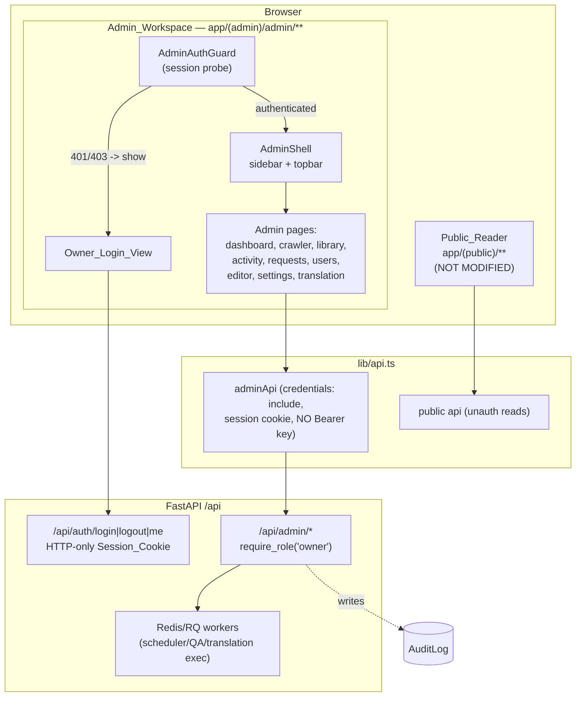
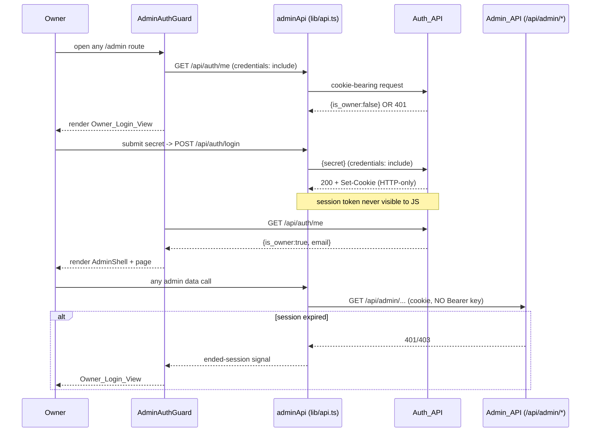
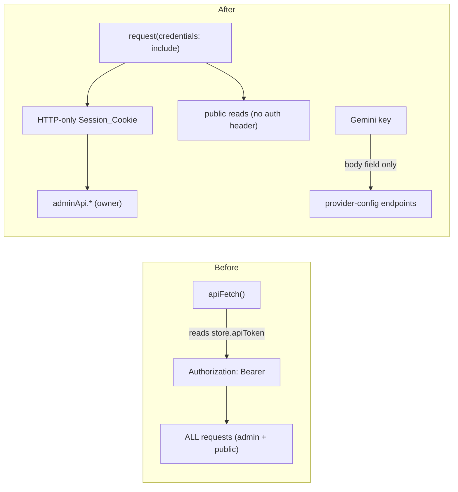
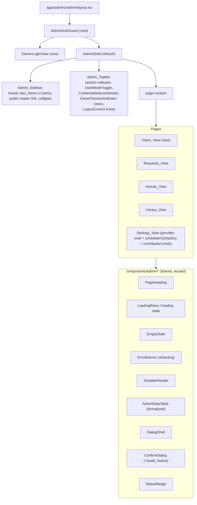
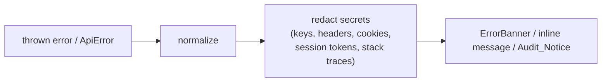

# Design Document: Admin UI Rework

## Overview

This design specifies a rework of the **owner-facing Admin_Workspace only** — the Next.js 15 / React 19 / TypeScript routes under `frontend/app/(admin)/admin/**` and the admin-only components under `frontend/components/admin/*`. It derives directly from `requirements.md` (Requirements 1–17) and is intentionally scoped away from the Public_Reader: it MUST NOT modify `app/(public)/**` and is **not** the WTR-LAB public redesign (that belongs to the separate `public-reader-rework` spec).

The rework delivers four families of change against the **current** code:

1. **Auth model migration.** The biggest structural change. Today `lib/api.ts#apiFetch` reads `apiToken` from the persisted zustand store and attaches it as `Authorization: Bearer <token>` on **every** request — the legacy "provider-key-as-auth" pattern. The platform now runs an HTTP-only session-cookie auth model (`POST /api/auth/login`, `POST /api/auth/logout`, `GET /api/auth/me`) with backend `require_role("owner")` over `/api/admin/*`. This design migrates admin data-access onto the session cookie (`credentials: "include"`) and demotes the Gemini key to pure **provider configuration** managed through the Admin_API. (Requirements 4, 9, 14)

2. **Admin shell refresh.** `components/admin/admin-shell.tsx` already renders a sidebar + topbar and toggles `html.dark` from `darkMode`. This design extends it with a Users nav item, a current-section indicator already present, a Credential_Status_Indicator (currently the raw "API Token" chip), and **new** Owner_Session_Indicator + Logout_Control, while preserving collapse + persistence. (Requirements 1, 2, 3, 13)

3. **Consistency layer.** Standardize Page_Heading, Loading/Empty/Error states, data-table density + sorting (`sortable-header.tsx`), and dialog/confirm behavior (`dialog-shell.tsx`, `confirm-dialog.tsx`) across Activity, Library, Requests, and the **new** Users view — with strict error redaction. (Requirements 5, 6, 7, 8, 12)

4. **New owner control surfaces.** Owner user management (Users_View), requests review/approval without auto-triggering paid translation, scheduler/QA/provider-policy configuration, and oversight of user-contributed provider credentials — all driven through `/api/admin/*`, all masked, none exposing raw secrets. (Requirements 10, 11, 16, 17)

### Research Notes (grounded in current code)

- **Bearer-token coupling is pervasive.** `apiFetch` and `apiDownload` in `lib/api.ts` both pull `useUiStore.getState().apiToken` and set the `Authorization` header. The same single `api` object is imported by both admin and public code paths, so the auth change must be made without altering the request contract the public reader relies on. The chosen approach (below) is an **admin-scoped client** plus a `credentials: "include"` default, leaving public read calls unauthenticated as they already effectively are. (Requirement 14, 15)
- **Current provider-key endpoints live under `/novels/admin/provider-api-key`** and are guarded by a legacy `verify_api_key` dependency (bearer key), not `require_role("owner")`. Requirements 9/16/17 call for the owner surfaces to target `/api/admin/*` under session-cookie + `require_role("owner")`. The design treats the backend `/api/admin/*` owner endpoints as the contract and maps the frontend client onto them; where a specific admin endpoint is not yet present, the design names the expected contract so tasks can reconcile it.
- **Session is server-side.** `backend/.../auth/session.py` stores `{user_id, email, role}` in a signed HTTP-only cookie via Starlette `SessionMiddleware`; `GET /api/auth/me` returns `{user_id, email, role, is_authenticated, is_owner}`. There is **no** JS-accessible token, which is exactly the invariant Requirement 4.4 demands — the frontend must never reintroduce one.
- **Dark mode mechanism already correct.** `tailwind.config.ts` uses `darkMode: ["class"]`; the shell toggles `document.documentElement.classList.toggle("dark", darkMode)`. `readerTheme` is a separate store field. Isolation (Requirement 13) is preserved by keeping these two fields independent and never cross-writing.
- **No test runner is installed yet.** `package.json` has `typecheck` and `build` but no vitest/jest/fast-check. The Testing Strategy specifies adding a dev-only PBT setup (Vitest + fast-check) without touching runtime deps or public code.

## Architecture

### Route and security boundary



The security boundary is the backend `require_role("owner")` dependency. Route hiding and the auth guard are **presentation only** (Requirement 4.8): an unauthenticated visitor sees the Owner_Login_View, but the actual rejection of unauthorized data access happens server-side with 401/403.

### Authentication / session flow



### Admin client evolution (off the provider-key-as-auth pattern)

The current single `apiFetch` is split by concern. The change is additive and contract-preserving for the public reader:

- A shared low-level `request()` helper sets `credentials: "include"` so the browser attaches the HTTP-only Session_Cookie automatically. It **no longer** reads `apiToken` or sets an `Authorization` header for admin calls.
- An **`adminApi`** namespace wraps owner endpoints (`/api/auth/*`, `/api/admin/*`). On a 401/403 it raises a typed `ApiError` that the AdminAuthGuard interprets as "session ended" (Requirement 4.7).
- The Gemini Provider_Credential is sent only as a **request body field** to provider-config endpoints (store/validate/activate/delete) — never as an auth header (Requirements 9.10, 14.2).
- The public reader's read calls (`readerNovel`, `readerChapter`, etc.) keep their existing signatures; they simply stop carrying a bearer key. Because the backend public routes do not require it, behavior is unchanged (Requirement 15.4).



## Components and Interfaces

### Component breakdown



### New / changed components

| Component | File | Status | Responsibility | Requirements |
|---|---|---|---|---|
| `AdminAuthGuard` | `components/admin/admin-auth-guard.tsx` | new | Probe `GET /api/auth/me`; show `OwnerLoginView` when unauthenticated or `is_owner` false; on 401/403 from any admin call, return to login. Presentation only. | 4.1, 4.7, 4.8 |
| `OwnerLoginView` | `components/admin/owner-login-view.tsx` | new | Collect login secret, call `POST /api/auth/login`, surface invalid-secret as `Error_State`, never persist a token. | 4.2, 4.3, 4.4 |
| `AdminShell` | `components/admin/admin-shell.tsx` | refresh | Compose sidebar + topbar; add Users nav; add Owner_Session_Indicator + Logout_Control; replace raw token chip with `CredentialStatusIndicator`; keep collapse + dark-mode. | 1, 2, 3, 13 |
| `OwnerSessionIndicator` | within shell / `components/admin/owner-session-indicator.tsx` | new | Render owner email from `GET /api/auth/me`. | 4.5 |
| `LogoutControl` | within shell | new | Call `POST /api/auth/logout`, then show `OwnerLoginView`. | 4.6 |
| `CredentialStatusIndicator` | `components/admin/credential-status-indicator.tsx` | new | Summarize active Provider_Credential (label/"None") sourced from Admin_API, never the raw value. | 9.11 |
| `AdminDataTable` | `components/admin/admin-data-table.tsx` | new (extract) | Shared dense table wrapper used by Activity/Library/Requests/Users; consistent header styling + density; hosts `SortableHeader` and renders `EmptyState` as a full-width row. | 6.6, 7.1, 7.7 |
| `useTableSort` | `lib/use-table-sort.ts` | new | Pure sort-state reducer (active key, direction, default direction) feeding `SortableHeader`; provides stable comparator. | 7.3, 7.4, 7.5 |
| `ConfirmDialog` | `components/admin/confirm-dialog.tsx` | extend | Add optional `auditNotice` content; keep destructive treatment + pending-disable (already present). | 8.6, 8.7, 12.1, 12.3 |
| `UsersView` | `app/(admin)/admin/users/page.tsx` | new | Owner user management table. | 10 |
| `SettingsView` | `app/(admin)/admin/settings/page.tsx` | rework | Provider_Credential config (masked + validation), Scheduler/QA/Provider_Policy controls, Contributed_Credential oversight. | 9, 16, 17 |

### Key interfaces (lib/api.ts)

```ts
// Shared low-level request — admin calls send the session cookie, never a bearer key.
function request<T>(path: string, init?: RequestInit): Promise<T>; // credentials: "include"

export const adminAuth = {
  me: () => request<AuthUser>("/auth/me"),
  login: (secret: string) => request<AuthUser>("/auth/login", { method: "POST", body: JSON.stringify({ secret }) }),
  logout: () => request<{ status: string }>("/auth/logout", { method: "POST" }),
};

export const adminApi = {
  // Users (Req 10)
  users: () => request<{ users: UserRecord[] }>("/admin/users"),
  updateUser: (id: number, patch: UserMutation) => request<UserRecord>(`/admin/users/${id}`, { method: "PATCH", body: JSON.stringify(patch) }),
  // Requests (Req 11)
  requests: () => request<{ requests: NovelRequestRecord[] }>("/admin/requests"),
  reviewRequest: (id: string, patch: { status: RequestStatus; notes?: string }) =>
    request<NovelRequestRecord>(`/admin/requests/${id}`, { method: "PATCH", body: JSON.stringify(patch) }),
  runRequest: (id: string) => request<NovelRequestRecord>(`/admin/requests/${id}/run`, { method: "POST" }), // explicit owner-invoked only
  // Provider credential as CONFIG (Req 9)
  providerCredential: (provider?: string) => request<ProviderCredential>(`/admin/providers/${provider ?? "gemini"}`),
  setProviderCredential: (body: { provider?: string; api_key: string }) => request<ProviderCredential>("/admin/providers", { method: "POST", body: JSON.stringify(body) }),
  validateProviderCredential: (provider?: string) => request<ProviderCredential>(`/admin/providers/${provider ?? "gemini"}/validate`, { method: "POST" }),
  activateProviderCredential: (id: string) => request<ProviderCredential>(`/admin/providers/${id}/activate`, { method: "POST" }),
  deleteProviderCredential: (id: string) => request<void>(`/admin/providers/${id}`, { method: "DELETE" }),
  // Scheduler / QA / Provider policy (Req 16)
  controlConfig: () => request<ControlConfig>("/admin/controls"),
  updateControlConfig: (patch: Partial<ControlConfig>) => request<ControlConfig>("/admin/controls", { method: "PUT", body: JSON.stringify(patch) }),
  // Contributed credentials oversight (Req 17)
  contributedCredentials: () => request<{ credentials: ContributedCredential[] }>("/admin/contributed-credentials"),
  setContributedCredentialState: (id: string, enabled: boolean) =>
    request<ContributedCredential>(`/admin/contributed-credentials/${id}`, { method: "PATCH", body: JSON.stringify({ enabled }) }),
  validateContributedCredential: (id: string) => request<ContributedCredential>(`/admin/contributed-credentials/${id}/validate`, { method: "POST" }),
};
```

The `adminApi` namespace is the **Admin_API_Client** of the requirements. It never reads `store.apiToken`; the only credential it carries is the HTTP-only cookie supplied by the browser.

## Data Models

All admin types live in `lib/api-types.ts` (extending the existing file). Masked-token and validation-status shapes are shared by both owner and contributed credentials.

```ts
// Auth (Req 4) — mirrors backend UserResponse
export type AuthUser = {
  user_id: number | null;
  email: string | null;
  role: "guest" | "user" | "owner";
  is_authenticated: boolean;
  is_owner: boolean;
};

// User management (Req 10)
export type UserRole = "guest" | "user" | "owner";
export type UserRecord = {
  id: number;
  email: string;
  display_name?: string | null;
  role: UserRole;
  is_active: boolean;
  created_at?: string | null;
  last_login_at?: string | null;
};
export type UserMutation = { is_active?: boolean }; // single-owner: no role-assignment-beyond-owner controls

// Requests review (Req 11) — backed by NovelRequest ORM
export type RequestStatus = "pending" | "approved" | "rejected" | "completed";
export type NovelRequestRecord = {
  id: string;
  title: string;
  status: RequestStatus;
  requested_by?: string | null;
  request_type?: string | null;
  source_url?: string | null;
  created_at?: string | null;
  resolved_at?: string | null;
};

// Masking + validation (Req 9, 17) — raw value never present on the wire to the client
export type TokenValidationStatus = "Unchecked" | "Checking" | "Working" | "Failed";
export type MaskedToken = string; // e.g. "AIza****wXyz"; backend supplies the mask, client never holds raw

// Owner provider credential as CONFIG (Req 9)
export type ProviderCredential = {
  id: string;
  provider: string;            // "gemini"
  masked_token: MaskedToken;
  configured: boolean;
  is_active: boolean;
  validation_status: TokenValidationStatus;
  validation_message?: string | null; // redacted: no raw key/headers/stack
  model?: string | null;
};

// Contributed credential oversight (Req 17)
export type ContributedCredential = {
  id: string;
  contributor_email: string;   // contributing user identity
  contributor_user_id?: number | null;
  masked_token: MaskedToken;
  validation_status: TokenValidationStatus;
  enabled: boolean;            // Contributed_Credential_State
  validation_message?: string | null; // redacted
  created_at?: string | null;
};

// Scheduler / QA / Provider policy config (Req 16) — backed by SystemSetting
export type SchedulerConfig = { enabled: boolean; poll_seconds: number; max_concurrent: number };
export type QaConfig = { enabled: boolean; min_confidence: number; auto_polish: boolean };
export type ProviderPolicyConfig = {
  use_owner_credential: boolean;
  use_contributed_credentials: boolean;
  ordering: "round_robin" | "priority" | "fallback";
};
export type ControlConfig = { scheduler: SchedulerConfig; qa: QaConfig; provider_policy: ProviderPolicyConfig };

// Admin UI state (Req 3, 13, 14) — already in lib/store.ts; admin-scoped fields
//   sidebarCollapsed: boolean   (persisted)
//   darkMode: boolean           (persisted, isolated from readerTheme)
// Owner_Session is NOT stored here — carried only by the HTTP-only cookie.
```

Activity and Library rows reuse the existing `ActivityRecord` and `NovelSummary` types already defined in `lib/api-types.ts`; they are rendered through the new `AdminDataTable` for consistent density and through `useTableSort` for consistent sorting.

### Store scoping note

`lib/store.ts` keeps `sidebarCollapsed` and `darkMode` as the only admin-scoped persisted fields (Requirement 14.4). The provider-key fields currently in the store (`apiToken`, `apiTokens`, etc.) are **decommissioned as an auth mechanism**: provider-credential state moves to the Admin_API (server-managed, masked). Any residual client-side token concept is removed so the session token is never reintroduced into JS-accessible storage (Requirement 4.4, 14.2). `readerTheme`/`readerFontSize`/`readerWidth` remain untouched for the public reader.

## Correctness Properties

*A property is a characteristic or behavior that should hold true across all valid executions of a system — essentially, a formal statement about what the system should do. Properties serve as the bridge between human-readable specifications and machine-verifiable correctness guarantees.*

These properties target the **pure, input-varying logic** of the admin surface: active-nav selection, UI-state toggles/persistence, dark-mode isolation, the cookie-only auth invariant, token masking and secret-redaction, the sort reducer/comparator, and table-render completeness. Concrete interaction checks (clicking nav, login/logout, dialog confirm/cancel), structural/consistency checks, backend `require_role` enforcement, and build/no-public-files gates are covered by example, integration, and smoke tests in the Testing Strategy. Following the prework reflection, redundant criteria are consolidated into the unique properties below.

### Property 1: Active navigation selects at most one, most-specific item

*For any* current path and *any* set of Nav_Items, the active-nav selection yields **at most one** active item; if any Nav_Item route equals the path or is a prefix of it, the selected item is the one with the **longest** matching route, and the topbar current-section label equals that selected item's label.

**Validates: Requirements 2.1, 2.2, 2.3, 2.4, 2.5**

### Property 2: Persisted boolean UI toggle round-trip

*For any* admin-scoped boolean UI field (Sidebar_Collapsed_State or Admin_Dark_Mode) and *any* sequence of toggle operations, the value after the sequence equals the parity of the toggle count applied to the initial value, and the value persisted to the UI_State_Store equals the final in-memory value (so a reload rehydrates to that same value).

**Validates: Requirements 3.2, 3.5, 3.6, 13.1, 13.6**

### Property 3: Admin dark mode is isolated from the reader theme

*For any* initial `readerTheme` value and *any* number of Admin_Dark_Mode toggles, the `readerTheme` value in the UI_State_Store is unchanged by those toggles (the two fields are independent).

**Validates: Requirements 13.4, 13.5**

### Property 4: Admin requests authenticate by session cookie only — never the provider/session token

*For any* admin request built by the Admin_API_Client and *any* provider-credential value, the request is issued with `credentials: "include"` (carrying the HTTP-only Session_Cookie) and carries **no** `Authorization` header set to the provider credential and **no** session token; and *for any* store/localStorage state, no session token is present in JavaScript-accessible storage.

**Validates: Requirements 4.4, 9.10, 14.2**

### Property 5: Credentials are always masked and raw values are never rendered

*For any* token string, the masking function reveals at most a short prefix and a short suffix and never emits the obscured middle verbatim; and *for any* Provider_Credential or Contributed_Credential, the rendered output (table cell, Credential_Status_Indicator) contains the masked form and never the raw credential value.

**Validates: Requirements 9.2, 9.3, 9.11, 17.3, 17.9**

### Property 6: Error output redacts secrets

*For any* error value (typed `ApiError`, raw string body, or arbitrary object) — including ones whose fields embed provider keys, contributed keys, authorization headers, session tokens, cookies, or stack traces — the message produced for an Error_State, validation-failure message, or Audit_Notice contains none of those secret substrings and no raw stack trace.

**Validates: Requirements 6.4, 9.7, 12.3, 16.7, 17.7, 17.9**

### Property 7: Dark-mode state maps deterministically to the root `dark` class

*For any* Admin_Dark_Mode boolean value, applying it adds the `dark` class to the document root element when enabled and removes it when disabled.

**Validates: Requirements 13.2, 13.3**

### Property 8: Sort reducer toggles direction or switches column with default direction

*For any* current sort state `(activeKey, direction)` and *any* activated column key: if the activated key equals `activeKey`, the new direction is the inversion of `direction` and the key is unchanged; if the activated key differs, the new active key is the activated key and the direction is that column's default direction.

**Validates: Requirements 7.4, 7.5**

### Property 9: Sorting reorders rows consistently and stably by the active column

*For any* list of rows, *any* sortable column, and *any* direction, the sorted output is a permutation of the input ordered non-decreasingly (asc) or non-increasingly (desc) by that column's value, and rows comparing equal retain their original relative order (stable).

**Validates: Requirements 7.3, 7.7**

### Property 10: Page heading renders the title and conditionally the description

*For any* title string and *any* optional description, the rendered Page_Heading contains the title text, and contains the description text if and only if a description was supplied.

**Validates: Requirements 5.2, 5.3**

### Property 11: Table empty-state spans all columns as a single row

*For any* positive column count `n`, when an Admin_Data_Table data set is empty the Empty_State renders as exactly one table row whose single cell has `colSpan === n`.

**Validates: Requirement 6.6**

### Property 12: Confirm dialog disables both controls while pending

*For any* Confirm_Dialog props with `pending === true`, both the confirm control and the cancel control are rendered in the disabled state, regardless of the destructive flag or label values.

**Validates: Requirement 8.7**

### Property 13: Data tables render every record's required fields

*For any* list of records (User_Records, Novel_Requests, or Contributed_Credentials) supplied to its Admin_Data_Table, the rendered output contains, for each record, that record's required display fields (User_Record: email + role; Novel_Request: status; Contributed_Credential: contributor identity + validation status + enabled state).

**Validates: Requirements 10.3, 11.2, 17.2**

### Property 14: Loading requests never auto-triggers paid translation

*For any* set of Novel_Requests loaded and rendered in the Requests_View, no translation/run Admin_API endpoint is invoked as a side effect of fetching or rendering; a run is invoked only by an explicit owner run action.

**Validates: Requirements 11.4, 11.5**

## Error Handling

### Redaction-first error pipeline

All admin errors flow through `lib/admin-errors.ts#formatAdminError`, which is extended into the single redaction chokepoint enforced by Property 6:

1. **Normalize** the error into a typed `ApiError` (already implemented in `lib/api.ts#responseError`) or a generic message.
2. **Redact** before display: strip any substring matching known secret shapes — `Authorization` header values, `Bearer ...` tokens, cookie strings, the active/contributed provider keys, and multi-line stack traces. Only the backend's human-readable `message`/`explanation` and a `trace_id` are surfaced.
3. **Render** via the shared `ErrorBanner` (table/page) or inline validation message. No raw `details`/`raw` payloads are shown in the admin UI.



### Auth/session error handling

- A `401` or `403` from any `adminApi.*` call is mapped to a typed "session ended" signal; the `AdminAuthGuard` clears in-memory session state and renders the `OwnerLoginView` (Property-adjacent behavior; Requirement 4.7). The Session_Cookie itself is managed by the browser/backend — the client never deletes or reads it directly.
- Invalid login secret (`401` from `POST /api/auth/login`) renders an Error_State in the `OwnerLoginView` and establishes no session (Requirement 4.3).

### Validation error handling

- Provider and contributed credential validation failures set `Token_Validation_Status = "Failed"` and display the redacted backend failure message (Requirements 9.7, 17.7). The raw key is never echoed back.
- Scheduler/QA/Provider_Policy config failures render a redacting Error_State without exposing secrets (Requirement 16.7).

### Empty / loading handling

- Loading uses `LoadingRows` (table) or a page-level loading indicator (Requirement 6.1).
- Empty data renders the shared `EmptyState`; inside an `AdminDataTable` it is a single full-width row (Requirements 6.2, 6.6).

## Testing Strategy

### Dual approach

- **Property-based tests** verify the 14 universal properties above (pure logic: nav selection, toggles/persistence, isolation, auth-credential invariant, masking, redaction, sort reducer/comparator, render completeness).
- **Example/unit tests** verify concrete interactions and renders (login/logout flow, nav click navigation, dialog confirm/cancel, validation status transitions, structural presence of shell elements and absence of out-of-scope controls).
- **Integration tests** verify backend `require_role("owner")` rejects non-owner access (Requirements 4.8, 10.6, 16.6) and that dangerous actions write an `AuditLog` row (Requirement 12.2).
- **Smoke / gate checks** verify no `app/(public)/**` files changed, the public reader renders unchanged, and `npm run typecheck` + `npm run build` pass (Requirements 15.3, 15.4, 15.5).

### Tooling

PBT applies to this feature's logic layer, so the design adopts a property-based testing library rather than hand-rolling generators:

- Add **Vitest** + **fast-check** + **@testing-library/react** as **dev dependencies only** (no runtime deps, no public-code changes). Add a `test` script; CI keeps the existing `typecheck` and `build` gates.
- Each property test runs a **minimum of 100 iterations** (fast-check default `numRuns >= 100`).
- Each property test is tagged with a comment referencing its design property, format:
  `// Feature: admin-ui-rework, Property {number}: {property_text}`
- Pure logic under test is extracted into testable units: `selectActiveNav(path, items)`, `currentSectionLabel(path, items)`, the `useTableSort` reducer + `compareRows` comparator, `maskToken(value)`, `formatAdminError(error)` redaction, and the admin request-builder (asserting `credentials: "include"` and no auth header) — keeping React components thin.

### Property-to-test mapping

| Property | Primary unit under test |
|---|---|
| P1 Active nav | `selectActiveNav` / `currentSectionLabel` |
| P2 Persisted toggle round-trip | `useUiStore` `toggleSidebar` / `toggleDarkMode` + persist |
| P3 Dark-mode isolation | `useUiStore` (darkMode vs readerTheme) |
| P4 Cookie-only auth | admin request builder in `lib/api.ts` |
| P5 Masking / no-raw render | `maskToken` + credential row/indicator render |
| P6 Error redaction | `formatAdminError` |
| P7 Dark-class mapping | shell dark-class effect |
| P8 Sort reducer | `useTableSort` reducer |
| P9 Stable sort ordering | `compareRows` comparator |
| P10 Heading render | `PageHeading` |
| P11 Empty-row colSpan | `EmptyState` (table mode) |
| P12 Confirm pending-disable | `ConfirmDialog` |
| P13 Table-row completeness | `AdminDataTable` rows for users/requests/contributed |
| P14 No auto-trigger | Requests_View data-load effect |

### Out-of-scope confirmation

No test or change touches `app/(public)/**`. Shared `components/ui/*` primitives are consumed without modifying their defaults (Requirement 15.1, 15.2); admin variants are applied via admin-scoped composition only.

## Requirements Traceability

| Requirement | Design coverage | Verified by |
|---|---|---|
| 1 Admin Shell Navigation Refresh | `AdminShell` (sidebar brand + Nav_Items + public link; topbar elements); layout wrapper | Example/structural tests |
| 2 Active Navigation State | `selectActiveNav` (most-specific, single active) + `currentSectionLabel` | **P1** |
| 3 Sidebar Collapse Behavior | collapse control + `sidebarCollapsed` persist; content offset class | **P2**; example tests (3.1, 3.3, 3.4) |
| 4 Owner Authentication and Session | `AdminAuthGuard`, `OwnerLoginView`, `adminAuth`, session-cookie model | **P4**; example tests (4.1–4.3, 4.5, 4.6); integration (4.8) |
| 5 Consistent Page Heading | shared `PageHeading` | **P10**; example tests (5.1, 5.4) |
| 6 Loading/Empty/Error Patterns | `LoadingRows`, `EmptyState`, redacting `ErrorBanner` | **P6, P11**; example tests (6.1–6.3, 6.5) |
| 7 Data-Table Density and Sorting | `AdminDataTable` + `useTableSort` + `SortableHeader` | **P8, P9**; example tests (7.1, 7.2, 7.6) |
| 8 Dialog and Confirmation Behavior | `DialogShell`, `ConfirmDialog` (destructive, pending) | **P12**; example tests (8.1–8.6) |
| 9 Provider Credential & Settings | provider-config endpoints (store/validate/activate/delete), masked display | **P4, P5, P6**; example tests (9.1, 9.4–9.9) |
| 10 Owner User Management | `UsersView` + `adminApi.users/updateUser` | **P13**; example tests (10.1, 10.2, 10.4, 10.5); integration (10.6) |
| 11 Requests Review and Approval | `Requests_View` + `reviewRequest`/`runRequest` (explicit run) | **P13, P14**; example tests (11.1, 11.3, 11.5) |
| 12 Audit Logging Surfacing | `ConfirmDialog` Audit_Notice; backend `AuditLog` | example test (12.1); integration (12.2); **P6** (12.3) |
| 13 Admin Dark Mode Isolated | `darkMode` field + root-class effect, separate from `readerTheme` | **P2, P3, P7** |
| 14 Admin Session & State Scoping | `adminApi` routing; admin-scoped store fields | **P4**; example tests (14.1, 14.3–14.5) |
| 15 Shared Component Reuse w/o Regression | compose `components/ui/*` unchanged; no public edits | smoke/gate tests (15.3–15.5); example (15.1, 15.2) |
| 16 Owner Control of Scheduler/QA/Provider Policy | `controlConfig`/`updateControlConfig` (`SystemSetting`) | **P6** (16.7); example tests (16.1–16.5); integration (16.6) |
| 17 Oversight of Contributed Credentials | `contributedCredentials` + state/validate; masked, redacted | **P5, P6, P13**; example tests (17.1, 17.4–17.8) |

## Phase Completion

This completes the design phase for the admin-ui-rework feature. The design derives from and traces to every requirement (1–17), is grounded in the current codebase (admin shell, `lib/api.ts` bearer-to-cookie migration, `lib/store.ts`, backend session/role model, and ORM models), and is strictly scoped to the admin surface — `app/(public)/**` is not modified. If gaps are found, we can return to requirements clarification. Otherwise, the next step is to generate the task list.
