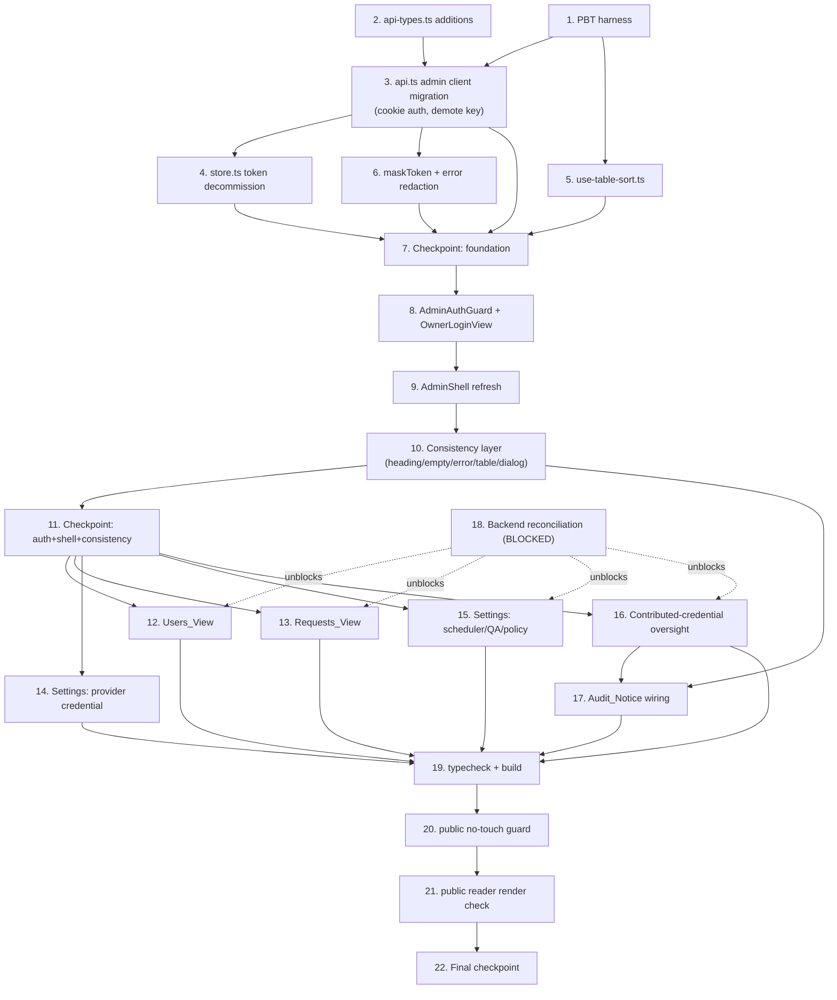

# Implementation Plan: Admin UI Rework

## Overview

This plan converts the `admin-ui-rework` design into an incremental, test-driven, **frontend-only** coding sequence (Next.js 15 / React 19 / TypeScript). All paths are relative to `frontend/`.

The plan is ordered so the **auth-model migration** — the biggest structural change — lands on a tested foundation before any new owner surface is built:

1. **Foundation first** — PBT harness, `lib/api-types.ts` additions, the admin client migration in `lib/api.ts` (move admin data-access OFF the `apiToken`-as-`Authorization: Bearer` pattern onto the HTTP-only Session_Cookie via `credentials: "include"`, demote the Gemini key to provider config), `lib/store.ts` admin-scoped cleanup, `lib/use-table-sort.ts`, masking + error-redaction helpers, then `AdminAuthGuard` / `OwnerLoginView`, then the `AdminShell` refresh and the consistency layer.
2. **New surfaces second** — Users, Requests review, Scheduler/QA/Provider-Policy controls, and Contributed-Credential oversight.
3. **Verification last** — `npm run typecheck`, `npm run build`, a public no-touch diff guard, and confirmation the public reader still renders.

### Scope guardrails (apply to EVERY task)

- **Public boundary is protected.** Do NOT modify any file under `app/(public)/**`. When editing the shared `lib/api.ts`, the public reader's read calls (`readerNovel`, `readerChapter`, `novel`, `chapters`, etc.) MUST keep their existing signatures and keep working unauthenticated. (Requirements 14.5, 15.3, 15.4)
- **Reuse `components/ui/*` by composition only.** Never alter a shared UI_Primitive's default styling contract; apply admin variants via admin-scoped wrappers. (Requirements 15.1, 15.2)
- **Never expose secrets.** No raw provider keys, contributed keys, `Authorization` headers, session tokens, cookies, or stack traces in UI, logs, or error envelopes. (Requirements 6.4, 9.7, 12.3, 16.7, 17.3, 17.7, 17.9)
- **Route hiding is presentation, not security.** Backend `require_role("owner")` is the boundary. (Requirement 4.8)
- **No `app/(public)/**` redesign** — that is the separate `public-reader-rework` spec and is out of scope here.

### PBT conventions (design Testing Strategy)

- Each property test is one PBT for one design property, placed next to the code it validates.
- Minimum **100 iterations** per property (`fast-check` `numRuns >= 100`).
- Each property test carries the tag comment exactly: `// Feature: admin-ui-rework, Property {n}: {property text}`.
- Test/PBT sub-tasks are marked optional with `*`; core implementation sub-tasks are never optional.

---

## Tasks

- [x] 1. Set up dev-only property-based testing harness
  - Add **Vitest**, **fast-check**, **@testing-library/react**, **@testing-library/jest-dom**, and **jsdom** as **devDependencies only** in `frontend/package.json` (no runtime deps added, no public code touched).
  - Create `frontend/vitest.config.ts` (jsdom environment, React plugin, path alias `@/` matching `tsconfig.json`) and `frontend/vitest.setup.ts` (testing-library matchers).
  - Add a `"test"` script (single-run, e.g. `vitest run`) to `package.json`; leave existing `typecheck` and `build` scripts and CI gates unchanged.
  - Configure fast-check default `numRuns` to at least 100 for the suite.
  - _Requirements: 15.5 (keeps existing gates green); Testing Strategy / Tooling_

- [x] 2. Add admin data-model types to `lib/api-types.ts`
  - Add `AuthUser`, `UserRole`, `UserRecord`, `UserMutation`, `RequestStatus`, `NovelRequestRecord` (reconcile/extend if a request type already exists), `TokenValidationStatus`, `MaskedToken`, `ProviderCredential`, `ContributedCredential`, `SchedulerConfig`, `QaConfig`, `ProviderPolicyConfig`, and `ControlConfig` exactly per the design Data Models section.
  - Keep existing exported types intact so current admin/public imports continue to compile.
  - Do NOT add any field that carries a raw credential value (masked-only on the wire).
  - _Requirements: 4, 9, 10, 11, 16, 17 (data shapes); 15.5_

- [x] 3. Migrate the admin client in `lib/api.ts` off provider-key-as-auth onto the session cookie
  - [x] 3.1 Introduce the shared low-level `request<T>(path, init?)` helper with `credentials: "include"`
    - Add `request()` that sets `Content-Type` for JSON, attaches NO `Authorization` header and NO session token, sends `credentials: "include"` so the browser carries the HTTP-only Session_Cookie, and reuses the existing `responseError` normalization to throw typed `ApiError`.
    - Do NOT read `useUiStore.getState().apiToken` in `request()`.
    - _Requirements: 4.4, 14.1, 14.2_

  - [x] 3.2 Add `adminAuth` namespace (`me`, `login`, `logout`)
    - Implement `adminAuth.me()` → `GET /api/auth/me`, `adminAuth.login(secret)` → `POST /api/auth/login` with `{ secret }`, `adminAuth.logout()` → `POST /api/auth/logout`, all via `request()`.
    - _Requirements: 4.2, 4.5, 4.6_

  - [x] 3.3 Add `adminApi` namespace (the Admin_API_Client) targeting `/api/admin/*`
    - Implement `users`, `updateUser`, `requests`, `reviewRequest`, `runRequest`, `providerCredential`, `setProviderCredential`, `validateProviderCredential`, `activateProviderCredential`, `deleteProviderCredential`, `controlConfig`, `updateControlConfig`, `contributedCredentials`, `setContributedCredentialState`, `validateContributedCredential` per the design interface.
    - Send the Gemini Provider_Credential only as a request **body** field to provider-config endpoints — never as an auth header.
    - On `401`/`403`, surface the typed `ApiError` so the guard can interpret "session ended".
    - _Requirements: 4.7, 9.1, 9.8, 9.9, 9.10, 10.2, 10.4, 11.1, 11.3, 11.5, 14.1, 14.2, 16.1, 16.5, 17.1, 17.4_

  - [x] 3.4 Preserve the public reader's request contract
    - Keep `readerNovel`, `readerChapter`, `novel`, `chapters`, and all other public read calls exported with unchanged signatures; route them through `request()` so they work unauthenticated (no Bearer key). Do NOT change `app/(public)/**`.
    - _Requirements: 14.5, 15.3, 15.4_

  - [ ]* 3.5 Property test: admin requests authenticate by session cookie only
    - `// Feature: admin-ui-rework, Property 4: Admin requests authenticate by session cookie only — never the provider/session token`
    - For any admin request built by the client and any provider-credential value, assert the issued request uses `credentials: "include"`, carries no `Authorization` header set to the provider credential, and carries no session token; and for any store/localStorage state, no session token is present in JS-accessible storage. Min 100 iterations.
    - _Validates: Requirements 4.4, 9.10, 14.2 (Design Property 4)_

- [x] 4. Decommission the client-side auth token in `lib/store.ts`
  - Remove `apiToken`/`apiTokens`/`apiTokenLabel` and their mutators **as an authentication mechanism** so no session token can be reintroduced into JS-accessible storage; keep only the admin-scoped persisted fields `sidebarCollapsed` and `darkMode`, plus the untouched public reader fields (`readerTheme`, `readerFontSize`, `readerWidth`).
  - Ensure `toggleSidebar` and `toggleDarkMode` remain and persist under the single `novelai-ui` storage key; do NOT cross-write `darkMode` and `readerTheme`.
  - Update any admin imports broken by the removal (provider-credential state now comes from the Admin_API, server-managed and masked).
  - _Requirements: 3.5, 3.6, 4.4, 13.4, 13.5, 13.6, 14.2, 14.4_

  - [x]* 4.1 Property test: persisted boolean UI toggle round-trip
    - `// Feature: admin-ui-rework, Property 2: Persisted boolean UI toggle round-trip`
    - For any admin-scoped boolean field and any sequence of toggles, assert the final value equals the parity of the toggle count applied to the initial value and equals the persisted value. Min 100 iterations.
    - _Validates: Requirements 3.2, 3.5, 3.6, 13.1, 13.6 (Design Property 2)_

  - [x]* 4.2 Property test: admin dark mode is isolated from the reader theme
    - `// Feature: admin-ui-rework, Property 3: Admin dark mode is isolated from the reader theme`
    - For any initial `readerTheme` and any number of `darkMode` toggles, assert `readerTheme` is unchanged. Min 100 iterations.
    - _Validates: Requirements 13.4, 13.5 (Design Property 3)_

- [x] 5. Implement the sort reducer and comparator in `lib/use-table-sort.ts`
  - Implement a pure sort-state reducer holding `(activeKey, direction, defaultDirection)`: activating the active column inverts direction; activating a different column switches the active key and applies that column's default direction.
  - Implement `compareRows` as a stable comparator producing non-decreasing (`asc`) / non-increasing (`desc`) ordering by the active column, preserving original relative order for equal keys.
  - Export a `useTableSort` hook wrapping the reducer for table components.
  - _Requirements: 7.3, 7.4, 7.5, 7.7_

  - [ ]* 5.1 Property test: sort reducer toggles direction or switches column
    - `// Feature: admin-ui-rework, Property 8: Sort reducer toggles direction or switches column with default direction`
    - Min 100 iterations.
    - _Validates: Requirements 7.4, 7.5 (Design Property 8)_

  - [ ]* 5.2 Property test: sorting reorders rows consistently and stably
    - `// Feature: admin-ui-rework, Property 9: Sorting reorders rows consistently and stably by the active column`
    - Assert output is a permutation, correctly ordered by direction, and stable on equal keys. Min 100 iterations.
    - _Validates: Requirements 7.3, 7.7 (Design Property 9)_

- [ ] 6. Implement token masking and extend the error-redaction chokepoint
  - [~] 6.1 Implement `maskToken(value)` (co-located with credential UI, e.g. `lib/mask-token.ts`)
    - Reveal at most a short prefix and short suffix; obscure the middle; never emit the obscured middle verbatim.
    - _Requirements: 9.2, 9.3, 9.11, 17.3, 17.9_

  - [~] 6.2 Extend `lib/admin-errors.ts#formatAdminError` into the single redaction chokepoint
    - Normalize to `ApiError`/string/object, then strip any substring matching `Authorization` header values, `Bearer ...` tokens, cookie strings, provider/contributed key shapes, and multi-line stack traces; surface only human-readable `message`/`explanation` plus optional `trace_id`. Never return raw `details`/`raw`.
    - _Requirements: 6.4, 9.7, 12.3, 16.7, 17.7, 17.9_

  - [ ]* 6.3 Property test: credentials are always masked and raw values are never rendered
    - `// Feature: admin-ui-rework, Property 5: Credentials are always masked and raw values are never rendered`
    - For any token string, assert masking reveals at most a short prefix/suffix and never the obscured middle verbatim. Min 100 iterations.
    - _Validates: Requirements 9.2, 9.3, 9.11, 17.3, 17.9 (Design Property 5)_

  - [ ]* 6.4 Property test: error output redacts secrets
    - `// Feature: admin-ui-rework, Property 6: Error output redacts secrets`
    - For any error value embedding keys/headers/cookies/session tokens/stack traces, assert the produced message contains none of those secret substrings and no raw stack trace. Min 100 iterations.
    - _Validates: Requirements 6.4, 9.7, 12.3, 16.7, 17.7, 17.9 (Design Property 6)_

- [~] 7. Checkpoint — foundation
  - Ensure all tests pass and `npm run typecheck` is green after the client/store migration. Ask the user if questions arise.

- [ ] 8. Implement owner authentication surfaces
  - [~] 8.1 Implement `OwnerLoginView` (`components/admin/owner-login-view.tsx`)
    - Collect the login secret, call `adminAuth.login(secret)`; on success establish the session (cookie set by backend), on invalid secret render an `Error_State` (via redacting `formatAdminError`) and establish no session; never persist a token.
    - _Requirements: 4.2, 4.3, 4.4_

  - [~] 8.2 Implement `AdminAuthGuard` (`components/admin/admin-auth-guard.tsx`) and wire into `app/(admin)/admin/layout.tsx`
    - Probe `adminAuth.me()`; render `OwnerLoginView` when unauthenticated or `is_owner` is false, otherwise render `AdminShell` + page. Map any `401`/`403` from `adminApi.*` to a "session ended" signal that returns to `OwnerLoginView`. Presentation only; never read/delete the cookie directly.
    - _Requirements: 4.1, 4.7, 4.8_

  - [ ]* 8.3 Example/unit tests for login/logout/guard flow
    - Test login success → shell render, invalid secret → error + no session, and 401/403 → login view. (Concrete interactions, not a property.)
    - _Requirements: 4.1, 4.2, 4.3, 4.6, 4.7_

- [ ] 9. Refresh the `AdminShell` (`components/admin/admin-shell.tsx`)
  - [~] 9.1 Implement active-nav selection helpers (co-located, e.g. `lib/admin-nav.ts`)
    - Implement `selectActiveNav(path, items)` (at most one active, most-specific/longest matching route) and `currentSectionLabel(path, items)` returning the selected item's label.
    - _Requirements: 2.1, 2.2, 2.3, 2.4, 2.5_

  - [~] 9.2 Compose the sidebar and topbar
    - Sidebar: brand element (links to dashboard), Nav_Items including the **new** Users item, and the Public_Reader link; collapse control toggling `sidebarCollapsed` with persisted state and narrowed content offset; collapsed items show icon-only with accessible `title`.
    - Topbar: current-section indicator (from `currentSectionLabel`), `Dark_Mode_Toggle`, `CredentialStatusIndicator`, the new `OwnerSessionIndicator`, and the new `LogoutControl`.
    - Apply `Active_Nav_State` via `selectActiveNav`. Ensure the shell renders only within `app/(admin)/admin/**`.
    - _Requirements: 1.1, 1.2, 1.3, 1.4, 1.5, 1.6, 2.1, 2.2, 2.3, 3.1, 3.2, 3.3, 3.4_

  - [~] 9.3 Implement `OwnerSessionIndicator`, `LogoutControl`, and `CredentialStatusIndicator`
    - `OwnerSessionIndicator` (`components/admin/owner-session-indicator.tsx`) renders the owner email from `adminAuth.me()`.
    - `LogoutControl` calls `adminAuth.logout()` then returns to `OwnerLoginView`.
    - `CredentialStatusIndicator` (`components/admin/credential-status-indicator.tsx`) summarizes the active Provider_Credential (label/"None") from the Admin_API, never the raw value, replacing the legacy raw "API Token" chip.
    - _Requirements: 4.5, 4.6, 9.11_

  - [~] 9.4 Implement the dark-mode root-class effect
    - Apply/remove the `dark` class on `document.documentElement` from `darkMode`; never write `readerTheme`.
    - _Requirements: 13.1, 13.2, 13.3_

  - [ ]* 9.5 Property test: active navigation selects at most one, most-specific item
    - `// Feature: admin-ui-rework, Property 1: Active navigation selects at most one, most-specific item`
    - Min 100 iterations.
    - _Validates: Requirements 2.1, 2.2, 2.3, 2.4, 2.5 (Design Property 1)_

  - [ ]* 9.6 Property test: dark-mode state maps deterministically to the root `dark` class
    - `// Feature: admin-ui-rework, Property 7: Dark-mode state maps deterministically to the root dark class`
    - Min 100 iterations.
    - _Validates: Requirements 13.2, 13.3 (Design Property 7)_

  - [ ]* 9.7 Example/structural tests for shell composition
    - Assert presence of brand, Nav_Items (+Users), public-reader link, topbar elements; assert absence of multi-admin/team/org/billing/role-assignment controls; nav-click navigation; collapse persistence.
    - _Requirements: 1.2, 1.3, 1.4, 3.1, 14.3_

- [ ] 10. Build the shared consistency layer
  - [~] 10.1 Standardize `PageHeading` (`components/admin/page-heading.tsx`)
    - Render the title always and the description only when supplied; ensure all admin pages use this single component.
    - _Requirements: 5.1, 5.2, 5.3, 5.4_

  - [~] 10.2 Standardize `EmptyState` table mode (`components/admin/empty-state.tsx`)
    - In table context, render exactly one row whose single cell uses `colSpan` equal to the column count.
    - _Requirements: 6.2, 6.6_

  - [~] 10.3 Make `ErrorBanner` (`components/admin/error-banner.tsx`) redact through `formatAdminError`
    - Route all displayed messages through the redaction chokepoint; show no raw `details`/`raw`.
    - _Requirements: 6.3, 6.4, 6.5_

  - [~] 10.4 Extract `AdminDataTable` (`components/admin/admin-data-table.tsx`) and wire `SortableHeader` + `useTableSort`
    - Provide a shared dense table wrapper with consistent header styling/density, hosting `sortable-header.tsx` (single shared sortable header with active-direction indicator) and rendering the table-mode `EmptyState`; integrate `useTableSort`/`compareRows`. Reuse on Activity/Library (existing `ActivityRecord`/`NovelSummary`) and the new Requests/Users views.
    - _Requirements: 6.6, 7.1, 7.2, 7.6, 7.7_

  - [~] 10.5 Extend `ConfirmDialog` (`components/admin/confirm-dialog.tsx`) on `DialogShell`
    - Built on the shared `dialog-shell.tsx` Modal_Dialog (centered, titled); add optional `auditNotice` content (redacted), keep destructive treatment, and disable both confirm and cancel while `pending`.
    - _Requirements: 8.1, 8.2, 8.3, 8.4, 8.5, 8.6, 8.7, 12.1, 12.3_

  - [ ]* 10.6 Property test: page heading renders title and conditional description
    - `// Feature: admin-ui-rework, Property 10: Page heading renders the title and conditionally the description`
    - Min 100 iterations.
    - _Validates: Requirements 5.2, 5.3 (Design Property 10)_

  - [ ]* 10.7 Property test: table empty-state spans all columns as a single row
    - `// Feature: admin-ui-rework, Property 11: Table empty-state spans all columns as a single row`
    - For any positive column count `n`, assert one row with one cell whose `colSpan === n`. Min 100 iterations.
    - _Validates: Requirement 6.6 (Design Property 11)_

  - [ ]* 10.8 Property test: confirm dialog disables both controls while pending
    - `// Feature: admin-ui-rework, Property 12: Confirm dialog disables both controls while pending`
    - For any props with `pending === true`, assert both controls disabled regardless of destructive flag/labels. Min 100 iterations.
    - _Validates: Requirement 8.7 (Design Property 12)_

  - [ ]* 10.9 Example tests for dialog and loading/error patterns
    - Confirm/cancel behavior (8.4, 8.5), destructive treatment present (8.6), `LoadingRows` shown while pending (6.1), error redaction render (6.3).
    - _Requirements: 6.1, 6.3, 8.4, 8.5, 8.6_

- [~] 11. Checkpoint — auth + shell + consistency layer
  - Ensure all tests pass and `npm run typecheck` is green before building new surfaces. Ask the user if questions arise.

- [ ] 12. Implement the Users_View (`app/(admin)/admin/users/page.tsx`)
  - Fetch via `adminApi.users()`; render each `UserRecord` with email + role in an `AdminDataTable`; provide owner-only actions via `adminApi.updateUser` guarded by backend Role_Enforcement; present standard Loading/Empty/Error states; do NOT render multi-admin/team/org/billing/role-assignment-beyond-owner controls.
  - _Requirements: 10.1, 10.2, 10.3, 10.4, 10.5, 14.3_

  - [ ]* 12.1 Example/integration test notes for user management
    - Example: render of users table fields, absence of out-of-scope controls. Integration (backend): `require_role("owner")` rejects non-owner (10.6) — depends on Task 18.
    - _Requirements: 10.1, 10.5, 10.6_

- [ ] 13. Implement the Requests_View (`app/(admin)/admin/requests/page.tsx`)
  - Fetch via `adminApi.requests()`; render each `NovelRequestRecord` with `Request_Status` in an `AdminDataTable`; approve/reject through `adminApi.reviewRequest`; run an approved request ONLY through an explicit owner-invoked `adminApi.runRequest` (behind a `ConfirmDialog`). Loading/render MUST NOT call any run/translation endpoint as a side effect.
  - _Requirements: 11.1, 11.2, 11.3, 11.4, 11.5_

  - [ ]* 13.1 Property test: loading requests never auto-triggers paid translation
    - `// Feature: admin-ui-rework, Property 14: Loading requests never auto-triggers paid translation`
    - For any set of loaded requests, assert no run/translation endpoint is invoked by fetch/render; only an explicit run action invokes it. Min 100 iterations.
    - _Validates: Requirements 11.4, 11.5 (Design Property 14)_

- [ ] 14. Implement the Settings_View provider-credential config (`app/(admin)/admin/settings/page.tsx`)
  - Enter/store the Gemini Provider_Credential via `adminApi.setProviderCredential` (key as body field only); display stored credential as `maskToken` Masked_Token; show `Token_Validation_Status`; trigger validation via `adminApi.validateProviderCredential` (set `Checking` → `Working`/`Failed` with redacted message); activate via `adminApi.activateProviderCredential`; remove via `adminApi.deleteProviderCredential`. Treat the key strictly as provider config, never as an auth credential.
  - _Requirements: 9.1, 9.2, 9.3, 9.4, 9.5, 9.6, 9.7, 9.8, 9.9, 9.10_

  - [ ]* 14.1 Example tests for credential lifecycle
    - Validation status transitions, masked display, activate/remove flows, failure message redaction.
    - _Requirements: 9.4, 9.5, 9.6, 9.7, 9.8, 9.9_

- [ ] 15. Implement Scheduler / QA / Provider-Policy controls in the Settings_View
  - Read current config via `adminApi.controlConfig()`; render `Scheduler_Controls`, `QA_Controls`, and `Provider_Policy` controls; persist changes via `adminApi.updateControlConfig` (guarded by backend Role_Enforcement); on failure show a redacting `Error_State`. Rely on backend workers for execution.
  - _Requirements: 16.1, 16.2, 16.3, 16.4, 16.5, 16.6, 16.7_

  - [ ]* 15.1 Example/integration test notes for controls
    - Example: control render + submit calls `updateControlConfig`, failure shows redacted error. Integration (backend): non-owner rejected (16.6) — depends on Task 18.
    - _Requirements: 16.1, 16.5, 16.6, 16.7_

- [ ] 16. Implement Contributed-Credential oversight in the Settings_View
  - Fetch via `adminApi.contributedCredentials()`; render each entry in an `AdminDataTable` with contributor identity, `maskToken` Masked_Token, `Token_Validation_Status`, and `Contributed_Credential_State`; enable/disable via `adminApi.setContributedCredentialState`; validate via `adminApi.validateContributedCredential` (`Checking` → `Working`/`Failed`, redacted message); provide controls for how contributed credentials participate in `Provider_Policy`. Never display raw contributed keys/headers/tokens/cookies/stack traces.
  - _Requirements: 17.1, 17.2, 17.3, 17.4, 17.5, 17.6, 17.7, 17.8, 17.9_

  - [ ]* 16.1 Property test: data tables render every record's required fields
    - `// Feature: admin-ui-rework, Property 13: Data tables render every record's required fields`
    - For any list of User_Records / Novel_Requests / Contributed_Credentials, assert the render contains each record's required fields (users: email+role; requests: status; contributed: contributor identity + validation status + enabled state). Place next to the `AdminDataTable` usage; min 100 iterations.
    - _Validates: Requirements 10.3, 11.2, 17.2 (Design Property 13)_

- [~] 17. Wire Audit_Notice into destructive confirmations
  - For dangerous owner actions (e.g. delete/unpublish content, remove credential), pass redacted `auditNotice` content into `ConfirmDialog` stating the action is recorded to the Audit_Log; rely on the Admin_API to write the `AuditLog` record. The notice exposes no tokens/cookies/keys/stack traces.
  - _Requirements: 12.1, 12.2, 12.3_

- [~] 18. Backend reconciliation — BLOCKED / ASSUMPTION (do NOT fake client-side)
  - **Assumption/contract task — track as a dependency, do not stub responses in the frontend.**
  - The current provider-key endpoints live under `/novels/admin/provider-api-key` behind the legacy bearer `verify_api_key` guard; they MUST be reconciled to the `/api/admin/*` surface under `require_role("owner")` + session cookie. The `adminApi`/`adminAuth` clients (Task 3) already target the intended `/api/admin/*` + `/api/auth/*` contract.
  - Several `/api/admin/*` owner endpoints the design assumes — `users`/`updateUser`, `requests` review/`run`, `controls` (scheduler/QA/provider-policy), and `contributed-credentials` (list/state/validate) — may not exist yet. Where an endpoint is absent, the dependent frontend surface (Tasks 12, 13, 15, 16) is blocked on backend availability. Do NOT fabricate fake data, mock endpoints, or hardcode responses in client code; surface the standard `Error_State` until the backend contract is live.
  - Capture the expected request/response contracts (matching `lib/api-types.ts`) for backend reconciliation. No frontend behavior change beyond honoring the named contract.
  - _Requirements: 4.7, 9.1, 10.2, 10.6, 11.1, 16.1, 16.6, 17.1 (contract dependencies)_

- [~] 19. Verification — typecheck and build gates
  - Run `npm run typecheck` and `npm run build`; fix any type/build errors introduced by the rework. CI gates remain unchanged.
  - _Requirements: 15.5_

- [~] 20. Verification — public boundary no-touch guard
  - Run a diff guard confirming **no files under `app/(public)/**` changed** by this rework, and that shared `components/ui/*` primitives were not modified (admin variants composed only).
  - _Requirements: 15.1, 15.2, 15.3_

- [ ] 21. Verification — public reader renders unchanged
  - [ ]* 21.1 Add a render check confirming the Public_Reader pages/controls still render with unchanged styling/behavior after the `lib/api.ts` migration (public read calls work unauthenticated; no Owner_Session / sidebar / dark-mode required).
    - _Requirements: 14.5, 15.4_

- [~] 22. Final checkpoint — ensure all tests pass
  - Ensure all property, example, and gate checks pass; `typecheck` + `build` green; public boundary intact. Ask the user if questions arise.

---

## Task Dependency Graph

## Property → Task Map

| Property | Task | Unit under test |
|---|---|---|
| P1 Active nav | 9.5 | `selectActiveNav` / `currentSectionLabel` |
| P2 Persisted toggle round-trip | 4.1 | `useUiStore` toggles + persist |
| P3 Dark-mode isolation | 4.2 | `darkMode` vs `readerTheme` |
| P4 Cookie-only auth | 3.5 | admin request builder |
| P5 Masking / no-raw render | 6.3 | `maskToken` |
| P6 Error redaction | 6.4 | `formatAdminError` |
| P7 Dark-class mapping | 9.6 | shell dark-class effect |
| P8 Sort reducer | 5.1 | `useTableSort` reducer |
| P9 Stable sort ordering | 5.2 | `compareRows` |
| P10 Heading render | 10.6 | `PageHeading` |
| P11 Empty-row colSpan | 10.7 | `EmptyState` (table mode) |
| P12 Confirm pending-disable | 10.8 | `ConfirmDialog` |
| P13 Table-row completeness | 16.1 | `AdminDataTable` rows |
| P14 No auto-trigger | 13.1 | Requests_View data-load |

## Notes

- Tasks marked with `*` are optional test/PBT sub-tasks and may be skipped for a faster MVP; top-level tasks are never optional.
- Every task is a frontend coding step; there are no deployment, user-testing, or manual end-to-end run tasks. Backend reconciliation (Task 18) is tracked as a contract dependency — it must NOT be faked in client code.
- Each property test is one PBT for one design property, placed next to the validated code, tagged `// Feature: admin-ui-rework, Property {n}: {text}`, running a minimum of 100 iterations.
- The public boundary is protected throughout: no `app/(public)/**` edits, shared `components/ui/*` reused by composition only, and the public reader's `lib/api.ts` read calls keep working unauthenticated.
