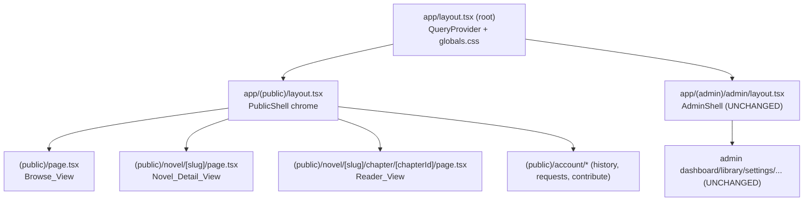
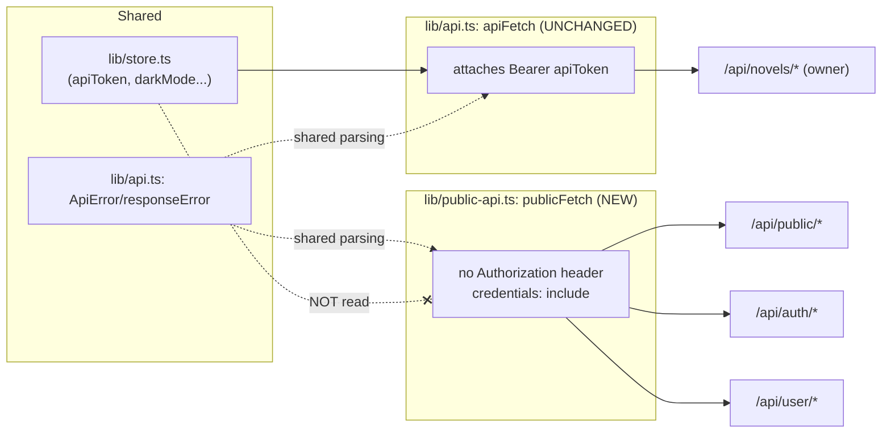
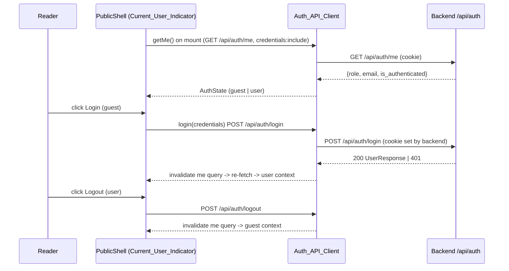
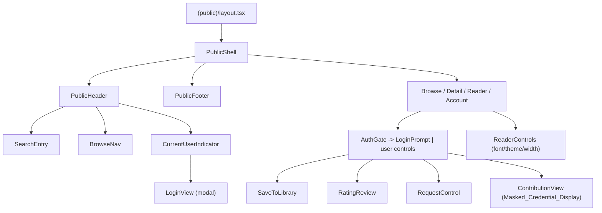

# Design Document: Public Reader Rework

## Overview

This design specifies a WTR-LAB-style rework of the **public reader application only** — the
routes under `frontend/app/(public)/**` of the Next.js 15 / React 19 / TypeScript frontend. It
adds a shared public chrome (header, search, browse/genre nav, current-user indicator, footer),
a browse/discovery home, a novel detail page, and a focused chapter reader with typography,
theme, and width controls. It also introduces authenticated account features for logged-in
users (`role: user`): login/logout, library, reading progress + continue-reading, reading
history, ratings/reviews, rate-limited requests, and contribution of a translation provider
credential.

The design is **strictly scoped to the public surface**. It MUST NOT modify, restyle, or
regress the admin/owner workspace under `frontend/app/(admin)/admin/**` or `components/admin/*`,
which is covered by the separate `admin-ui-rework` spec. Because the public reader and the admin
workspace share code (`lib/api.ts`, `lib/store.ts`, `components/ui/*`, `app/globals.css`,
`tailwind.config.ts`, the root `app/layout.tsx`), this design also defines a protected boundary
so the shared foundation can evolve safely.

### Grounding in the current codebase (audit findings)

The design derives from the actual repository state, not an idealized one. Key facts that shaped
it:

- **No public layout exists.** `app/(public)/` contains only `page.tsx`,
  `novel/[slug]/page.tsx`, and `novel/[slug]/chapter/[chapterId]/page.tsx`. There is no
  `(public)/layout.tsx`. The root `app/layout.tsx` only wires `QueryProvider` + `globals.css`.
- **The public pages currently call OWNER endpoints.** `(public)/page.tsx` calls `api.novels()`
  (`GET /api/novels`), the detail page calls `api.readerNovel()`, and the reader calls
  `api.readerChapter()`. All of these flow through the single `apiFetch` in `lib/api.ts`, which
  **attaches the owner `apiToken` as a `Bearer` header to every request**. This is precisely the
  credential-leak risk Requirement 7 targets; the rework re-points public reads at
  `GET /api/public/*` through a public-scoped client that never reads the store token.
- **The shared store mixes concerns.** `lib/store.ts` is a single persisted Zustand store
  (localStorage key `novelai-ui`) that holds both admin fields (`apiToken`, `apiTokens`,
  `darkMode`, `sidebarCollapsed`) and reader prefs (`readerTheme`, `readerFontSize`,
  `readerWidth`). Reader font size is already clamped to `[15,24]` in `setReaderFontSize`.
- **Admin owns the `html.dark` class.** `components/admin/admin-shell.tsx` runs
  `document.documentElement.classList.toggle("dark", darkMode)`. Reader theming MUST NOT touch
  that class (Requirement 15). The existing reader already applies dark/sepia via local container
  classes/inline styles; the rework formalizes this into public-scoped theming.
- **Backend public contract is fixed.** `routers/public.py` exposes `GET /api/public/catalog`
  (params `q`, `status`, `language`, `page`, `page_size`; returns `{novels,total,page,page_size}`),
  `GET /api/public/novels/{slug}`, `.../chapters`, and `.../chapters/{chapter_id}`.
- **Auth is HTTP-only session cookies.** `routers/auth.py` exposes `POST /api/auth/login`,
  `POST /api/auth/logout`, `GET /api/auth/me` (returns `{user_id,email,role,is_authenticated,is_owner}`).
  v1 login is an owner bootstrap secret; broader `user`-role login is a backend dependency
  (see Assumptions & Risks).
- **User endpoints exist except contributions.** `routers/user_data.py` implements
  `/api/user/library`, `/progress/{slug}`, `/history`, `/reviews/{slug}`, `/requests` behind
  `require_role("user")`. `/api/user/contributions` is **not yet implemented** in the backend;
  the frontend is designed to the `/api/user/*` convention with the backend dependency flagged.

### Goals

1. Add a public layout/chrome that wraps only `(public)/**` and is isolated from root/admin layouts.
2. Introduce a public-scoped data-access layer so public/auth/user requests never carry the owner
   Bearer token and use cookie-based session auth.
3. Add client auth/session state from `GET /api/auth/me`, with login/logout and gated user-only controls.
4. Apply reader theming (`light`/`dark`/`sepia`) without toggling `html.dark`, with reader prefs
   stored separately from the shared store's admin fields.
5. Deliver browse/search/genre/pagination, novel detail, reader view, and a contribution surface.

### Non-Goals

- Any change to `app/(admin)/admin/**`, `components/admin/*`, or admin behavior.
- Google OAuth wiring (schema-supported, future enhancement; login uses session credentials).
- Batch mode, billing, organizations, multi-admin teams (out of scope and blocked).
- Backend implementation of the contributions endpoints (frontend integrates; backend is a dependency).

## Architecture

### Route group isolation

The public reader gets a new `app/(public)/layout.tsx` server component that renders the
`PublicShell` client chrome around all public pages. Route groups in the App Router do not share
segment layouts, so `(public)/layout.tsx` and `(admin)/admin/layout.tsx` are siblings under the
single root `app/layout.tsx`; neither nests inside the other. This satisfies Requirement 1.5 and
16.3 by construction — the public chrome physically cannot render inside the admin tree.



### Data-access layering (public-scoped vs. shared)

The single `apiFetch` in `lib/api.ts` stays intact and keeps attaching the owner Bearer token for
admin use. A **new, separate public-scoped module** `lib/public-api.ts` provides the
`Public_API_Client`, `Auth_API_Client`, and `User_API_Client`. These use their own fetch wrapper
(`publicFetch`) that:

- **Never imports or reads `useUiStore().apiToken`** and never sets an `Authorization` header.
- Sets `credentials: "include"` so the HTTP-only session cookie is sent on `/api/auth/*` and
  `/api/user/*` requests.
- Reuses the existing `ApiError`/`responseError` parsing exported from `lib/api.ts` for consistent
  error shapes (importing those helpers does not couple it to the token logic).

This coexistence (two wrappers, one shared error model) keeps admin untouched while guaranteeing
the public surface cannot leak the owner credential (Requirement 7).



### Auth/session flow



The session token lives only in the HTTP-only cookie set by the backend. The client never reads,
writes, or persists it; `localStorage`, `sessionStorage`, and the Zustand store hold no session
token (Requirement 8.7).

### Reader theming isolation

Reader theme is applied via a **public-scoped `data-reader-theme` attribute** on the reader
container plus public-scoped CSS variables, never by toggling `document.documentElement.classList`
`dark`. Reader preferences move to a dedicated store slice (`useReaderPrefsStore`) persisted under
a separate localStorage key, fully decoupled from the admin `darkMode` field (Requirement 15).

### State management overview

| State | Location | Persistence | Scope |
|-------|----------|-------------|-------|
| Reader prefs (theme, fontSize, width) | `useReaderPrefsStore` (new) | localStorage `novelai-reader` | public only |
| Auth/session (role, email) | React Query `["auth","me"]` | none (cookie is source of truth) | public only |
| Library / progress / history / reviews / requests / contribution status | React Query caches | none (server is source of truth) | public, user-only |
| Owner `apiToken`, `darkMode`, `sidebarCollapsed` | `useUiStore` (existing) | localStorage `novelai-ui` | admin (unchanged) |

## Components and Interfaces

### Public chrome

- **`app/(public)/layout.tsx`** (server component) — wraps children in `<PublicShell>`. Adds nothing
  to `<html>`/`<body>` (root layout owns those).
- **`PublicShell`** (`components/public/public-shell.tsx`, client) — renders `Public_Header` +
  `{children}` + `Public_Footer`. Mounts the auth `me` query once for the whole subtree.
- **`PublicHeader`** — brand link → Browse_View (Req 1.4), `SearchEntry`, `BrowseNav`,
  `CurrentUserIndicator`. At viewport ≤ 768px collapses nav/search/indicator into a disclosure
  menu (Req 1.6).
- **`PublicFooter`** — static informational content/attribution (Req 1.3).
- **`CurrentUserIndicator`** — reads auth state; guest → login entry opening `LoginView`; user →
  identity + logout control (Req 8.1, 8.2, 8.5).
- **`SearchEntry`** — submits free-text query; pushes `?q=` to Browse_View (Req 3.1).
- **`BrowseNav`** — genre/facet selection; pushes `?genre=` (mapped to catalog filter) (Req 3.4).

### Pages

- **`Browse_View`** (`(public)/page.tsx`, rewritten) — uses `Public_API_Client.catalog()`; renders
  `NovelCard` grid; loading/empty/no-results/error states; pagination "next page" control; clear
  filters control (Req 2, 3).
- **`Novel_Detail_View`** (`novel/[slug]/page.tsx`, rewritten) — `Public_API_Client.novel()` +
  `chapters()`; ascending chapter order; translated → read control, untranslated → pending
  indicator; back-to-browse; 404/error states; for users: save-to-library, rating/review,
  continue-reading (Req 4, 10, 11, 13).
- **`Reader_View`** (`chapter/[chapterId]/page.tsx`, reworked) — `Public_API_Client.chapter()`;
  title + text; prev/next nav; back to detail; loading/404/error states; typography/theme/width
  controls; for users: progress `PUT` on chapter change and history `POST` on display (Req 5, 6,
  11, 12).
- **Account surfaces** under `(public)/account/*` (new): `Reading_History` view (Req 12),
  request list (Req 14), and `Contribution_View` (Req 17).

### Auth & gating components

- **`LoginView`** — credential form; calls `Auth_API_Client.login()`; 401 → invalid-credentials
  message without echoing credentials; no OAuth-specific controls (Req 8.3, 8.4, 8.8).
- **`AuthGate`** — renders user-only children when `role === "user"`, otherwise renders a
  `LoginPrompt` (Req 9). Centralizes 401/403 handling: a user request returning 401/403 flips the
  cached auth state to guest and shows the prompt (Req 9.4).
- **`LoginPrompt`** — placeholder affordance that opens `LoginView` (Req 9.1, 9.2).

### Data-access interfaces (`lib/public-api.ts`)

```ts
// publicFetch: no Authorization header; credentials: "include"; shared ApiError parsing.
export const publicApi = {
  catalog: (params: CatalogParams) => Promise<PublicCatalogResponse>,
  novel: (slug: string) => Promise<PublicNovelSummary>,
  chapters: (slug: string) => Promise<PublicChapterSummary[]>,
  chapter: (slug: string, chapterId: string) => Promise<PublicChapterDetail>,
};
export const authApi = {
  me: () => Promise<AuthUser>,
  login: (input: LoginInput) => Promise<AuthUser>,   // POST /api/auth/login
  logout: () => Promise<void>,                        // POST /api/auth/logout
};
export const userApi = {
  getLibraryItem: (slug) => Promise<LibraryMembership>,
  addToLibrary: (slug) => Promise<LibraryMembership>,
  removeFromLibrary: (slug) => Promise<void>,
  getProgress: (slug) => Promise<ReadingProgress>,
  putProgress: (slug, chapterId) => Promise<ReadingProgress>,
  recordHistory: (slug, chapterId) => Promise<void>,
  listHistory: () => Promise<HistoryEntry[]>,
  postReview: (slug, review) => Promise<ReviewResult>,
  listRequests: () => Promise<NovelRequest[]>,
  createRequest: (input) => Promise<NovelRequest>,
  getContribution: () => Promise<ContributionStatusResponse>,    // GET /api/user/contributions
  submitContribution: (rawKey) => Promise<ContributionStatusResponse>, // POST
  removeContribution: () => Promise<void>,                        // DELETE
};
```

React Query hooks (`hooks/public/*`) wrap these: `useCatalog`, `useNovel`, `useChapter`, `useAuthMe`,
`useLogin`, `useLogout`, `useLibraryItem`, `useProgress`, `useHistory`, `useReview`, `useRequests`,
`useContribution`. User-only hooks are `enabled: role === "user"` so guests never issue `/api/user/*`
requests (Req 9, 11.4, 12.5).

### Reader preferences store (`lib/reader-prefs.ts`)

A new persisted Zustand store, separate from `useUiStore`:

```ts
type ReaderPrefsState = {
  theme: "light" | "dark" | "sepia";
  fontSize: number;          // clamped to [15, 24]
  width: "compact" | "comfortable" | "wide";
  setTheme(theme): void;
  setFontSize(size): void;   // Math.min(24, Math.max(15, Math.round(size)))
  setWidth(width): void;
};
// persist key: "novelai-reader" (distinct from admin "novelai-ui")
```

The reader container applies theme via `data-reader-theme={theme}` and width via a max-width class;
font size via inline `style={{ fontSize }}`. No `documentElement` class is touched (Req 15.1).

### Component hierarchy



## Data Models

All types live in a new `lib/public-types.ts` (public-scoped; does not modify `lib/api-types.ts`).
Shapes mirror the backend Pydantic responses verified in the audit.

```ts
// ---- Catalog / Novel / Chapter (from routers/public.py) ----
export interface PublicNovelSummary {
  novel_id: string;
  slug: string;
  title: string | null;
  author: string | null;          // null -> render "Unknown author" (Req 2.4)
  language: string | null;
  status: string | null;
  chapter_count: number;
  translated_count: number;
}

export interface PublicCatalogResponse {
  novels: PublicNovelSummary[];
  total: number;                  // total > page_size -> show next-page control (Req 3.6)
  page: number;
  page_size: number;
}

export interface CatalogParams {
  q?: string;
  status?: string;
  language?: string;              // genre/facet mapped here
  page?: number;
  page_size?: number;
}

export interface PublicChapterSummary {
  chapter_id: string;
  title: string | null;
  chapter_number: number | null;  // sort ascending (Req 4.3)
  translated: boolean;            // false -> pending indicator (Req 4.5)
}

export interface PublicChapterDetail {
  novel_id: string;
  chapter_id: string;
  novel_title: string | null;
  title: string | null;
  text: string;
  previous_chapter_id: string | null;  // Req 5.4
  next_chapter_id: string | null;      // Req 5.5
}

// ---- Auth (from routers/auth.py) ----
export type ReaderRole = "guest" | "user" | "owner";
export interface AuthUser {
  user_id: number | null;
  email: string | null;
  role: ReaderRole;
  is_authenticated: boolean;
  is_owner: boolean;
}
export interface LoginInput { /* credential fields; session-based, no OAuth */ email?: string; secret: string; }

// ---- User data (from routers/user_data.py) ----
export interface LibraryMembership { slug: string; inLibrary: boolean; status?: string; }
export interface ReadingProgress { slug: string; chapter_id: string | null; progress_percent: number; }
export interface HistoryEntry { slug: string; read_at: string; chapter_id?: string | null; }
export interface ReviewInput { rating: number; body?: string; }   // rating range validated client-side (Req 13.4)
export interface ReviewResult { slug: string; rating: number | null; message: string; }
export type NovelRequestType = "novel" | "chapter";
export interface NovelRequestInput { request_type: NovelRequestType; source_url?: string; novel_id?: number | null; details?: string; }
export interface NovelRequest { id: number; request_type: string; status: string; source_url: string | null; }

// ---- Contribution (frontend-designed; backend dependency) ----
export type ContributionStatus = "Unchecked" | "Checking" | "Working" | "Failed";
export interface ContributionStatusResponse {
  present: boolean;                  // whether a credential exists
  status: ContributionStatus;        // Req 17.9
  masked_value: string | null;       // Masked_Credential_Display value, e.g. "AIza…7Bx" (Req 17.7)
  provider?: string | null;
  updated_at?: string | null;
}
// NOTE: raw credential is request-only input; never stored client-side (Req 17.6).
```

### Masking & font-size helpers (pure functions, property-tested)

```ts
// lib/public-format.ts
export function maskCredential(raw: string, prefix = 4, suffix = 2): string; // never returns full raw
export function clampReaderFontSize(size: number): number;                   // -> [15,24]
```


## Correctness Properties

*A property is a characteristic or behavior that should hold true across all valid executions of a
system — essentially, a formal statement about what the system should do. Properties serve as the
bridge between human-readable specifications and machine-verifiable correctness guarantees.*

These properties target the **public-scoped pure logic and data-access layer** (the fetch wrappers,
preference store, masking/clamp helpers, and rendering mappers), which is where input variation
meaningfully reveals bugs. Purely structural, copy, or one-time-setup criteria are covered by
example/smoke tests in the Testing Strategy and the Requirements Traceability table, not here.

### Security & isolation properties

#### Property 1: Owner credential is never attached to public requests

*For any* request issued through `publicFetch` (any path, method, or caller-supplied headers), even
while a non-empty owner `apiToken` exists in the shared store, the outgoing request carries no
`Authorization` header derived from that store.

**Validates: Requirements 7.2, 7.3**

#### Property 2: Auth and user requests use the session cookie and no store Bearer

*For any* request to an `/api/auth/*` or `/api/user/*` endpoint (including `/api/user/contributions`),
the request init has `credentials: "include"` and carries no `Authorization` header derived from the
shared store.

**Validates: Requirements 7.5, 17.5**

#### Property 3: Public reader never targets owner novel endpoints

*For any* reader data fetch made by the public clients, the request URL path begins with `/api/public`,
`/api/auth`, or `/api/user` and never with `/api/novels`.

**Validates: Requirements 7.1, 7.4**

#### Property 4: Session token is never written to JavaScript-accessible storage

*For any* sequence of authentication actions (me, login, logout) and any backend response, after each
action `localStorage`, `sessionStorage`, and the Zustand store snapshots contain no session token
value.

**Validates: Requirements 8.7**

#### Property 5: Guests never call user-only endpoints

*For any* user-gated view rendered while the role is `guest`, no request is issued to any `/api/user/*`
endpoint.

**Validates: Requirements 9 (gating), 11.4, 12.5**

#### Property 6: Reader theme never toggles the document dark class

*For any* sequence of `Reader_Theme` selections (including `dark`) under any admin `darkMode` value,
the document root element never gains the `dark` class as a result, and the reading area reflects the
selected `Reader_Theme`.

**Validates: Requirements 6.4, 15.1, 15.4**

#### Property 7: Reader theme changes never mutate the admin dark-mode field

*For any* sequence of `Reader_Theme` changes, the shared store's `darkMode` value is unchanged, and
reader preferences persist under the dedicated `novelai-reader` key (separate from admin `novelai-ui`).

**Validates: Requirements 15.2, 15.3**

#### Property 8: Raw contributed credential is never persisted client-side

*For any* submitted raw `Contributed_Credential`, after submission no substring equal to the raw value
appears in `localStorage`, `sessionStorage`, or the Zustand store.

**Validates: Requirements 17.6**

#### Property 9: Masked credential never reveals the full value

*For any* credential string, `maskCredential` returns a value that is not equal to the raw input,
exposes at most the configured leading prefix and trailing suffix characters of the raw value, and
masks the middle for values longer than the prefix+suffix budget.

**Validates: Requirements 17.7**

#### Property 10: Error messages redact secrets and stack traces

*For any* error value (including `ApiError`s whose fields embed token-like, header-like, session-like,
or credential-like strings), the user-facing error text produced by the public error formatter
excludes provider keys, `Authorization` header values, session values, the raw contributed credential,
and raw stack traces.

**Validates: Requirements 2.8, 4.8, 5.8, 13.5, 17.14**

#### Property 11: Login failure never echoes the submitted secret

*For any* submitted login secret, when `POST /api/auth/login` returns 401 the rendered
invalid-credentials message does not contain the submitted secret or a raw stack trace.

**Validates: Requirements 8.4**

### Reader preferences properties

#### Property 12: Font size stays within the inclusive range [15, 24]

*For any* starting font size and any sequence of increase/decrease operations, the resulting persisted
font size is an integer within `[15, 24]`, and clamping an already-clamped value is idempotent.

**Validates: Requirements 6.1, 6.2**

#### Property 13: Reader settings persist and rehydrate identically

*For any* valid `Reader_Settings` value (theme, font size, width), writing it to the
`Reader_Preferences_Store` and reading it back (including after rehydration) yields the same value.

**Validates: Requirements 6.7, 6.8**

#### Property 14: Content width maps to a fixed maximum-width class

*For any* width selection in `{compact, comfortable, wide}`, the reader container applies the single
mapped maximum-width class for that selection.

**Validates: Requirements 6.5, 6.6**

### Catalog, detail, and reader rendering properties

#### Property 15: One card per returned novel

*For any* catalog/search result list, the `Browse_View` renders exactly one `Novel_Card` per returned
novel.

**Validates: Requirements 2.2, 3.2**

#### Property 16: Cards and detail always render required fields with author fallback

*For any* novel summary, the rendered `Novel_Card` and `Novel_Detail_View` contain the title, the
translated chapter count, and the author — rendering the literal text `Unknown author` whenever the
author value is null or empty.

**Validates: Requirements 2.3, 2.4, 4.2**

#### Property 17: Chapter list renders in ascending order

*For any* chapter list returned in any order, the `Novel_Detail_View` renders the chapters in
non-decreasing order by chapter number (falling back to chapter id).

**Validates: Requirements 4.3**

#### Property 18: Translated chapters get a read control, untranslated get a pending indicator

*For any* chapter, when it is marked translated the detail view renders an enabled control navigating
to its `Reader_View`, and when it is not translated it renders a non-interactive pending indicator.

**Validates: Requirements 4.4, 4.5**

#### Property 19: Reader navigation targets match the returned neighbor ids

*For any* chapter detail, the previous control is present iff a previous chapter id exists and targets
that id, and the next control is present iff a next chapter id exists and targets that id.

**Validates: Requirements 5.4, 5.5**

#### Property 20: Next-page control visibility matches the pagination arithmetic

*For any* `(total, page, page_size)`, the `Browse_View` shows the next-page control iff
`page * page_size < total`.

**Validates: Requirements 3.6**

#### Property 21: Clearing filters restores the unfiltered baseline

*For any* active combination of search query and genre filter, activating the clear control yields the
same catalog request parameters as the initial unfiltered state.

**Validates: Requirements 3.5**

#### Property 22: No-results message includes the submitted query

*For any* submitted search query that returns zero results, the no-results message contains the
submitted query text verbatim.

**Validates: Requirements 3.3**

### User-feature properties

#### Property 23: Role-based gating renders exactly one affordance

*For any* user-only control kind and any role, the `AuthGate` renders the `LoginPrompt` (and not the
action control) when the role is `guest`, and renders the action control (and not the prompt) when the
role is `user`.

**Validates: Requirements 9.1, 9.3, 17.2**

#### Property 24: Library toggle is a round-trip

*For any* initial library membership state, performing add-then-remove (or remove-then-add) returns the
displayed membership to its initial state, and each confirmed step updates the control to the new
membership.

**Validates: Requirements 10.2, 10.3, 10.4**

#### Property 25: Library state is unchanged when a request fails

*For any* initial membership state, if a `Library_Endpoint` request fails the displayed membership
equals the pre-action membership.

**Validates: Requirements 10.6**

#### Property 26: Continue-reading targets the recorded chapter

*For any* recorded `Reading_Progress` chapter id, the `Continue_Reading` control targets the
`Reader_View` for that chapter.

**Validates: Requirements 11.3**

#### Property 27: Reading history renders most-recent-first

*For any* non-empty history entry list, the `Reading_History` view renders entries in non-increasing
order by `read_at`.

**Validates: Requirements 12.3**

#### Property 28: Reviews submit only for in-range ratings

*For any* rating value, the review control calls `POST /api/user/reviews/{slug}` iff the rating is
within the accepted range, and otherwise shows a validation message and makes no endpoint call.

**Validates: Requirements 13.4**

#### Property 29: Contribution status is constrained to the allowed set

*For any* status value returned by the contribution endpoint, the `Contribution_View` renders a status
within `{Unchecked, Checking, Working, Failed}` (mapping unknown values to a safe default).

**Validates: Requirements 17.9**

## Error Handling

All public error handling routes through a single public-scoped formatter
(`lib/public-format.ts: toReaderError(error)`) that reuses the shared `ApiError` shape but produces a
**sanitized, reader-safe** message. It never surfaces provider keys, `Authorization` header values,
session values, the raw contributed credential, or raw stack traces (Property 10).

| Condition | Detection | Reader-facing behavior | Requirements |
|-----------|-----------|------------------------|--------------|
| Catalog/novel/chapter request pending | React Query `isPending` | Loading indicator | 2.6, 5.3 |
| Catalog returns empty | `novels.length === 0` (no query) | Empty-state message | 2.7 |
| Search returns empty | `novels.length === 0` (query active) | No-results message incl. query text | 3.3 |
| Novel/chapter 404 | `ApiError.status === 404` | Not-found / chapter-unavailable message | 4.7, 5.7 |
| Public request failure (non-404) | `isError` | Sanitized error message | 2.8, 4.8, 5.8 |
| Login 401 | `ApiError.status === 401` | Invalid-credentials message, secret not echoed | 8.4 |
| User endpoint 401/403 | `ApiError.status in {401,403}` | Flip auth state to guest, show `LoginPrompt` | 9.4, 17.15 |
| Library failure | `isError` on mutation | Error message; membership state unchanged | 10.6 |
| Progress failure | `isError` | Render content without `Continue_Reading` | 11.5 |
| Review failure | `isError` | Sanitized error message | 13.5 |
| Request rate-limited | rate-limit status | Rate-limit message; no auto-resubmit | 14.5 |
| Contribution failure | `isError` | Sanitized error; raw credential never shown | 17.14 |

Loading and empty states are first-class for every data view; mutations use optimistic-safe patterns
that revert to server truth on error (Property 25).

## Testing Strategy

### Dual approach

- **Property-based tests** validate the universal invariants in the Correctness Properties section —
  primarily the pure helpers (`maskCredential`, `clampReaderFontSize`, width mapping, pagination
  predicate, error sanitizer), the fetch-wrapper header/credential policy, the preferences store, and
  the rendering mappers (card count, ordering, gating). This is where input variation finds real bugs.
- **Example-based unit tests** validate specific interactions and copy: header landmarks present,
  brand/back link targets, "which endpoint was called" assertions, OAuth-absent login form, rate-limit
  message, request framing copy, 404 messages, and the `Checking`/in-progress contribution state.
- **Smoke/structural tests** validate one-time facts: public layout wraps public pages, admin layout
  does not import public chrome, shared `components/ui/*` and admin files are unmodified, and the
  `npm run typecheck` + `npm run build` gates pass.

### Property-based testing configuration

PBT **is appropriate** here because the data-access and helper layer exposes clear input/output
behavior and universal invariants over large input spaces (arbitrary credentials, font sizes, error
payloads, novel/chapter lists, request parameters). It is **not** used for layout structure, static
copy, responsive layout, or the toolchain gates.

- Library: **fast-check** with Vitest + React Testing Library (matches the TypeScript/React stack).
- Minimum **100 iterations** per property test.
- Each property test is tagged with a comment referencing its design property, using the format:
  `// Feature: public-reader-rework, Property {number}: {property_text}`
- Each Correctness Property is implemented by a **single** property-based test.
- For the storage/fetch-policy properties, tests use an in-memory storage shim and a `fetch` spy so no
  network or owner credential is involved; the shared store is seeded with a random token to prove it
  is never read by `publicFetch`.

### Key example/integration tests

- Endpoint-selection tests assert browse/detail/reader use `publicApi` (`/api/public/*`), not
  `api.novels*`, and that captured request init has no `Authorization` header.
- Auth flow tests drive guest → login → user → logout and assert `me` re-fetch and indicator state.
- Gating tests assert guest views issue zero `/api/user/*` calls (also covered as Property 5).
- Admin regression smoke test renders an admin page and asserts public chrome is absent and the
  `dark` class behavior is owned solely by `AdminShell`.

## No Admin Files Touched & Build Gates

This rework is additive on the public surface and protects the shared boundary:

- **New files only** for public behavior: `app/(public)/layout.tsx`, `components/public/*`,
  `lib/public-api.ts`, `lib/public-types.ts`, `lib/public-format.ts`, `lib/reader-prefs.ts`,
  `hooks/public/*`, plus the rewritten `(public)` pages.
- **Untouched:** `app/(admin)/admin/**`, `components/admin/*` (including `admin-shell.tsx` which owns
  the `html.dark` toggle), and `lib/api.ts`'s existing `apiFetch` token behavior.
- **Shared, consumed not modified:** `components/ui/*` primitives are reused via composition only;
  any public-only visual variant is applied through wrapper classes, never by editing the primitive
  defaults (Requirements 16.1, 16.2).
- **Shared store:** `lib/store.ts` admin fields are not altered by the reader; reader preferences move
  to the separate `useReaderPrefsStore`. If reader-pref fields are later removed from `useUiStore`,
  that is a follow-up cleanup that must not change admin field behavior.
- **Gates:** the change must pass the existing `npm run typecheck` and `npm run build` checks
  (Requirement 16.5), and the CI workflow (`.github/workflows/ci.yml`) runs them. A diff guard in
  review confirms no changes under admin paths (Requirements 16.3, 16.4).

## Requirements Traceability

| Requirement | Covered by (design element) | Verification |
|-------------|------------------------------|--------------|
| 1.1–1.6 Layout & chrome | `(public)/layout.tsx`, `PublicShell`, `PublicHeader`, `PublicFooter`, responsive disclosure | Smoke + example tests |
| 2.1–2.8 Browse | `Browse_View`, `useCatalog`, `NovelCard`, states | Properties 3, 10, 15, 16; examples |
| 3.1–3.6 Search/genre/pagination | `SearchEntry`, `BrowseNav`, catalog params, clear control | Properties 20, 21, 22; examples |
| 4.1–4.8 Novel detail | `Novel_Detail_View`, `useNovel`/`useChapters` | Properties 10, 16, 17, 18; examples |
| 5.1–5.8 Reader experience | `Reader_View`, `useChapter` | Properties 10, 19; examples |
| 6.1–6.9 Typography/theme/width | `ReaderControls`, `useReaderPrefsStore`, `data-reader-theme` | Properties 6, 12, 13, 14; examples |
| 7.1–7.5 Public-scoped access | `lib/public-api.ts` `publicFetch` | Properties 1, 2, 3 |
| 8.1–8.8 Auth/session | `Auth_API_Client`, `CurrentUserIndicator`, `LoginView` | Properties 4, 11; examples |
| 9.1–9.4 Gating | `AuthGate`, `LoginPrompt`, 401/403 handling | Properties 5, 23; examples |
| 10.1–10.6 Library | `SaveToLibrary`, `useLibraryItem` | Properties 24, 25; examples |
| 11.1–11.5 Progress | progress hooks, `Continue_Reading` | Properties 5, 26; examples |
| 12.1–12.5 History | `Reading_History`, history hooks | Properties 5, 27; examples |
| 13.1–13.5 Reviews | `RatingReview`, `useReview` | Properties 10, 28; examples |
| 14.1–14.6 Requests | `RequestControl`, `useRequests` | Examples (incl. rate-limit, framing) |
| 15.1–15.4 Theme isolation | `data-reader-theme`, separate store key | Properties 6, 7 |
| 16.1–16.5 Shared reuse / no regression | composition-only reuse, diff guard, gates | Smoke tests |
| 17.1–17.15 Contribution | `Contribution_View`, `Masked_Credential_Display`, contribution hooks | Properties 2, 8, 9, 10, 23, 29; examples |

## Assumptions & Risks

1. **User-role login is a backend dependency.** `routers/auth.py` currently implements only an owner
   bootstrap secret login (`LoginRequest.secret`) and Google OAuth is not wired. The design treats
   `POST /api/auth/login` as the session-establishing endpoint and builds the credential `LoginView`
   around it (no OAuth controls, Req 8.8). **Risk:** until the backend supports `role: user`
   credential login, end-to-end user features cannot be exercised against a live `user` session. The
   frontend is built to the documented contract and degrades to guest behavior when `me` reports
   `guest`.
2. **Contribution endpoints are not yet implemented.** `/api/user/contributions` (GET/POST/DELETE) is
   designed to the `/api/user/*` convention (session cookie, masked status response) but does not exist
   in `user_data.py` yet. **Risk/Dependency:** backend must add these endpoints returning the
   `ContributionStatusResponse` shape (masked value + `Contribution_Status`); the frontend never
   receives or stores the raw credential (Properties 8, 9). Until then, the `Contribution_View` should
   surface a clear "not yet available" state behind the existing gating.
3. **Catalog genre/facet mapping.** The backend `catalog` endpoint exposes `status` and `language`
   filters but no explicit `genre` field. `BrowseNav` genre selection maps onto the available filter
   parameter(s); if a dedicated genre facet is added later, only the param mapping changes, not the UI.
4. **History payload shape.** `POST /api/user/history` currently takes `slug`/`chapter_id` as query
   parameters and `GET /api/user/history` returns `{slug, read_at}`. The `HistoryEntry` type treats
   `chapter_id` as optional to match the current backend while allowing future enrichment.
5. **Reader prefs migration.** Existing reader fields live in `useUiStore` (`novelai-ui`). Moving them
   to `useReaderPrefsStore` (`novelai-reader`) means prior guest preferences are not auto-migrated;
   defaults (`light`, 18px, `comfortable`) apply on first load. A one-time read-and-copy migration is
   optional and must not write admin fields.
