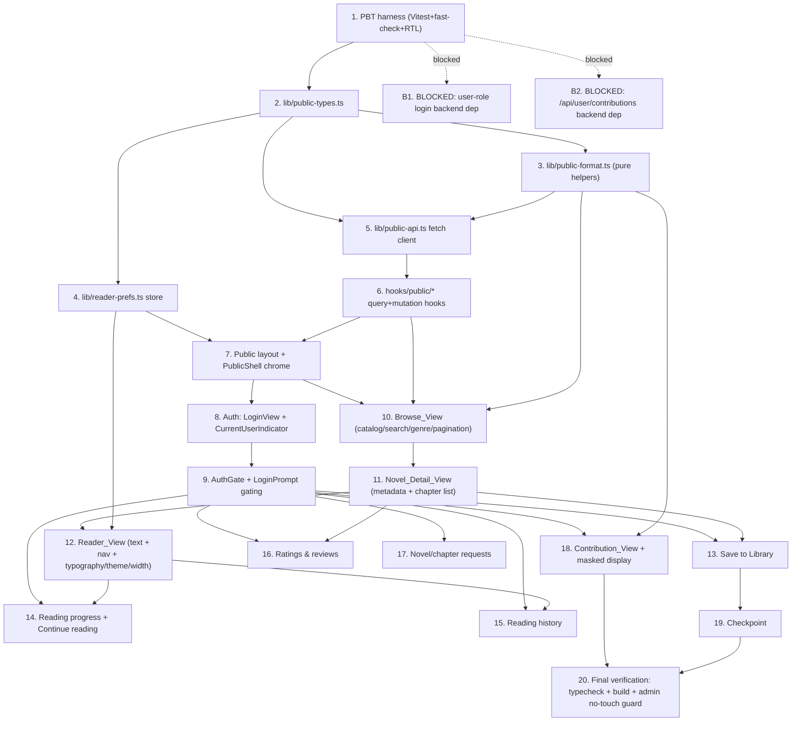

# Implementation Plan: Public Reader Rework

## Overview

This plan implements the WTR-LAB-style public reader rework strictly within the
`frontend/app/(public)/**` route group and the new public-scoped modules defined in the design
(`lib/public-api.ts`, `lib/public-types.ts`, `lib/public-format.ts`, `lib/reader-prefs.ts`,
`hooks/public/*`, `components/public/*`). Work is sequenced foundation-first: a property-based
testing harness, the public-scoped types + pure helpers, the reader-preferences store, the
public-scoped fetch client, and the public layout/shell are built and verified before any page or
user feature consumes them. Pages and user-only features follow, each landing its design
Correctness Properties as `fast-check` property tests next to the code they validate.

The plan is **additive and protective of the admin boundary**. No task may modify
`app/(admin)/admin/**`, `components/admin/*`, or the existing `apiFetch` token behavior in
`lib/api.ts`. Shared `components/ui/*` primitives are reused via composition only. The plan ends
with verification tasks (`npm run typecheck`, `npm run build`, and an admin no-touch diff guard).

Two backend dependencies are flagged as blocked/assumption tasks so they are never silently faked
client-side: user-role session login (`POST /api/auth/login` for `role: user`) and the
`/api/user/contributions` GET/POST/DELETE endpoints.

### Conventions

- Language/stack: TypeScript, React 19, Next.js 15 App Router (matches the existing frontend).
- Property tests use **Vitest + fast-check + React Testing Library**, minimum **100 iterations**
  per property, each tagged with a comment:
  `// Feature: public-reader-rework, Property {number}: {property_text}`
- Each Correctness Property is implemented by exactly **one** property-based test.
- Sub-tasks marked with `*` are optional test tasks and are not required for a working MVP.
- Pure, input/output logic (masking, clamping, width mapping, pagination predicate, sorting,
  author fallback, status mapping, error sanitizing, filter-clearing) is extracted into pure
  functions so it can be property-tested without rendering or network.

---

## Task Dependency Graph

---

## Tasks

- [x] 1. Set up property-based testing harness (foundation)
  - Add `vitest`, `fast-check`, `@testing-library/react`, `@testing-library/jest-dom`, `jsdom`
    (and `@testing-library/user-event`) to `frontend/package.json` devDependencies.
  - Add `vitest.config.ts` with the `jsdom` environment, React plugin, and the `@/` path alias
    matching `tsconfig.json`; add a `test` setup file registering `jest-dom` matchers and an
    in-memory `localStorage`/`sessionStorage` shim for storage-policy tests.
  - Add `"test"` and `"test:run"` scripts (single-run, e.g. `vitest run`) to `package.json`.
  - Add a trivial smoke spec under `app/(public)/__tests__/` to confirm the runner and `@/` alias
    resolve; do NOT add any test config or dependency that alters admin behavior.
  - _Requirements: 16.5_

- [x] 2. Define public-scoped data types
  - Create `lib/public-types.ts` with all interfaces from the design: `PublicNovelSummary`,
    `PublicCatalogResponse`, `CatalogParams`, `PublicChapterSummary`, `PublicChapterDetail`,
    `ReaderRole`, `AuthUser`, `LoginInput`, `LibraryMembership`, `ReadingProgress`, `HistoryEntry`,
    `ReviewInput`, `ReviewResult`, `NovelRequestType`, `NovelRequestInput`, `NovelRequest`,
    `ContributionStatus`, and `ContributionStatusResponse`.
  - Do NOT modify `lib/api-types.ts`; this is a new, separate public-scoped module.
  - _Requirements: 2.3, 2.4, 4.2, 4.3, 4.5, 5.4, 5.5, 8.1, 17.7, 17.9_

- [x] 3. Implement public-scoped pure helpers
  - [x] 3.1 Implement `lib/public-format.ts` pure functions
    - `clampReaderFontSize(size)` → integer in `[15, 24]`.
    - `maskCredential(raw, prefix=4, suffix=2)` → masked string that never equals the raw value.
    - `toReaderError(error)` → sanitized reader-safe message (reuses shared `ApiError` shape from
      `lib/api.ts` for parsing only; never surfaces provider keys, `Authorization` values, session
      values, raw contributed credential, or stack traces).
    - `widthClass(width)` → single mapped max-width class for `compact|comfortable|wide`.
    - `hasNextPage(total, page, page_size)` → `page * page_size < total`.
    - `clearedCatalogParams()` → the baseline unfiltered `CatalogParams`.
    - `sortChaptersAscending(chapters)` and `authorOrFallback(author)` (returns `"Unknown author"`
      when null/empty).
    - `mapContributionStatus(value)` → constrains to `{Unchecked, Checking, Working, Failed}` with
      a safe default for unknown values.
    - _Requirements: 2.4, 3.3, 3.5, 3.6, 4.2, 4.3, 6.2, 6.5, 6.6, 17.7, 17.9_

  - [x] 3.2 Write property test for `clampReaderFontSize`
    - **Property 12: Font size stays within the inclusive range [15, 24]**
    - **Validates: Requirements 6.1, 6.2**

  - [x] 3.3 Write property test for `maskCredential`
    - **Property 9: Masked credential never reveals the full value**
    - **Validates: Requirements 17.7**

  - [x] 3.4 Write property test for `toReaderError`
    - **Property 10: Error messages redact secrets and stack traces**
    - **Validates: Requirements 2.8, 4.8, 5.8, 13.5, 17.14**

  - [x] 3.5 Write property test for `widthClass`
    - **Property 14: Content width maps to a fixed maximum-width class**
    - **Validates: Requirements 6.5, 6.6**

  - [x] 3.6 Write property test for `hasNextPage`
    - **Property 20: Next-page control visibility matches the pagination arithmetic**
    - **Validates: Requirements 3.6**

  - [x] 3.7 Write property test for `clearedCatalogParams`
    - **Property 21: Clearing filters restores the unfiltered baseline**
    - **Validates: Requirements 3.5**

  - [x] 3.8 Write property test for `mapContributionStatus`
    - **Property 29: Contribution status is constrained to the allowed set**
    - **Validates: Requirements 17.9**

- [x] 4. Implement the reader preferences store
  - [x] 4.1 Create `lib/reader-prefs.ts` `useReaderPrefsStore`
    - Persisted Zustand store with key `"novelai-reader"` (distinct from admin `"novelai-ui"`);
      fields `theme` (`light|dark|sepia`), `fontSize` (clamped via `clampReaderFontSize`), `width`
      (`compact|comfortable|wide`); actions `setTheme`, `setFontSize`, `setWidth`; defaults
      `light`, `18`, `comfortable`. Do NOT touch `useUiStore`/`darkMode` or
      `document.documentElement` class state.
    - _Requirements: 6.7, 6.8, 15.1, 15.2, 15.3_

  - [ ] 4.2 Write property test for reader-prefs persistence/rehydration
    - **Property 13: Reader settings persist and rehydrate identically**
    - **Validates: Requirements 6.7, 6.8**

  - [ ] 4.3 Write property test for theme isolation from admin dark-mode
    - **Property 7: Reader theme changes never mutate the admin dark-mode field**
    - **Validates: Requirements 15.2, 15.3**

- [x] 5. Implement the public-scoped fetch client
  - [x] 5.1 Create `lib/public-api.ts` with `publicFetch` and clients
    - `publicFetch` never imports/reads `useUiStore().apiToken` and never sets an `Authorization`
      header; sets `credentials: "include"`; reuses `ApiError`/`responseError` parsing imported
      from `lib/api.ts` (parsing only, no token coupling).
    - Export `publicApi` (`catalog`, `novel`, `chapters`, `chapter` → `/api/public/*`), `authApi`
      (`me`, `login`, `logout` → `/api/auth/*`), and `userApi` (library/progress/history/reviews/
      requests/contributions → `/api/user/*`) per the design interface.
    - Do NOT call owner `/api/novels/*` endpoints from any public client.
    - _Requirements: 7.1, 7.2, 7.3, 7.4, 7.5, 8.3, 8.6, 17.5_

  - [ ] 5.2 Write property test for owner-credential isolation
    - **Property 1: Owner credential is never attached to public requests**
    - Seed `useUiStore` with a random non-empty `apiToken`; assert outgoing init via a `fetch` spy
      has no store-derived `Authorization` header.
    - **Validates: Requirements 7.2, 7.3**

  - [ ] 5.3 Write property test for auth/user cookie policy
    - **Property 2: Auth and user requests use the session cookie and no store Bearer**
    - **Validates: Requirements 7.5, 17.5**

  - [ ] 5.4 Write property test for endpoint-path scoping
    - **Property 3: Public reader never targets owner novel endpoints**
    - **Validates: Requirements 7.1, 7.4**

  - [ ] 5.5 Write property test for session-token storage policy
    - **Property 4: Session token is never written to JavaScript-accessible storage**
    - Drive me/login/logout against stubbed responses; assert `localStorage`, `sessionStorage`, and
      the Zustand snapshot contain no session-token value.
    - **Validates: Requirements 8.7**

- [x] 6. Implement React Query hooks over the public clients
  - Create `hooks/public/` modules: `useCatalog`, `useNovel`, `useChapters`, `useChapter`,
    `useAuthMe`, `useLogin`, `useLogout`, `useLibraryItem`, `useProgress`, `useHistory`,
    `useReview`, `useRequests`, `useContribution`.
  - User-only hooks MUST be `enabled: role === "user"` (from `useAuthMe`) so guests never issue
    `/api/user/*` requests; centralize 401/403 handling to flip cached auth state to guest.
  - _Requirements: 8.1, 9.4, 11.4, 12.5, 17.15_

  - [ ] 6.1 Write property test for guest gating at the hook layer
    - **Property 5: Guests never call user-only endpoints**
    - With role `guest`, render user-gated hook consumers and assert zero `/api/user/*` fetches.
    - **Validates: Requirements 9 (gating), 11.4, 12.5**

- [x] 7. Implement the public layout and shell chrome
  - Create `app/(public)/layout.tsx` (server component) wrapping children in `PublicShell`; add
    nothing to `<html>`/`<body>` (root layout owns those).
  - Create `components/public/public-shell.tsx` (client) rendering `PublicHeader` + `{children}` +
    `PublicFooter`, mounting the `useAuthMe` query once for the subtree.
  - Create `components/public/public-header.tsx` (brand link → Browse_View, `SearchEntry`,
    `BrowseNav`, `CurrentUserIndicator`), `components/public/public-footer.tsx`,
    `components/public/search-entry.tsx` (pushes `?q=`), and `components/public/browse-nav.tsx`
    (pushes `?genre=`). At viewport ≤ 768px collapse nav/search/indicator into a disclosure menu.
  - Reuse `components/ui/*` via composition only; do NOT modify primitive defaults.
  - _Requirements: 1.1, 1.2, 1.3, 1.4, 1.5, 1.6, 3.1, 3.4, 16.1, 16.2_

  - [ ] 7.1 Write smoke/structural tests for public chrome isolation
    - Assert the public layout wraps a sample public page with header/footer landmarks and brand
      link target; assert public chrome does NOT render in/import from the admin tree.
    - _Requirements: 1.1, 1.2, 1.3, 1.5_

- [x] 8. Implement authentication UI and session indicator
  - Create `components/public/login-view.tsx` (credential form; calls `useLogin`; 401 →
    invalid-credentials message that does not echo the submitted secret; no OAuth-specific
    controls) and `components/public/current-user-indicator.tsx` (guest → login entry opening
    `LoginView`; user → identity + logout via `useLogout`).
  - Wire the indicator into `PublicHeader`; invalidate the `["auth","me"]` query on login/logout.
  - _Requirements: 8.1, 8.2, 8.3, 8.4, 8.5, 8.6, 8.7, 8.8_

  - [ ] 8.1 Write property test for login-failure secret redaction
    - **Property 11: Login failure never echoes the submitted secret**
    - **Validates: Requirements 8.4**

  - [ ] 8.2 Write example tests for auth flow and OAuth-absence
    - Drive guest → login → user → logout asserting `me` re-fetch and indicator state; assert the
      login form exposes no OAuth controls.
    - _Requirements: 8.2, 8.5, 8.6, 8.8_

- [x] 9. Implement role-based gating components
  - Create `components/public/auth-gate.tsx` (renders user-only children when `role === "user"`,
    otherwise renders `LoginPrompt`) and `components/public/login-prompt.tsx` (opens `LoginView`).
  - Route user-endpoint 401/403 through `AuthGate` to flip auth state to guest and show the prompt.
  - _Requirements: 9.1, 9.2, 9.3, 9.4_

  - [ ] 9.1 Write property test for gating affordance exclusivity
    - **Property 23: Role-based gating renders exactly one affordance**
    - **Validates: Requirements 9.1, 9.3, 17.2**

- [x] 10. Rewrite the Browse_View (discovery home)
  - Rewrite `app/(public)/page.tsx` to use `useCatalog` (`publicApi.catalog`) instead of owner
    `api.novels()`; create `components/public/novel-card.tsx` (title, author via `authorOrFallback`,
    translated chapter count; activates → Novel_Detail_View).
  - Render the card grid; loading indicator while pending; empty-state when unfiltered list empty;
    no-results message including submitted query text when a query returns zero; sanitized error
    message via `toReaderError`; next-page control gated by `hasNextPage`; clear-filters control
    using `clearedCatalogParams`.
  - _Requirements: 2.1, 2.2, 2.3, 2.4, 2.5, 2.6, 2.7, 2.8, 3.1, 3.2, 3.3, 3.4, 3.5, 3.6_

  - [ ] 10.1 Write property test for card-per-novel rendering
    - **Property 15: One card per returned novel**
    - **Validates: Requirements 2.2, 3.2**

  - [ ] 10.2 Write property test for required card fields and author fallback
    - **Property 16: Cards and detail always render required fields with author fallback**
    - **Validates: Requirements 2.3, 2.4, 4.2**

  - [ ] 10.3 Write property test for no-results message content
    - **Property 22: No-results message includes the submitted query**
    - **Validates: Requirements 3.3**

  - [ ] 10.4 Write example tests for loading/empty/error states
    - _Requirements: 2.6, 2.7, 2.8_

- [x] 11. Rewrite the Novel_Detail_View
  - Rewrite `app/(public)/novel/[slug]/page.tsx` to use `useNovel` + `useChapters`
    (`publicApi.novel`/`chapters`); display title, author (`authorOrFallback`), translated chapter
    count; render chapters ascending via `sortChaptersAscending`; translated → read control to
    Reader_View, untranslated → non-interactive pending indicator; back-to-browse control; 404
    not-found message; sanitized error message.
  - Reserve composition slots (behind `AuthGate`) for save-to-library, rating/review, and
    continue-reading added in later tasks.
  - _Requirements: 4.1, 4.2, 4.3, 4.4, 4.5, 4.6, 4.7, 4.8_

  - [ ] 11.1 Write property test for ascending chapter order
    - **Property 17: Chapter list renders in ascending order**
    - **Validates: Requirements 4.3**

  - [ ] 11.2 Write property test for translated/untranslated chapter affordances
    - **Property 18: Translated chapters get a read control, untranslated get a pending indicator**
    - **Validates: Requirements 4.4, 4.5**

  - [ ] 11.3 Write example tests for 404 and error states
    - _Requirements: 4.7, 4.8_

- [x] 12. Rework the Reader_View (chapter reading + controls)
  - Rework `app/(public)/novel/[slug]/chapter/[chapterId]/page.tsx` to use `useChapter`
    (`publicApi.chapter`); display chapter title + text; loading indicator while pending; prev/next
    nav present iff neighbor ids exist and target those ids; back-to-detail control; 404
    chapter-unavailable message; sanitized error message.
  - Create `components/public/reader-controls.tsx` consuming `useReaderPrefsStore`: font-size
    increase/decrease (clamped `[15,24]`), `Reader_Theme` select applied via `data-reader-theme`,
    content-width select applied via `widthClass`; font size via inline style. Never toggle the
    `html.dark` class.
  - _Requirements: 5.1, 5.2, 5.3, 5.4, 5.5, 5.6, 5.7, 5.8, 6.1, 6.2, 6.3, 6.4, 6.5, 6.6, 6.7, 6.8, 15.1, 15.4_

  - [ ] 12.1 Write property test for reader navigation targets
    - **Property 19: Reader navigation targets match the returned neighbor ids**
    - **Validates: Requirements 5.4, 5.5**

  - [ ] 12.2 Write property test for theme/dark-class isolation
    - **Property 6: Reader theme never toggles the document dark class**
    - **Validates: Requirements 6.4, 15.1, 15.4**

- [x] 13. Implement save-to-library
  - Create `components/public/save-to-library.tsx` (behind `AuthGate`) used by `NovelCard` and
    `Novel_Detail_View`; initial state from `useLibraryItem` (`GET /api/user/library/{slug}`);
    activate → `POST`/`DELETE /api/user/library/{slug}`; update control on confirm; on failure show
    error and leave displayed membership unchanged.
  - _Requirements: 10.1, 10.2, 10.3, 10.4, 10.5, 10.6_

  - [ ] 13.1 Write property test for library toggle round-trip
    - **Property 24: Library toggle is a round-trip**
    - **Validates: Requirements 10.2, 10.3, 10.4**

  - [ ] 13.2 Write property test for membership stability on failure
    - **Property 25: Library state is unchanged when a request fails**
    - **Validates: Requirements 10.6**

- [x] 14. Implement reading progress and continue-reading
  - In `Reader_View`, when the displayed chapter changes for a Public_User, call `useProgress`
    `PUT /api/user/progress/{slug}` with the current chapter id; guests never call the endpoint.
  - In `Novel_Detail_View`, fetch progress via `GET /api/user/progress/{slug}` and render a
    `components/public/continue-reading.tsx` control targeting the recorded chapter's Reader_View;
    on progress fetch failure render content without the affordance (no stack traces).
  - _Requirements: 11.1, 11.2, 11.3, 11.4, 11.5_

  - [ ] 14.1 Write property test for continue-reading target
    - **Property 26: Continue-reading targets the recorded chapter**
    - **Validates: Requirements 11.3**

- [x] 15. Implement reading history
  - In `Reader_View`, when a chapter is displayed for a Public_User, call
    `POST /api/user/history` (via `useHistory`); guests never call the endpoint.
  - Create `app/(public)/account/history/page.tsx` (+ a `components/public/reading-history.tsx`
    list) using `GET /api/user/history`; render entries most-recent-first by `read_at`;
    empty-state message when the list is empty.
  - _Requirements: 12.1, 12.2, 12.3, 12.4, 12.5_

  - [ ] 15.1 Write property test for history ordering
    - **Property 27: Reading history renders most-recent-first**
    - **Validates: Requirements 12.3**

- [x] 16. Implement ratings and reviews
  - Create `components/public/rating-review.tsx` (behind `AuthGate`) on `Novel_Detail_View`;
    validate rating range client-side and call `POST /api/user/reviews/{slug}` (via `useReview`)
    only for in-range ratings; show submission-confirmed message on success; show validation
    message and make no call for out-of-range; sanitized error message on failure.
  - _Requirements: 13.1, 13.2, 13.3, 13.4, 13.5_

  - [ ] 16.1 Write property test for in-range review submission
    - **Property 28: Reviews submit only for in-range ratings**
    - **Validates: Requirements 13.4**

- [x] 17. Implement novel/chapter requests
  - Create `components/public/request-control.tsx` (behind `AuthGate`) and
    `app/(public)/account/requests/page.tsx`; submit via `POST /api/user/requests` (via
    `useRequests`); show request-submitted message; frame as a request for Owner review (never as
    triggering translation); on rate-limit status show a rate-limit message and do not auto-resubmit;
    list submitted requests via `GET /api/user/requests`.
  - _Requirements: 14.1, 14.2, 14.3, 14.4, 14.5, 14.6_

  - [ ] 17.1 Write example tests for request framing and rate-limit handling
    - _Requirements: 14.3, 14.4, 14.5_

- [x] 18. Implement the Contribution_View
  - Create `app/(public)/account/contribute/page.tsx` and
    `components/public/contribution-view.tsx` (behind `AuthGate`); load status via
    `GET /api/user/contributions` (via `useContribution`); submit raw credential only on explicit
    user action via `POST /api/user/contributions`; remove via `DELETE`; render existing credential
    through `Masked_Credential_Display` (`maskCredential`); display `Contribution_Status` mapped via
    `mapContributionStatus`; show `Checking` while validation is in progress; never persist the raw
    credential in `localStorage`/`sessionStorage`/store; sanitized error messages; 401/403 → prompt.
  - While the backend endpoint is unavailable (see B2), surface a clear "not yet available" state
    behind the existing gating rather than faking success.
  - _Requirements: 17.1, 17.2, 17.3, 17.4, 17.5, 17.6, 17.7, 17.8, 17.9, 17.10, 17.11, 17.12, 17.13, 17.14, 17.15_

  - [ ] 18.1 Write property test for raw-credential non-persistence
    - **Property 8: Raw contributed credential is never persisted client-side**
    - **Validates: Requirements 17.6**

  - [ ] 18.2 Write example test for the in-progress (`Checking`) status state
    - _Requirements: 17.10_

- [x] 19. Checkpoint - Ensure all tests pass
  - Run the property and example suites for tasks 1-18; ensure all tests pass, ask the user if
    questions arise.

- [ ] B1. BLOCKED (backend dependency): user-role session login
  - Do NOT implement a client-side fake `user` session. `routers/auth.py` currently supports only
    an owner bootstrap secret; `role: user` credential login is a backend dependency. Build
    `LoginView`/`Auth_API_Client` strictly to the documented `POST /api/auth/login` contract and
    degrade to guest behavior when `GET /api/auth/me` reports `guest`. This task is a tracking
    placeholder; mark complete only when the backend supports `role: user` login.
  - _Requirements: 8.3, 8.8 (assumption: design "Assumptions & Risks" #1)_

- [ ] B2. BLOCKED (backend dependency): `/api/user/contributions` endpoints
  - Do NOT fabricate contribution responses client-side. `GET/POST/DELETE /api/user/contributions`
    are not yet implemented in `user_data.py`. The frontend integrates against the documented
    `ContributionStatusResponse` shape (masked value + `Contribution_Status`) and surfaces a clear
    "not yet available" state until the backend exists. This task is a tracking placeholder; mark
    complete only when the backend endpoints exist.
  - _Requirements: 17.5, 17.8, 17.11 (assumption: design "Assumptions & Risks" #2)_

- [x] 20. Final verification (code gates + admin boundary guard)
  - Run `npm run typecheck` and `npm run build` from `frontend/` and fix any type/build errors in
    the new public-scoped code only.
  - Run `npm run test:run` to execute the full property + example suite.
  - Run an admin no-touch diff guard (e.g. `git diff --name-only` against the base) and confirm no
    changes under `app/(admin)/admin/**`, `components/admin/*`, or `apiFetch` token behavior in
    `lib/api.ts`; confirm `components/ui/*` defaults are unmodified (reuse via composition only).
  - _Requirements: 16.3, 16.4, 16.5_

## Notes

- Tasks marked with `*` are optional test tasks and can be skipped for a faster MVP; all 29
  Correctness Properties are covered by `*` property sub-tasks (P1-P5 in task 5/6, P6-P7 in tasks
  12/4, P8-P10 in tasks 18/3, P11 in task 8, P12-P14 in tasks 3/4, P15-P22 in tasks 10/11/12,
  P23 in task 9, P24-P29 in tasks 13/14/15/16/3).
- Foundation (tasks 1-7) is sequenced before pages and user features (tasks 8-18).
- Tasks B1 and B2 are blocked backend dependencies and must not be implemented as client-side fakes.
- Every task is additive on the public surface and protective of the admin boundary; the final task
  enforces the no-touch guard plus the `typecheck`/`build` gates.
