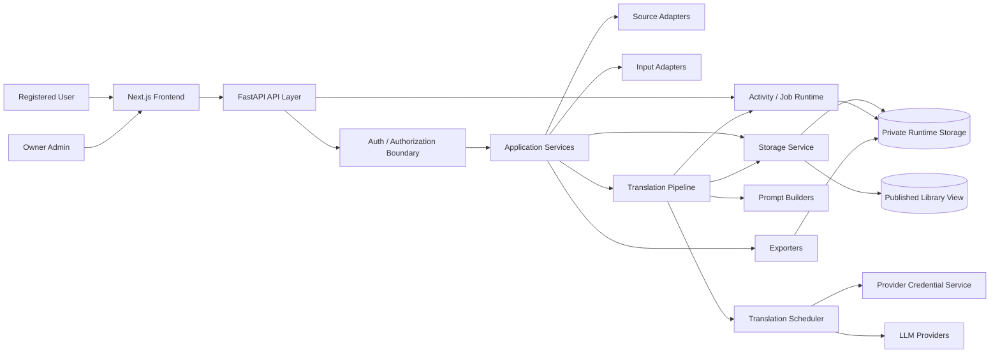
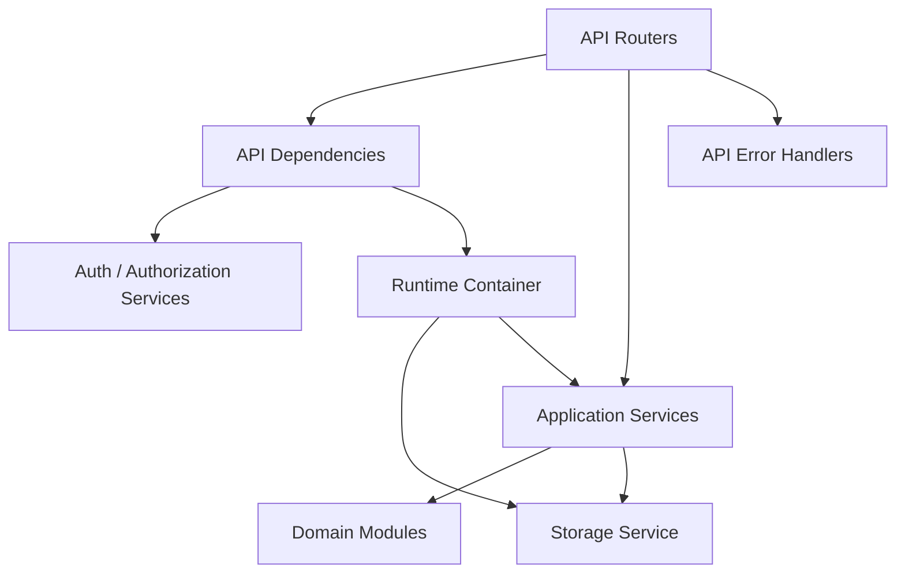

# NovelAI Architecture

**Status:** Canonical project architecture  
**Audience:** Future development, Codex prompts, backend/frontend refactors, tests, deployment decisions  
**Last reviewed:** 2026-06-04  
**Aligned with:** Revised Codex implementation prompt sequence with Prompt 12 public contribution workflow and Prompt 13 security hardening

This document is the spine of the NovelAI project. If a new feature, refactor, or bug fix violates this file, the feature is probably wrong. Architecture is not decoration; it is the law that keeps this project from becoming wet spaghetti in a storm drain.

---

## 1. Product Boundary

NovelAI is a web-based Japanese novel ingestion, translation, editing, library, and export system.

It has four primary surfaces:

1. **Owner/admin surface** — crawl/import sources, manage requests, approve translations, manage jobs, translate chapters, edit output, configure providers, inspect activity, manage sanitized credentials, and export.
2. **Public reader surface** — browse published translated novels and read published chapters.
3. **Registered user surface** — request novel/chapter translations and optionally contribute Gemini API quota for approved public-library translation jobs.
4. **Backend runtime** — source ingestion, input import, translation pipeline, storage, usage/cost tracking, activity logging, scheduler state, security controls, and export generation.

### 1.1 Core mode

The current core project should still be treated as a **single-owner / controlled-admin translation system** until the foundational pipeline is reliable.

Core mode includes:

```text
owner/admin operations
public reading
source ingestion
translation pipeline
storage
jobs/activity
provider settings
exports
```

Core mode does **not** require:

```text
multi-admin teams
billing
organizations
distributed workers
database migration
public contribution credentials
```

### 1.2 Optional public contribution mode

Public contribution mode is an explicit later phase. It is not the same thing as a multi-tenant SaaS.

It adds:

```text
registered users
translation request submission
owner/admin approval queue
user-contributed Gemini credentials
encrypted credential storage
credential usage limits
public-library-only contribution scope
audit logs
security hardening
```

Role model:

```text
public_reader
registered_user
owner_admin
```

Rules:

1. Public readers can read published translations.
2. Registered users can request translations.
3. Registered users can manage their own contributed credentials.
4. Owner admin can approve/reject requests.
5. Owner admin can manage sanitized credential metadata.
6. Owner admin can revoke/delete any contributed credential.
7. Owner admin cannot retrieve raw user API keys through normal UI/API after creation.
8. Contributed credentials may only be used for approved public-library jobs.
9. Contributed credentials must never be used for private user uploads/jobs.
10. Do not add multi-admin/team permission complexity unless the architecture explicitly changes again.

### 1.3 Phase gate

Do not implement Prompt 12 public contribution credentials unless the project already has or explicitly introduces:

```text
authenticated registered users
owner_admin authorization
request approval workflow
encrypted credential storage
credential revocation/deletion flows
audit logging
usage limits
contribution consent
object-level authorization
```

Do not fake user ownership with browser localStorage IDs. That is not auth; that is a cardboard badge.

---

## 2. North Star

> **One canonical library. Many sources. One translation pipeline. Thin API. Predictable storage. Frontend as a client, not a second backend.**

Everything else bends around that.

### 2.1 Strategic correction

The critical path is operational reliability:

```text
Smart segmentation
→ provider error classification
→ traceable pipeline state
→ translation QA
→ storage/cache contracts
→ source fetcher/parser split
→ quality gates
→ multi-model scheduler
→ request approval and contributed credentials
→ security hardening
```

Do not chase more source sites, prompt tweaks, or UI glitter until the pipeline can explain exactly what failed, where it failed, whether retrying will waste money, and whether any sensitive data could leak.

---

## 3. System Overview



### Rule of gravity

Data flows inward through adapters and outward through API/exporters. Core storage is the lake. Do not let frontend components, API routers, source adapters, provider implementations, or ad hoc scripts invent hidden ponds.

---

## 4. Repository Map

```text
backend/src/novelai/
  activity/          Background activity queue, runner, worker, event stream
  api/               FastAPI app, routers, dependencies, error handlers, schemas
  config/            Settings and workflow profiles
  core/              Shared domain errors and primitive types only
  cost_estimator/    Provider/model cost estimation and comparison
  export/            Exporter interfaces and concrete EPUB/HTML/MD/PDF exporters
  glossary/          Glossary domain logic and runtime term memory
  infrastructure/    Target: external plumbing, HTTP client, fetch cache, throttling, retry
  inputs/            Non-web input adapters: EPUB, PDF, CBZ, images, text, web
  prompts/           Prompt builders, prompt models, templates, response parsing
  providers/         LLM provider interface and provider implementations
  runtime/           Dependency container, bootstrap, CLI runtime
  services/          Application use cases and orchestration
  shared/            Target: cross-domain protocols, logging, pipeline contracts, typed helpers
  sources/           Web source parsers/adapters and source registry
  storage/           File-backed persistence boundary and schema readers/writers
  translation/       Translation pipeline stages, QA, cache, scheduler, post-processing
  utils/             Tiny pure utilities only; no domain imports

frontend/
  app/               Next.js App Router pages and route groups
  components/        Reusable UI/admin/public components
  lib/               API client, query client, client-side utilities/store
  server/            Server-side frontend environment handling

docs/
  architecture/      Canonical architecture documents
  guides/            Human setup and usage guides
  reference/         Stable command/data references

deploy/              Dockerfiles, Caddy, compose, production examples
storage/             Runtime library data; never treated as source code
```

### 4.1 Target modules for public contribution mode

Public contribution mode should prefer existing architectural patterns before inventing new folders.

Recommended additions:

```text
backend/src/novelai/services/provider_credentials_service.py
backend/src/novelai/services/security_audit_service.py
backend/src/novelai/storage/provider_credentials.py
backend/src/novelai/storage/security.py
backend/src/novelai/api/routers/provider_credentials.py
backend/src/novelai/api/routers/admin_credentials.py
backend/src/novelai/api/routers/security.py
```

If the project introduces formal auth/account modules, keep them small and boundary-owned:

```text
backend/src/novelai/auth/
backend/src/novelai/accounts/
```

Do not scatter user/session/credential rules through random routers and React pages. That is how secrets start leaking like a cracked irrigation pipe.

---

## 5. Architectural Principles

### 5.1 One owner per responsibility

| Responsibility | Owner | Not allowed |
|---|---|---|
| HTTP route shape | `backend/src/novelai/api/routers/*` | Business logic in page components |
| Authentication/authorization | API dependencies / auth service | Trusting frontend flags |
| Use-case orchestration | `backend/src/novelai/services/*` | Filesystem writes directly in routers |
| Runtime persistence | `backend/src/novelai/storage/*` | Random `Path(...)` writes from services |
| Web scraping | `backend/src/novelai/sources/*` | Scraping selectors inside API/services |
| HTTP fetching/throttle/cache | `infrastructure/http/*` or equivalent | Fresh HTTP clients in every adapter |
| Document import | `backend/src/novelai/inputs/*` | Parsing EPUB/PDF in translation stages |
| Translation flow | `backend/src/novelai/translation/*` | Calling LLM providers directly from routers |
| Prompt construction | `backend/src/novelai/prompts/*` | String-building prompts inside provider code |
| LLM calls | `backend/src/novelai/providers/*` | Provider-specific code in pipeline stages except registry lookup |
| Credential encryption/decryption | credential service + storage boundary | Raw key reveal in admin/public UI |
| Export generation | `backend/src/novelai/export/*` and `services/export_service.py` | Export formatting in frontend |
| UI rendering | `frontend/app/*`, `frontend/components/*` | Business/storage rules in UI |

### 5.2 Dependency direction

Allowed direction:

```text
api -> services -> domain modules -> storage/providers/sources/export
translation -> prompts -> providers
scheduler -> credential service -> providers
frontend -> backend API only
```

Forbidden direction:

```text
storage -> api
providers -> api
providers -> storage
sources -> services
frontend -> storage files
translation stages -> FastAPI request objects
source parsers -> HTTP clients directly
credential storage -> frontend
admin UI -> raw secrets
```

If a module needs to reach backward, the design is cracked. Use interfaces or service injection.

### 5.3 Contracts beat cleverness

Every boundary must expose stable contracts:

- API request/response schemas.
- Source adapter return shape.
- Input adapter return shape.
- Translation pipeline state.
- Storage file schema.
- Provider credential schema.
- Scheduler state schema.
- Request approval schema.
- Security audit event schema.
- Exporter output contract.

No “just a dict bro” across module boundaries unless the shape is documented and tested. Dicts are fine at the edge; ambiguity is not.

---

## 6. Canonical Naming Contract

These names must remain stable across backend, frontend, storage, tests, and docs.

| Term | Meaning | Owner | Rules |
|---|---|---|---|
| `source_key` | Registered source adapter key | `sources.registry` | Examples: `syosetu_ncode`, `novel18_syosetu`, `kakuyomu`, `generic` |
| `source_novel_id` | External source-specific work identifier | source adapter | Example: Syosetu ncode or Kakuyomu work ID |
| `novel_id` | Stable internal library identifier | source adapter + storage | Derived from normalized source ID; must not be rewritten by frontend |
| `source_url` | Canonical source URL for the novel/work | source adapter | Used for re-crawl/update |
| `chapter_id` | Stable chapter identifier inside a novel | source/storage | String; may be numeric but should not be assumed numeric |
| `chapter.num` | Display/order index | source adapter | Integer ordering only |
| `paragraph_id` | Stable paragraph ID inside a chapter | translation pipeline | Deterministic: `p0001`, `p0002`, etc. |
| `chunk_id` | Stable translation chunk ID | translation pipeline | Deterministic: `c0001`, `c0002`, etc. |
| `bundle_id` | Temporary translation bundle ID | translation/storage | For retry/cache artifacts only; not canonical chapter storage |
| `provider_key` | LLM provider key | providers registry/preferences | Examples: `gemini`, `openai`, `dummy` |
| `provider_model` | Concrete model string | preferences/provider/scheduler | Chosen by settings, UI, scheduler, or fallback logic |
| `credential_id` | Stored provider credential ID | credential service/storage | Never reveals raw key |
| `credential_owner_user_id` | User who owns a contributed credential | credential service | Required when contributed key is used |
| `requesting_user_id` | User who requested a translation job | request service/job runtime | May differ from credential owner |
| `contribution_scope` | Where a contributed key may be used | credential service | `own_jobs_only`, `public_library`, `selected_novels`, `disabled` |
| `request_id` | Translation request identifier | request service | Owner-approved queue item |
| `activity_id` / `job_id` | Background operation identifier | activity runtime | Used for polling, logs, and error traceability |
| `prompt_version` | Prompt contract version | prompts/translation | Cache key input |
| `glossary_hash` | Hash of prompt-affecting glossary state | glossary/translation | Cache key input |
| `final_text` | Final translated chapter text | translation pipeline | Stored only after successful pipeline completion |

### Naming rules

1. Use `source_key`, not `source`, when referring to adapter selection in API/UI payloads.
2. Use `source` only in persisted external metadata if it already exists; new code should prefer `source_key`.
3. Use `novel_id` everywhere internally. Never call the same field `slug`, `id`, `ncode`, `workId`, or `novelKey` unless the value is genuinely different.
4. Frontend route params may use `slug` because Next.js routes are generic, but API payloads must still call the value `novel_id`.
5. Use `provider_key`, not `provider`, for provider identity.
6. Use `provider_model`, not `model`, for concrete model strings.
7. Use `requesting_user_id` and `credential_owner_user_id` separately when a contributed credential translates another user's approved request.
8. Do not let UI labels leak into backend enums. Human wording can change; keys should not.

---

## 7. Backend Architecture

### 7.1 Layer model



### 7.2 API layer

`backend/src/novelai/api` is the HTTP boundary.

It may:

- Validate request payloads.
- Apply authentication and rate limits.
- Enforce object-level authorization.
- Call application services.
- Convert known domain errors to stable HTTP responses.
- Return typed response models.

It must not:

- Write files directly.
- Scrape websites directly.
- Translate text directly.
- Build prompts directly.
- Decrypt or reveal raw API keys directly.
- Know source-specific HTML selectors.
- Contain multi-step business workflows that belong in services.

Routers are gates, not kitchens. They should not cook.

### 7.3 Service layer

`backend/src/novelai/services` owns use cases.

Examples:

- Crawl metadata.
- Import documents.
- Translate chapters.
- Manage request approval.
- Manage provider credentials.
- Manage usage, cache, preferences, audit events.
- Export novels.
- Backup/checkpoint runtime state.

Services coordinate modules but should not become god objects. If a service exceeds one clear use case, split orchestration into `services/orchestration/*`.

### 7.4 Runtime container

`backend/src/novelai/runtime/container.py` is the composition root.

Use it to wire shared services:

- Storage service.
- Orchestrator.
- Activity queue/runner/worker.
- Preferences service.
- Translation cache.
- Usage service.
- Credential service.
- Scheduler.
- Security audit service.

Do not create new singleton-like services in random files. If it is shared runtime state, wire it in the container or inject it explicitly.

---

## 8. Source Ingestion Architecture

### 8.1 Target source ingestion model

The source pipeline is not “adapter fetches some HTML and hopes.” It is a source ingestion system:

```text
SourceRegistry
  -> SourceAdapter.detect / normalize
  -> FetchService
       - shared HTTP client
       - SSRF-safe URL validation
       - per-domain throttling
       - retry/backoff
       - conditional cache / raw snapshots
  -> SourceParser
       - parse metadata
       - parse chapter list
       - parse chapter payload
       - parse images/assets
  -> SourceQualityGate
       - validate metadata
       - validate chapter text
       - detect boilerplate/gates/duplicates
       - emit warnings
  -> StorageService
```

Separation rule: the fetcher does not know what a chapter is. The parser does not know how HTTP is performed. The quality gate does not translate anything. Storage is the only persistence boundary.

### 8.2 Source adapter contract

All web novel sources implement a stable source contract. The current transitional contract may still expose fetch methods, but new code should move toward parser-first adapters that accept fetched text/payloads rather than creating their own clients.

```python
class SourceAdapter:
    key: str

    def matches_url(identifier_or_url: str) -> bool: ...
    def normalize_novel_id(identifier_or_url: str) -> str: ...
    def canonicalize_url(identifier_or_url: str) -> str: ...

    async def fetch_metadata(url: str, *, max_chapter: int | None = None) -> dict: ...
    async def fetch_chapter(url: str) -> str: ...
    async def fetch_chapter_payload(url: str) -> Mapping[str, Any]: ...
    async def fetch_asset(url: str, *, referer: str | None = None) -> Mapping[str, Any]: ...
```

Target internal parser shape:

```python
class SourceParser:
    key: str
    parser_version: str

    def parse_metadata(self, html: str, *, url: str) -> NovelMetadata: ...
    def parse_chapter_list(self, html: str, *, url: str) -> list[ChapterMetadata]: ...
    def parse_chapter_payload(self, html: str, *, url: str) -> ChapterPayload: ...
```

### 8.3 Existing source types

| Source | Key | Purpose |
|---|---|---|
| Syosetu Ncode | `syosetu_ncode` | Normal Syosetu web novels |
| Novel18 Syosetu | `novel18_syosetu` | Adult Syosetu/Nocturne variants with age cookie handling |
| Kakuyomu | `kakuyomu` | Kakuyomu works and episodes |
| Generic | `generic` | Explicit fallback for arbitrary novel pages |

### 8.4 Source registry rules

`novelai.sources.registry` is the only source lookup mechanism.

- Register sources with `register_source(key, factory)`.
- Resolve explicit keys with `get_source(key)`.
- Detect URLs with `detect_source(identifier_or_url)`.
- List public options with `available_sources()`.

Do not hardcode adapter classes in API routes. If you are writing `if source == "kakuyomu": KakuyomuSource()` outside source-registration/bootstrap code, you are making tomorrow’s bug.

### 8.5 Fetching rules

Fetching belongs to `infrastructure/http/*` or a clearly equivalent HTTP boundary, not random adapter methods.

Required components:

```text
infrastructure/http/client.py         shared AsyncClient factory
infrastructure/http/fetch_service.py  FetchService API
infrastructure/http/throttle.py       per-domain adaptive throttle
infrastructure/http/cache.py          raw response cache / conditional requests
infrastructure/http/errors.py         normalized fetch errors
```

Every fetch must:

1. Validate URL safety before network access.
2. Reject private/internal targets.
3. Reuse a shared async HTTP client per job/app lifecycle.
4. Respect per-domain throttle.
5. Retry only transient errors.
6. Capture final URL, status code, headers, fetched time, body hash, and source key.
7. Support conditional requests using `ETag` / `Last-Modified` when available.
8. Return normalized `FetchResult`, not raw provider-specific response objects.

Adapter-level `_fetch_page()` helpers that create fresh HTTP clients are transitional debt. Remove them gradually.

### 8.6 Source quality gates

Every parsed novel/chapter must pass quality gates before translation.

Metadata gates:

- title exists
- `source_url` exists
- `source_novel_id` exists when available
- chapter count > 0
- chapter order is stable
- no duplicate chapter URLs
- no suspicious chapter gaps unless source allows them
- Syosetu count matches or does not exceed API `general_all_no` when available

Chapter gates:

- text length is above minimum
- text is not mostly navigation/boilerplate
- text is not an age gate, login gate, Cloudflare block, or error page
- no duplicate content hash across different chapters
- image placeholders match structured image metadata
- Japanese ratio is high enough for Japanese sources
- parser version is recorded

Quality gates should emit structured warnings, not just pass/fail:

```json
{
  "warnings": [
    "chapter_text_short",
    "toc_count_mismatch",
    "possible_age_gate",
    "boilerplate_detected",
    "duplicate_chapter_hash"
  ]
}
```

### 8.7 Source-specific rules

#### Syosetu / Novel18

Use official API metadata before scraping where available. Use API values such as total episode count and update timestamp to decide whether TOC/chapter crawling is necessary.

#### Novel18 age gate

Age-gate detection is an adapter/parser concern, but the failure must be represented as a structured source error. Do not let an age-gate page become translated chapter text.

#### Kakuyomu

Treat as scrape-first and selector-fragile. Add fixture tests before expanding behavior.

#### Generic

`generic` is a fallback, not magic. It should be selected explicitly or only after detection fails. Its output must carry a confidence score. Low confidence means `needs_adapter` or manual review, not automatic bulk translation.

---

## 9. Input Adapter Architecture

`backend/src/novelai/inputs` is for non-source ingestion:

- EPUB.
- PDF.
- CBZ.
- Image folder.
- Plain text.
- Web input wrapper.

Input adapters should convert external documents into the same internal novel/chapter concepts used by source adapters.

They must not call translation providers. Their job is extraction and normalization, not translation.

---

## 10. Translation Architecture

### 10.1 Target canonical pipeline

Translation is coordinated by `TranslationService`, but the service should orchestrate stages rather than contain translation logic.

Current simple pipeline:

```text
FetchStage -> ParseStage -> SegmentStage -> TranslateStage -> PostProcessStage
```

Target pipeline:

```text
FetchStage
-> ParseStage
-> AnalyzeChapterStage
-> SmartSegmentStage
-> BuildPromptStage
-> TranslateStage
-> TranslationQAStage
-> SelectiveRetryStage
-> PostProcessStage
-> SaveStateStage
```

Cheap stable version first:

```text
Fetch
Parse
AnalyzeChapterStage
SmartSegmentStage
TranslateStage
TranslationQAStage
PostProcessStage
SaveStateStage
```

Quality mode later:

```text
Fetch
Parse
AnalyzeChapterStage
BuildGlossaryStage
SmartSegmentStage
TranslateDraftStage
TranslationQAStage
SelectiveRetryStage
ChapterPolishStage
PostProcessStage
SaveStateStage
```

Bulk mode later:

```text
Import chapters
Build global glossary / character memory
Submit batch jobs
Poll status
Merge results
Run QA
Retry failed chunks
Export
```

Do not build bulk mode before single-chapter preview mode is reliable.

### 10.2 Pipeline contract

Use an explicit pipeline contract for scrape and translation jobs.

```python
@dataclass
class PipelineContext:
    job_id: str | None = None
    activity_id: str | None = None
    novel_id: str | None = None
    chapter_id: str | None = None
    source_key: str | None = None
    provider_key: str | None = None
    provider_model: str | None = None
    current_stage: str | None = None
    data: dict[str, Any] = field(default_factory=dict)
    warnings: list[str] = field(default_factory=list)
    errors: list[dict[str, Any]] = field(default_factory=list)

class PipelineStep(Protocol):
    name: str

    async def run(self, context: PipelineContext) -> PipelineContext:
        ...
```

No invisible handoffs. If a stage changes the chapter state, creates chunks, calls a provider, or writes output, it must be visible in `PipelineContext` or job events.

### 10.3 Canonical pipeline data

Canonical fields inside `PipelineContext.data`:

- `chapter_url`
- `raw_text`
- `normalized_text`
- `paragraphs`
- `chunks`
- `temporary_bundles`
- `translations`
- `translation_qa`
- `final_text`
- `images`
- `metadata`

Known metadata keys:

- `source_language`
- `target_language`
- `glossary`
- `glossary_max_entries`
- `glossary_max_context_chars`
- `glossary_runtime_state`
- `style_preset`
- `consistency_mode`
- `json_output`
- `prompt_version`
- `glossary_hash`
- `source_text_hash`
- `_source_adapter`
- `_prefetched_text`
- `_prefetched_images`

### 10.4 Paragraph, chunk, and bundle contracts

Paragraphs must be tracked before segmentation.

```python
@dataclass(frozen=True)
class Paragraph:
    paragraph_id: str
    chapter_id: str
    text: str
    char_count: int
```

Translation chunks must preserve chapter and paragraph lineage.

```python
@dataclass(frozen=True)
class TranslationChunk:
    chunk_id: str
    novel_id: str
    chapter_ids: list[str]
    paragraph_ids: list[str]
    source_text: str
    char_count: int
    previous_context: str | None = None
```

Temporary bundles are not canonical storage. They are provider-request optimization artifacts.

```python
@dataclass(frozen=True)
class TranslationBundle:
    bundle_id: str
    novel_id: str
    chunk_ids: list[str]
    chapter_ids: list[str]
    paragraph_ids: list[str]
    source_text_hash: str
    char_count: int
```

Rules:

1. Same normalized input should produce deterministic paragraph IDs.
2. Chunks must preserve original paragraph order.
3. Chunks may contain one chapter or nearby short chapters only when chapter boundaries remain explicit and recoverable.
4. Normal chunks should target around 4,500 Japanese characters.
5. Hard maximum should usually be around 7,000 characters.
6. Overlap should be summary or last 1–2 paragraphs, not full repeated chunk text.
7. Translation concurrency should start at 1–2 until provider retry/backoff is proven.
8. No code may translate one paragraph per provider request by default.
9. No code may send a whole novel as one giant provider request.
10. Final translated output remains chapter-based.
11. Provider output must be splittable back by `chapter_id` and `paragraph_id`, not by text guessing.

Paragraph IDs are not bureaucracy. They are how the QA stage catches skipped text.

### 10.5 Stage responsibilities

| Stage | Input | Output | Forbidden |
|---|---|---|---|
| `FetchStage` | `chapter_url`, `_source_adapter` or `_prefetched_text` | `raw_text`, images | Segmentation, provider calls |
| `ParseStage` | `raw_text` | `normalized_text`, `paragraphs` seed data | Provider calls, source fetching |
| `AnalyzeChapterStage` | `normalized_text`, metadata | chapter summary, term candidates, style notes | Final translation |
| `SmartSegmentStage` | `paragraphs` / `normalized_text` | `chunks` and optional temporary bundles | Provider calls, prompt building |
| `BuildPromptStage` | chunk, glossary, memory, style | typed prompt request | Provider SDK calls |
| `TranslateStage` | typed prompt requests, provider/model/credential | raw translations | API responses |
| `TranslationQAStage` | source chunks + translations | QA result, warnings/errors | New provider calls unless configured as model-QA |
| `SelectiveRetryStage` | failed/weak chunks | retried translations or review state | Infinite retries |
| `PostProcessStage` | accepted translations | `final_text` or chapter-grouped output | Re-fetching source |
| `SaveStateStage` | final/partial output | persisted chapter state | Translation logic |

### 10.6 Translation output contract

Provider output should be normalized into a stable shape:

```python
{
  "text": "translated output",
  "metadata": {
    "usage": {...},
    "provider_specific": {...},
    "finish_reason": "..."
  }
}
```

When JSON mode is enabled, prompt responses should validate against a typed response model:

```json
{
  "translated_text": "...",
  "paragraph_map": [
    {
      "chapter_id": "chapter_001",
      "paragraph_id": "p0001",
      "translated_text": "..."
    }
  ],
  "notes": [],
  "uncertain_terms": []
}
```

Invalid JSON is a provider/pipeline error, not successful translation. Multi-chapter bundle output without reliable `chapter_id` mapping must become `qa_failed` or `needs_review`.

### 10.7 Translation QA rules

Before a chunk is accepted, QA must check at least:

- output is non-empty
- output is not identical to source
- suspiciously short output is flagged
- placeholders/images are preserved
- scene break markers are preserved when required
- paragraph IDs are covered when `paragraph_map` exists
- chapter IDs are correct when multiple chapters exist in one chunk/bundle
- paragraph order is preserved
- duplicate/unexpected paragraph IDs fail QA
- glossary-locked terms are respected where safe
- provider did not summarize instead of translate
- provider did not return safety/block/refusal text as if it were translation
- provider output is not obviously truncated

Suggested routing:

```text
QA score >= 0.90  -> accept
0.75–0.89         -> accept with warning or mark needs_review depending error type
< 0.75            -> retry stronger model or mark needs_review
```

Hard failures override score:

```text
empty output
missing paragraph mapping
duplicate paragraph mapping
cross-chapter mapping error
missing image placeholder
provider refusal/error text
unsafe multi-chapter split
```

Do not polish every chunk by default. That is cost cosplay.

### 10.8 Translation provider rules

`TranslateStage` may resolve providers through the provider registry and scheduler, but provider-specific API details belong in `providers/*`.

Provider implementations must:

1. Accept typed provider requests.
2. Return normalized provider results.
3. Classify provider errors.
4. Preserve raw provider metadata for debugging.
5. Never write storage.
6. Never decide chapter/job status directly.
7. Never own scheduling policy.
8. Never receive or return raw stored credentials through public/admin APIs.

### 10.9 Prompt rules

Prompt construction belongs in `prompts/*`.

Do not build long prompt strings inside:

- API routers
- Source adapters
- Storage modules
- Frontend components
- Provider implementations, except provider-specific message formatting

The translation prompt should be built from a typed `TranslationRequest`, not scattered string fragments.

Prompt structure should favor stable prefixes:

```text
[STABLE SYSTEM PROMPT]
Rules, style policy, JSON schema

[STABLE PROJECT MEMORY]
Novel title, genre, global glossary

[DYNAMIC CHAPTER MEMORY]
Chapter summary, selected glossary entries

[DYNAMIC CHUNK]
Japanese source text with stable markers
```

### 10.10 Multi-model scheduler

The scheduler belongs in the translation/service/job layer, not in providers.

Scheduler responsibilities:

```text
select provider_model
respect per-model RPM/RPD state
respect cooldown_until and exhausted_until
preserve chunk progress
record provider/model per attempt
route fallback only when policy allows
avoid random round-robin that damages style
```

Supported routing modes:

```text
volume_first
quality_first
```

The scheduler must prefer one main model per chapter when possible and use stronger models for failed/weak chunks, retries, or final quality mode. Multi-model routing must not bypass glossary, prompt versioning, QA, cache keys, or chunk status tracking.

### 10.11 Cost and quality rules

Target behavior:

1. Pack chunks intelligently instead of translating every paragraph.
2. Use glossary + memory for names, terms, pronouns, honorifics, and recurring phrasing.
3. Use cheap/high-quota models for bulk draft.
4. Use stronger models only for difficult chunks, retries, or final quality mode.
5. Cache by prompt-affecting metadata, not raw text alone.
6. Track usage per provider/model/chapter/chunk/credential when available.
7. Add batch mode only after sync preview mode is reliable.

Blunt truth: translation quality is won before the model call. Bad segmentation makes even a good model limp.

---

## 11. Storage Architecture

### 11.1 Storage boundary

`backend/src/novelai/storage` is the only layer allowed to know exact runtime file layout.

All code outside storage should ask storage services for operations such as:

- Create/update novel metadata.
- Save raw chapter text.
- Save parsed chapter data.
- Save translation chunks.
- Save temporary bundle state if needed.
- Save translated chapter text.
- Save provider request records.
- Save credential records through credential storage.
- Save jobs/activity/security audit records.
- Read chapter/novel summaries.
- Save media assets.
- Save exports.
- Delete or archive runtime data.

### 11.2 Runtime root

Runtime data lives under:

```text
storage/novel_library/
```

This directory is not source code and must stay out of version control except for documentation/placeholders.

### 11.3 Private storage rule

Raw scraped chapters, parsed chapters, provider responses, translation chunks, temporary bundles, credential records, scheduler state, logs, and job internals are private runtime data.

They must never be served directly by frontend/static paths.

Public reader endpoints may expose only:

```text
published novel metadata
published translated chapters
published cover/media assets approved for reading
```

### 11.4 Storage rules

1. No frontend code reads runtime files directly.
2. No API router writes runtime files directly.
3. No source adapter writes runtime files directly.
4. No provider implementation writes runtime files directly.
5. Services may coordinate storage, but concrete file paths belong to storage modules.
6. Storage schema changes require migration or backward-compatible readers.
7. Every persisted JSON shape must be documented in `docs/reference/DATA_OUTPUT_STRUCTURE.md`.
8. Storage modules must protect against path traversal.
9. Storage APIs accept IDs, not raw filesystem paths from clients.

### 11.5 Minimum persisted objects

The file-backed storage may remain JSON-based, but it must behave like a schema-owned system, not a junk drawer.

Minimum persisted concepts:

```text
novels
chapters
chapter_raw_snapshots
parsed_chapters
translation_chunks
temporary_translation_bundles
translation_outputs
translation_cache_entries
glossary_entries
provider_requests
provider_credentials
credential_usage_records
translation_requests
request_approval_events
jobs
job_events
scheduler_state
fetch_cache_entries
security_audit_events
```

Critical `translation_chunks` fields:

```text
chunk_id
novel_id
chapter_ids
paragraph_ids
source_text_hash
source_text
char_count
status
provider_key
provider_model
credential_id if used
retry_count
last_error_code
qa_score
created_at
updated_at
```

Critical `translation_outputs` fields:

```text
output_id
chunk_id
novel_id
chapter_ids
paragraph_ids
translated_text
structured_paragraph_map
raw_provider_response_path or safe summary
qa_score
qa_warnings
qa_errors
prompt_version
glossary_hash
provider_key
provider_model
credential_id if used
created_at
```

Critical `temporary_translation_bundles` fields:

```text
bundle_id
novel_id
chunk_ids
chapter_ids
paragraph_ids
source_text_hash
target_chars
hard_max_chars
prompt_version
status
created_at
updated_at
```

Critical `provider_requests` fields:

```text
request_id
job_id or activity_id
translation_request_id if available
chunk_id
bundle_id if available
requesting_user_id if available
credential_id if used
credential_owner_user_id if used
provider_key
provider_model
prompt_version
source_text_hash or prompt_hash
input_tokens
output_tokens
total_tokens
success
normalized_provider_error_code
retry_after_seconds
cooldown_until
exhausted_until
created_at
```

Critical `provider_credentials` fields:

```text
credential_id
user_id
provider_key
encrypted_api_key
key_fingerprint
label
allowed_models
contribution_enabled
contribution_scope
allowed_novel_ids
daily_request_limit
monthly_request_limit
requests_today
requests_this_month
cooldown_until
exhausted_until
status
revoked_at
created_at
updated_at
last_used_at
```

Critical `translation_requests` fields:

```text
request_id
requesting_user_id
source_key
source_url
source_novel_id
title
requested_scope
status
admin_decision
approved_by
approved_at
rejected_reason
created_at
updated_at
```

Critical `fetch_cache_entries` fields:

```text
url
canonical_url
source_key
status_code
headers_json
etag
last_modified
fetched_at
body_hash
body_text or body_path
parser_version
```

### 11.6 Translation cache key

Translation cache keys must include at least:

```text
source_text_hash
source_language
target_language
provider_key
provider_model
prompt_version
glossary_hash
style_preset
json_output
consistency_mode
```

Include these too if they affect output:

```text
chapter_memory_hash
novel_memory_hash
selected_glossary_hash
system_prompt_hash
temperature
top_p
structured_output_schema_version
```

Never cache only by raw chunk text.

### 11.7 Database rule

Do not add a database casually. File-backed storage is acceptable while:

- The core project is single-owner/admin-controlled.
- Write concurrency is manageable.
- JSON schemas are stable.
- Storage service owns all filesystem operations.

Public contribution mode may eventually make a database useful, but it does not justify a reckless migration. If a database becomes necessary, it must sit behind the same storage service interface. The rest of the app should not care whether persistence is files, SQLite, or Postgres.

---

## 12. Activity and Job Architecture

Long-running work must not block normal HTTP request/response flow.

Use the activity/job runtime for:

- Crawling multiple chapters.
- Translating chapters or novels.
- Importing large documents.
- OCR.
- Export generation.
- Batch updates.
- Approved public-library request processing.
- Retry/repair jobs.

### 12.1 Job lifecycle

```text
queued -> running -> succeeded
queued -> running -> failed
queued -> cancelled
running -> cancelled
queued/running -> paused -> queued/running
```

Pause reasons:

```text
all_models_cooling_down
all_models_daily_exhausted
awaiting_admin_approval
awaiting_credential
needs_review
```

### 12.2 Chapter/job state model

Chapter translation state must be more detailed than job lifecycle.

```text
pending
-> fetched
-> parsed
-> quality_failed
-> segmented
-> translating
-> translated_partial
-> translated
-> qa_failed
-> needs_retry
-> needs_review
-> exported
-> failed
```

### 12.3 Translation request workflow

Public translation requests require owner/admin approval before translation.

```text
pending_review
-> approved
-> queued
-> translating
-> translated_partial
-> completed

pending_review
-> rejected

approved/queued/translating
-> cancelled

translating
-> failed / needs_review
```

Rules:

1. Unapproved requests must never enter translation queue.
2. Unapproved requests must never use contributed credentials.
3. Rejected requests must not be translated automatically.
4. Approved requests are public-library jobs.
5. Owner admin may prioritize approved requests if queue supports priority.

### 12.4 Job events

Every transition should produce a job event:

```json
{
  "job_id": "job_123",
  "request_id": "req_456",
  "novel_id": "novel_abc",
  "chapter_id": "chapter_001",
  "chunk_id": "c0002",
  "stage": "TranslateStage",
  "status_before": "segmented",
  "status_after": "translated_partial",
  "requesting_user_id": "user_b",
  "credential_id": "cred_123",
  "credential_owner_user_id": "user_a",
  "provider_key": "gemini",
  "provider_model": "gemini-3.1-flash-lite",
  "error_code": null,
  "timestamp": "2026-06-04T12:00:00Z"
}
```

### 12.5 Job rules

1. Jobs must be idempotent where possible.
2. Each job must write enough activity detail for debugging.
3. A failed chapter should not corrupt an entire novel.
4. Partial progress must be visible in the admin UI.
5. Successful chunks must not be retranslated after pause/resume unless explicitly forced.
6. Never swallow provider/source/security errors. Convert them into structured activity errors.
7. Provider/model/credential used for each chunk must be recorded where possible.

---

## 13. API Contract

### 13.1 API design rules

1. API routers expose use cases, not filesystem implementation.
2. Every request body should use a Pydantic model.
3. Every successful response should have a stable response model.
4. Every error should follow the shared API error envelope.
5. Frontend should call API through `frontend/lib/api.ts` only.
6. Frontend types should be generated from backend schemas or manually centralized in one place.
7. Every endpoint accepting object IDs must enforce authorization scope.

### 13.2 Error response contract

All known errors should become predictable frontend payloads:

```json
{
  "code": "SOURCE_ERROR",
  "message": "Human-readable summary",
  "explanation": "What this usually means",
  "details": {},
  "trace_id": "optional"
}
```

Do not leak raw tracebacks to public responses. Put tracebacks in server logs/activity logs only after sanitization.

### 13.3 Authentication, authorization, and rate limits

Core admin endpoints must pass through configured admin authentication.

If public contribution mode is implemented, use these boundaries:

```text
public reader endpoints:
  published content only

/me/* endpoints:
  authenticated registered user only
  own resources only

/admin/* endpoints:
  owner_admin only
```

Object-level authorization rule:

```text
Every endpoint accepting credential_id, request_id, novel_id, chapter_id, job_id, activity_id, or export_id must validate access scope before returning or mutating data.
```

Rate-sensitive actions must be rate-limited:

- login/auth
- request submission
- source scrape/import
- translate
- export
- edit
- delete
- credential add/update/delete
- public chapter reads
- job polling if abused

If an endpoint can burn provider money, hammer a source website, expose private runtime data, or touch secrets, it is not “just another route.” Lock the gate.

### 13.4 Credential API contract

Public user credential endpoints:

```text
POST   /api/me/provider-credentials
GET    /api/me/provider-credentials
PATCH  /api/me/provider-credentials/{credential_id}
DELETE /api/me/provider-credentials/{credential_id}
GET    /api/me/provider-credential-usage
```

Admin credential endpoints:

```text
GET    /api/admin/provider-credentials
POST   /api/admin/provider-credentials
PATCH  /api/admin/provider-credentials/{credential_id}
DELETE /api/admin/provider-credentials/{credential_id}
GET    /api/admin/provider-credential-usage
```

Rules:

1. Raw API key is accepted only on creation/replacement.
2. Raw API key is encrypted immediately.
3. Raw API key is never returned after save.
4. Raw API key is never logged.
5. Admin responses show sanitized metadata only.
6. Public responses show own sanitized metadata only.
7. Admin may revoke/delete any credential but cannot reveal raw user keys through normal UI/API.

### 13.5 Request approval API contract

Request endpoints should support:

```text
POST   /api/requests
GET    /api/me/requests
GET    /api/admin/requests
PATCH  /api/admin/requests/{request_id}
```

Rules:

1. New user requests start as `pending_review`.
2. Owner/admin approval is required before queueing translation.
3. Approval/rejection writes audit/job events.
4. Unapproved requests cannot consume contributed quota.

---

## 14. Frontend Architecture

### 14.1 Route groups

The frontend uses Next.js App Router with conceptual route groups:

```text
frontend/app/(admin)/admin/*
frontend/app/(public)/*
frontend/app/(public)/account/*
```

Admin pages are for operations. Public pages are for reading and own-account actions. Do not mix admin-only control state into public reader pages.

### 14.2 Frontend layers

| Layer | Path | Responsibility |
|---|---|---|
| Pages/routes | `frontend/app/*` | Route composition, loading states, page layout |
| Admin components | `frontend/components/admin/*` | Admin UI blocks |
| Public/account components | `frontend/components/*` | Public reader/account UI blocks |
| UI primitives | `frontend/components/ui/*` | Reusable buttons, inputs, panels, badges |
| API client | `frontend/lib/api.ts` | Only place browser talks to backend |
| API types | `frontend/lib/api-types.ts` or generated types | Centralized response/request shapes |
| Query client | `frontend/lib/query-client.tsx` | Server-state caching |
| Client store | `frontend/lib/store.ts` | Local UI state only |
| Server env | `frontend/server/env.ts` | Frontend server environment parsing |

### 14.3 Frontend rules

1. No raw `fetch()` calls in random components. Use `lib/api.ts`.
2. Do not duplicate backend business logic in React.
3. Server state belongs in React Query or equivalent query layer.
4. Local UI state belongs in the client store or component state.
5. API errors must display backend `code`, `message`, and useful details.
6. Admin pages should expose activity/job status instead of pretending long work is instant.
7. Public user pages manage only the authenticated user's own credentials/requests.
8. Admin pages manage request approval and sanitized credential metadata.
9. No frontend page receives raw API key after creation.
10. No frontend page reads runtime storage directly.

### 14.4 Public contribution UI

Public user page should show:

```text
add key form
saved key fingerprint
allowed models
contribution toggle
daily/monthly limits
scope selector
usage today/month
pause/revoke/delete
consent text
```

Contribution consent must be clear:

```text
If you enable contribution mode, your Gemini API key may be used to translate approved public-library jobs requested by other users. Novel text and model output will be sent to Google through your API key under your Gemini API terms. You can pause contribution or delete your key anytime.
```

Do not hide this in tiny gray text. This is the whole deal.

### 14.5 Admin credential/request UI

Admin pages should show:

```text
pending translation requests
approve/reject controls
request source URL/source key/requesting user
all credentials as sanitized rows
owner user
provider
fingerprint
allowed models
scope
enabled/revoked status
usage counters
cooldown/exhaustion
disable/revoke/delete controls
security/audit events
```

Admin UI must never show raw user API keys.

Frontend should be a cockpit, not another engine.

---

## 15. Export Architecture

`backend/src/novelai/export` owns output formats:

- Markdown.
- HTML.
- EPUB.
- PDF.

Exporters should accept normalized internal novel/chapter data and return generated files or file metadata. They should not crawl, translate, or mutate novel state except through explicit service coordination.

Exporter registry should mirror the source/provider registry pattern:

```text
key -> exporter factory -> exporter implementation
```

Exports must never include private runtime artifacts, raw provider responses, user credentials, or unpublished chapters unless explicitly requested through an authorized admin-only operation.

---

## 16. Glossary Architecture

Glossary appears in two places:

1. **Prompt-time guidance** — selected terms are injected into translation requests.
2. **Runtime observation** — term context and occurrence state are updated as chunks are processed.

Avoid naive global replacement after translation unless the term is locked and grammatically safe. Global substitution is cheap, seductive, and often wrong—the software equivalent of correcting poetry with a chainsaw.

Glossary state that affects translation output must be represented in cache keys through `glossary_hash` or equivalent prompt-affecting metadata.

---

## 17. Provider, Preferences, Credentials, Cache, and Usage

### 17.1 Provider registry

Provider lookup must go through `providers.registry`.

Provider-specific concerns:

- Request formatting.
- Response parsing.
- Provider-specific exceptions.
- Provider-specific SDK/API details.

Providers must not own:

- Scheduler policy.
- Credential storage.
- Storage writes.
- Job state decisions.
- Admin/public API response shaping.

### 17.2 Preferences

Preferences own defaults:

- Preferred provider.
- Preferred model.
- Workflow defaults.
- UI preferences.
- Glossary settings.
- Scheduler policy defaults.

Runtime preferences affect behavior and must be visible in admin settings.

Preferences do **not** own contributed user credentials. Site-owned provider keys may remain in preferences during core mode, but public contribution mode must move provider credentials behind an explicit credential service/storage contract.

### 17.3 Provider credentials

Provider credential service owns:

```text
site-owned/admin credentials
user-contributed credentials
encryption/decryption boundary
key fingerprinting
revocation/deletion
usage limits
contribution scope
scheduler-visible credential state
sanitized credential views
```

Rules:

1. Raw API keys are encrypted at rest.
2. Raw API keys are accepted only on creation/replacement.
3. Raw API keys are decrypted only inside the provider-call execution path.
4. Raw API keys are never returned to frontend after creation.
5. Raw API keys are never logged.
6. Admin can revoke/delete credentials but cannot reveal raw user keys through normal UI/API.
7. Scheduler receives credential IDs and sanitized state, not raw keys.
8. Provider implementations receive the decrypted key only for the immediate call and must not store it.

Important limitation:

```text
If the site owner controls infrastructure and deployment, they can theoretically modify server code to extract decrypted keys. The application must still provide no normal UI/API/log/database path for raw key retrieval.
```

### 17.4 Translation cache

Cache should key on:

- Normalized source text or prompt request cache key.
- Source language.
- Target language.
- Provider key.
- Provider model.
- Prompt version.
- Style preset.
- Glossary hash.
- JSON/structured output mode.
- Consistency mode.
- Relevant memory hashes.
- Temperature/top_p if they affect output.

Never cache only by raw chunk text if prompt metadata can change the output. Never reuse cache across different provider models unless explicitly configured.

### 17.5 Usage tracking

Every successful and failed provider call should record:

- Timestamp.
- Request/job/chunk/bundle IDs.
- Provider key.
- Provider model.
- Credential ID if used.
- Credential owner user ID if used.
- Requesting user ID if available.
- Token usage if available.
- Provider metadata.
- Normalized provider error if failed.
- Retry/cooldown/quota metadata if available.

Usage is not decoration; it is the dashboard for whether this project is burning money quietly in the walls.

---

## 18. Error Handling Architecture

Errors should originate as domain-specific exceptions in `core.errors` or module-specific wrappers, then be mapped by API error handlers.

### Rules

1. Raise meaningful domain errors close to the failure.
2. API layer maps errors to HTTP status and error envelope.
3. Activity/job layer records failure details.
4. Frontend displays actionable messages.
5. Unknown errors become `INTERNAL_ERROR`, not mysterious 500 soup.
6. Public errors must not include raw secrets, raw provider payloads, auth headers, cookies, full filesystem paths, or tracebacks.

### Provider error codes

Provider failures must be classified before they reach API handlers or activity logs.

```python
class ProviderErrorCode(StrEnum):
    RATE_LIMITED = "provider_rate_limited"
    QUOTA_EXHAUSTED = "provider_quota_exhausted"
    MODEL_UNAVAILABLE = "provider_model_unavailable"
    MODEL_DEPRECATED = "provider_model_deprecated"
    CONTEXT_TOO_LARGE = "provider_context_too_large"
    SAFETY_BLOCKED = "provider_safety_blocked"
    TIMEOUT = "provider_timeout"
    INVALID_JSON = "provider_invalid_json"
    EMPTY_OUTPUT = "provider_empty_output"
    PARTIAL_OUTPUT = "provider_partial_output"
    UNKNOWN = "provider_unknown_error"
```

HTTP mapping:

| Provider error | HTTP |
|---|---:|
| `provider_rate_limited` | 429 |
| `provider_quota_exhausted` | 429 or 503 |
| `provider_model_unavailable` | 503 |
| `provider_model_deprecated` | 503 |
| `provider_context_too_large` | 400 |
| `provider_safety_blocked` | 422 |
| `provider_timeout` | 504 |
| `provider_invalid_json` | 502 |
| `provider_empty_output` | 502 |
| `provider_partial_output` | 502 |

A quota error, invalid model, blocked output, or invalid JSON response must never collapse into anonymous `HTTP_500_INTERNAL_SERVER_ERROR` soup.

### Common error families

- `SOURCE_ERROR` — adapter failed to fetch or parse source.
- `PIPELINE_ERROR` — translation pipeline failed.
- `PROVIDER_ERROR` — provider call failed.
- `PROVIDER_CONFIG_ERROR` — missing/invalid provider configuration.
- `CREDENTIAL_ERROR` — stored provider credential is invalid, revoked, inaccessible, or failed auth.
- `AUTHENTICATION_ERROR` — user/session is missing or invalid.
- `AUTHORIZATION_ERROR` — user is authenticated but not allowed to access the resource.
- `RATE_LIMITED` — rate limiter blocked action.
- `RESOURCE_NOT_FOUND` — storage item missing.
- `CONFLICT` — requested mutation conflicts with current state.
- `SECURITY_POLICY_VIOLATION` — SSRF/path traversal/private storage rule blocked action.
- `INTERNAL_ERROR` — unexpected uncategorized failure.

---

## 19. Security and Safety

Security is not a later coat of paint. It is part of the architecture.

### 19.1 URL safety

Source fetching must validate URLs and reject private/internal targets. This protects against SSRF-style mistakes.

Reject:

```text
localhost
127.0.0.0/8
10.0.0.0/8
172.16.0.0/12
192.168.0.0/16
169.254.0.0/16
metadata service IPs
file://
ftp://
internal hostnames
non-http/https schemes
```

### 19.2 Secrets

Never commit:

- `.env`
- API keys
- provider tokens
- runtime preferences containing secrets
- user credential records
- translation cache if it may contain private text
- provider request logs
- storage runtime data unless intentionally creating fixtures

### 19.3 Credential security

Rules:

1. Store API keys encrypted at rest.
2. Keep encryption master key outside persisted runtime data.
3. Do not store raw API keys in plaintext.
4. Do not return raw API keys after creation.
5. Do not expose raw API keys in admin UI.
6. Do not expose encrypted API keys in API responses.
7. Do not log raw keys, auth headers, cookies, or provider request headers.
8. Show only a safe fingerprint/last chars/hash.
9. Decrypt only inside provider-call execution path.
10. Revoke/delete must make credentials unselectable by scheduler immediately.

### 19.4 Private storage isolation

Never serve `storage/novel_library` or private runtime folders directly as static files.

Private:

```text
raw chapters
parsed chapters
provider requests
translation chunks
temporary bundles
translation cache
fetch cache
user credentials
jobs/activity internals
security audit logs
backups
```

Public:

```text
published translated chapter text
published novel metadata
approved public media assets
```

### 19.5 Object-level authorization

Every endpoint that accepts an object ID must validate access scope.

Examples:

```text
credential_id -> owner user or owner_admin only
request_id    -> requester user or owner_admin only
job_id        -> owner/admin visibility only unless intentionally public
activity_id   -> admin visibility unless sanitized
novel_id      -> public only if published
chapter_id    -> public only if published
```

Do not trust frontend route visibility. Authorization lives in backend.

### 19.6 Path traversal protection

Frontend/API clients must never send raw storage paths.

Allowed:

```text
novel_id
chapter_id
job_id
request_id
export_id
credential_id
```

Forbidden:

```text
../storage/...
C:\...
/etc/passwd
encoded path traversal
symlink escape
```

Storage modules must normalize and validate IDs before path construction.

### 19.7 Public anti-scrape and rate limiting

You cannot make readable text uncopyable. Public text can be copied, screenshotted, scraped, or saved.

You can:

```text
rate-limit chapter reads per IP/user
avoid bulk download endpoints for anonymous users
avoid public raw JSON dumps for entire novels
detect sequential chapter scraping
use CAPTCHA/Turnstile on suspicious behavior
add robots.txt for polite bots
ban abusive clients
optionally watermark logged-in public views
```

Do not waste engineering time on:

```text
disable right-click
CSS unselectable text
JavaScript copy blocking
obfuscated HTML as primary protection
```

That is theater. Protect unpublished/private data instead.

### 19.8 Logging and redaction

Security-relevant actions should be logged:

```text
login failures
credential_created
credential_revoked
credential_deleted
credential_used_for_job
request_approved
request_rejected
job_cancelled
chapter_unpublished
admin_security_action
storage_export_started
```

Never log:

```text
raw API key
encrypted API key
authorization header
cookie
full provider request headers
full private raw chapter text
full raw provider response when sensitive
```

### 19.9 Backups and incident response

Backups must be encrypted and access-restricted.

Incident playbook:

```text
1. Disable contribution pool.
2. Revoke suspect credential.
3. Rotate app encryption key if needed.
4. Disable affected user account.
5. Check audit logs.
6. Rebuild from clean deploy if server compromise is suspected.
7. Notify affected users if their credential may be exposed.
```

### 19.10 Deployment hardening

Minimum production rules:

```text
HTTPS only
Secure HttpOnly SameSite cookies if cookie auth is used
CSRF protection for state-changing cookie-auth actions
strict CORS allowlist
production debug off
backend runs as non-root where practical
private storage volume mounted only to backend
frontend cannot read private storage volume
database/storage not publicly exposed
.env not committed
Docker images do not bake secrets
dependency scanning where practical
```

### 19.11 Source politeness

Scraping must obey configured delay, retry conservatively, and avoid aggressive parallel fetching against public source sites.

### 19.12 Adult source handling

Adult source support is an adapter concern. Do not spread age-gate logic across orchestration, frontend, or generic HTTP helpers.

---

## 20. Testing Architecture

Tests should mirror architecture boundaries.

### Required test categories

| Area | Test type |
|---|---|
| Source adapters | Fixture HTML parsing, URL detection, ID normalization, metadata/chapter extraction |
| Translation pipeline | Stage-by-stage unit tests and full pipeline integration with dummy provider |
| Smart segmentation | Paragraph/chunk IDs, bundle boundaries, oversized paragraphs, placeholder preservation |
| Translation QA | Empty output, missing mappings, duplicate IDs, unsafe multi-chapter split |
| Providers | Request/response parsing, error classification, missing-key behavior |
| Scheduler | model selection, cooldown, quota exhaustion, pause/resume, chunk progress |
| Credentials | encryption, no reveal, permission checks, revocation, usage accounting |
| Request workflow | user request, pending review, approval/rejection, queueing |
| Storage | Read/write schema tests, migration/backward compatibility tests, path traversal tests |
| API | Router response models, error envelope, auth/rate limits, object-level authorization |
| Frontend API client | Request paths and response shape assumptions |
| Exporters | Snapshot or structural output tests |
| Activity/jobs | Queued/running/paused/succeeded/failed state transitions |
| Security | SSRF, secret redaction, private storage isolation, anti-scrape/rate-limit behavior |

### Test rules

1. Source tests use fixtures; they should not require live websites.
2. Provider tests must not require paid API calls by default.
3. Storage tests must use temporary directories.
4. Pipeline tests should verify state at each stage.
5. API tests should assert error codes, not just status codes.
6. Credential tests must prove raw keys are not returned after creation.
7. Security tests must prove private storage paths are not reachable.
8. Authorization tests must prove user A cannot access user B's credentials/requests.

---

## 21. Deployment Architecture

Deployment lives under `deploy/` and should remain boring.

Expected production-ish shape:

```text
Caddy / reverse proxy
  -> frontend container
  -> backend container
  -> private shared storage volume mounted only to backend
```

### Deployment rules

1. Backend owns runtime storage volume.
2. Frontend talks to backend through configured API base URL.
3. Environment examples belong in `.env.example` and `deploy/.env.production.example`.
4. Dockerfiles should not bake secrets.
5. Runtime storage must be mounted, not hidden inside ephemeral containers.
6. Private storage must not be mounted into the frontend container.
7. Production `.env` files must not be copied into final images.
8. `.dockerignore` must exclude `.env`, storage, frontend build caches, node_modules, and VCS metadata unless explicitly needed.

---

## 22. Extension Playbooks

### 22.1 Add a new source site

1. Create `backend/src/novelai/sources/<site>.py`.
2. Implement `SourceAdapter`.
3. Add fixture HTML/JSON.
4. Add tests for:
   - `matches_url`
   - `normalize_novel_id`
   - `fetch_metadata` parsing
   - `fetch_chapter_payload` parsing
   - image extraction if relevant
5. Register adapter in source bootstrap/registry setup.
6. Ensure `/sources` returns the new key.
7. Add UI label only after backend key is stable.

### 22.2 Add a new provider

1. Create `backend/src/novelai/providers/<provider>_provider.py`.
2. Implement provider base interface.
3. Add model fallback support if needed.
4. Add settings/preference support.
5. Add tests with mocked HTTP.
6. Update admin settings provider list.
7. Verify cache and usage records include the provider key/model.

### 22.3 Add a new import type

1. Create input adapter in `inputs/`.
2. Normalize output into internal novel/chapter representation.
3. Store through `StorageService`.
4. Route through importer orchestration.
5. Add fixtures and storage tests.

### 22.4 Add a new export format

1. Create exporter in `export/`.
2. Register it.
3. Accept normalized library data only.
4. Save output through storage/export service.
5. Add tests for generated structure.

### 22.5 Add a new admin page

1. Add API endpoint first if the data/action does not exist.
2. Add typed function in `frontend/lib/api.ts`.
3. Add page under `frontend/app/(admin)/admin/*`.
4. Use shared admin/UI components.
5. Show activity/job status for long-running operations.

### 22.6 Add public contribution mode

1. Confirm authenticated registered users exist.
2. Confirm owner_admin authorization exists.
3. Implement owner-approved request workflow.
4. Implement encrypted credential storage.
5. Add public user credential page.
6. Add admin sanitized credential management page.
7. Extend scheduler to select eligible contributed credentials.
8. Add usage/audit records.
9. Add security hardening tests.
10. Run final architecture audit.

Do not skip directly to credential pooling. That is not innovation; it is a leak looking for a calendar date.

---

## 23. Refactor Rules

Before changing architecture, ask:

1. Which module owns this responsibility?
2. Is there already a registry/service/storage boundary for this?
3. Will this create duplicate names between frontend and backend?
4. Will this bypass cache, usage, activity, security audit, or error handling?
5. Will this expose raw storage paths or secrets?
6. Can tests prove the contract still holds?

If the answer is fuzzy, stop. Fuzzy architecture breeds bugs with teeth.

---

## 24. Immediate Architecture Debt

These are the pressure points to fix before scaling features. This is the current execution order.

### Priority 1 — Smart segmentation

Replace paragraph-only segmentation with `SmartSegmentStage`.

Target module:

```text
backend/src/novelai/translation/pipeline/stages/segment.py
```

Requirements:

- create stable paragraph IDs
- include chapter IDs in paragraph/chunk lineage
- pack paragraphs into budget-aware chunks
- support safe temporary bundles for nearby short chapters
- preserve paragraph order
- preserve image/placeholders
- target around 4,500 Japanese characters per chunk
- avoid huge `asyncio.gather()` stampedes
- never create a full-novel giant provider request

### Priority 2 — Provider error classification

Create a normalized provider error model.

Target modules:

```text
backend/src/novelai/providers/errors.py
backend/src/novelai/api/error_handlers.py
backend/src/novelai/activity/events.py
```

Requirements:

- classify rate limit, quota, invalid model, safety block, invalid JSON, timeout, and empty output
- expose retry-after when available
- distinguish RPM cooldown from daily exhaustion
- map provider errors to stable API envelopes
- store error code on failed chunk/job event

### Priority 3 — Traceable pipeline state

Create/standardize `PipelineContext`, `PipelineStep`, chapter statuses, and job events.

Target modules:

```text
backend/src/novelai/shared/pipeline.py
backend/src/novelai/storage/state.py
backend/src/novelai/storage/jobs.py
```

Requirements:

- every stage has a name
- every stage transition is visible
- partial translation is representable
- failed chunks can be retried without retranslating successful chunks
- provider/model used per chunk is recorded where possible
- credential/request fields exist as optional traceability fields for Prompt 12

### Priority 4 — Translation QA

Add deterministic translation QA before final save.

Target modules:

```text
backend/src/novelai/translation/qa.py
backend/src/novelai/translation/pipeline/stages/translation_qa.py
```

Requirements:

- non-empty output
- not identical to source
- length sanity
- placeholder preservation
- image placeholder preservation
- paragraph/chapter mapping integrity
- no provider refusal/error text as translation
- failed QA does not become final text

### Priority 5 — Storage/cache contracts

Document and implement traceable storage shapes.

Target modules:

```text
backend/src/novelai/storage/translations.py
backend/src/novelai/storage/jobs.py
backend/src/novelai/storage/service.py
docs/reference/DATA_OUTPUT_STRUCTURE.md
```

Requirements:

- chunk/output persistence
- provider request records
- temporary bundle records if needed
- exact translation cache key
- scheduler state foundation
- backward-compatible readers
- private storage isolation rules

### Priority 6 — Central FetchService

Move source HTTP fetching out of individual adapters.

Target modules:

```text
backend/src/novelai/infrastructure/http/client.py
backend/src/novelai/infrastructure/http/fetch_service.py
backend/src/novelai/infrastructure/http/throttle.py
backend/src/novelai/infrastructure/http/cache.py
```

Requirements:

- shared async client
- URL safety validation
- per-domain throttle
- retry/backoff
- raw response capture
- conditional cache hooks

### Priority 7 — Source quality gates

Add parser validation before translation.

Target modules:

```text
backend/src/novelai/sources/quality.py
backend/src/novelai/sources/<source>.py
```

Requirements:

- metadata gates
- chapter gates
- age-gate/block-page detection
- duplicate chapter hash detection
- generic confidence score
- parser versioning

### Priority 8 — Parser fixture tests

Protect source adapters with offline fixtures before expanding behavior.

Requirements:

- Syosetu/Novel18 fixtures
- Kakuyomu fixtures
- Generic fixtures
- no live network tests
- age-gate/block tests where relevant

### Priority 9 — API/schema contract

Create a single source of truth for backend response models and frontend types.

Options:

- Generate TypeScript types from FastAPI OpenAPI.
- Or manually centralize all API types in `frontend/lib/api-types.ts` and keep tests against backend fixtures.

Do not let every page invent its own response interface.

### Priority 10 — Final core integration audit

Run final cleanup after priorities 1–9 before scheduler and public contribution.

Requirements:

- boundaries intact
- naming consistent
- tests run or failures documented
- remaining debt explicit

### Priority 11 — Multi-model scheduler

Add provider/model scheduler after traceability and provider errors are stable.

Requirements:

- per-model RPM/RPD state
- cooldown/exhaustion handling
- pause/resume
- model selection policy
- provider/model per chunk
- no random round-robin quality drift
- cache/prompt/QA not bypassed

### Priority 12 — Owner-approved request workflow and contribution credentials

Run only after core pipeline and scheduler are stable and auth/owner_admin boundaries exist or are explicitly introduced.

Requirements:

- registered user request submission
- owner/admin approval queue
- encrypted credential storage
- public user credential management
- admin sanitized credential management
- contributed keys only for approved public-library jobs
- usage limits and audit events
- no raw key reveal

### Priority 13 — Security hardening and storage isolation

Run after public contribution design is clear.

Requirements:

- credential protection
- private storage isolation
- object-level authorization
- path traversal protection
- anti-scrape/read rate limits
- source URL SSRF protection
- logging redaction
- backup/incident plan
- deployment hardening

---

## 25. Non-Negotiable Anti-Patterns

Do not do these:

- Direct filesystem access from frontend, API routers, source adapters, or providers.
- Provider API calls from routes/components.
- Source-specific scraping logic outside `sources/*`.
- Prompt string construction scattered outside `prompts/*`.
- New status strings without updating the canonical state contract.
- New API response fields without frontend type updates.
- Translation cache keys that ignore prompt-affecting metadata.
- Translation cache keys that ignore `provider_key` or `provider_model`.
- Hidden runtime files that storage service does not know about.
- Catching broad exceptions and returning generic 500 without activity detail.
- Creating a new HTTP client per fetched chapter.
- Letting a source adapter mix fetching, parsing, caching, throttling, quality validation, and storage.
- Translating every paragraph as its own provider call.
- Sending a whole novel as one giant provider request.
- Saving translations before QA has passed.
- Treating provider refusal/safety text as translated novel text.
- Treating temporary bundles as canonical chapter storage.
- Splitting multi-chapter output by fragile text guessing.
- Adding batch mode before sync translation is reliable.
- Adding a database to avoid designing storage contracts.
- Returning raw user API keys after creation.
- Letting admin UI reveal raw contributed keys.
- Storing provider credentials in plaintext.
- Logging API keys, cookies, auth headers, provider request headers, or raw secrets.
- Using contributed credentials for unapproved requests.
- Using contributed credentials for private user jobs.
- Serving `storage/novel_library` directly as static files.
- Accepting raw filesystem paths from frontend.
- Building public contribution mode without authenticated user ownership.
- Building public contribution mode before request approval workflow exists.
- Letting frontend enforce authorization instead of backend.

---

## 26. Codex Instruction Header

Use this header in future Codex prompts:

```text
You are working inside the NovelAI project. Follow docs/architecture/architecture.md as the highest project-level design authority.

Non-negotiable rules:
- Keep API routers thin.
- Put use-case logic in services/orchestration.
- Put source parsing only in source adapters/parsers.
- Put HTTP fetching, throttling, and fetch cache in infrastructure/http or the documented equivalent.
- Put persistence only behind storage services.
- Put prompt construction only in prompts.
- Put provider-specific API logic only in providers.
- Put scheduler policy in translation/service/job layer, not providers.
- Put credential encryption/decryption behind credential service/storage boundary.
- Frontend must call backend only through frontend/lib/api.ts.
- Preserve canonical names: source_key, novel_id, source_novel_id, chapter_id, paragraph_id, chunk_id, bundle_id, provider_key, provider_model, credential_id, requesting_user_id, credential_owner_user_id, activity_id/job_id, request_id.
- Add/update tests for every changed contract.
- Do not add new source sites before FetchService, source quality gates, and parser fixtures are stable.
- Do not add batch translation before SmartSegmentStage, provider errors, and translation QA are stable.
- Do not implement public contribution credentials unless authenticated users, owner_admin authorization, encrypted credential storage, and request approval workflow exist or are explicitly introduced.
- Public contributed credentials may only be used for approved public-library jobs.
- Raw API keys must never be returned, logged, or exposed through admin/public frontend after creation.
- Storage runtime data must not be served directly.
- Before editing, identify which architectural boundary owns the change. If code exists in the wrong layer, move it instead of patching around it.
```

---

## 27. Final Standard

A feature is architecturally acceptable only when:

1. Its owner module is obvious.
2. Its data contract is named and typed.
3. Its runtime state goes through storage service.
4. Its long-running work goes through activity/job runtime.
5. Its errors are structured.
6. Its frontend call path goes through `frontend/lib/api.ts`.
7. Its authorization boundary is backend-enforced.
8. Its secrets never leak through normal UI/API/log paths.
9. Its private runtime files are not directly public.
10. Its tests protect the boundary it touches.

Everything else is sandcastle engineering: impressive until the tide arrives.
